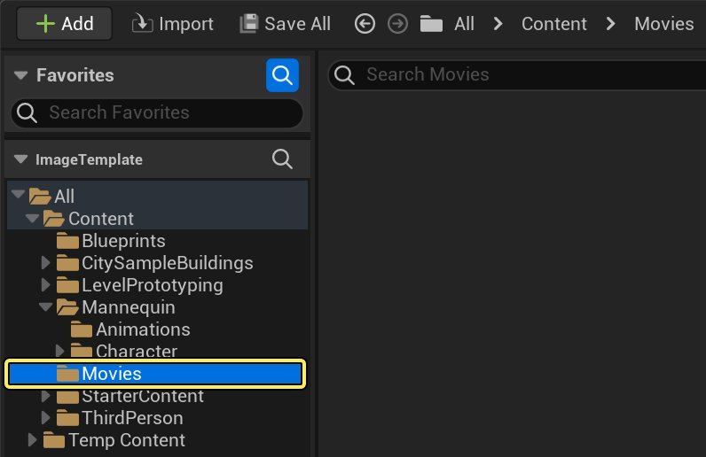
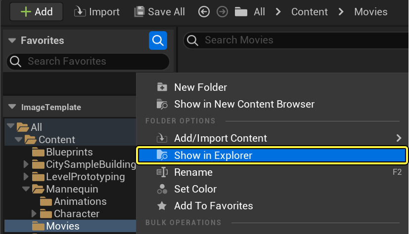
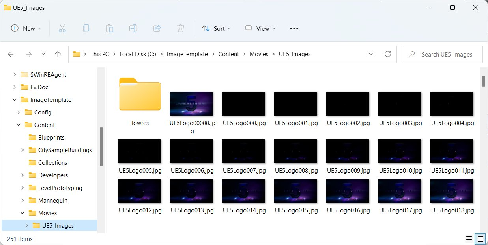
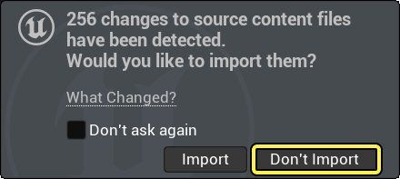
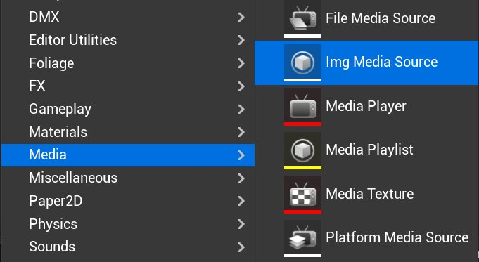
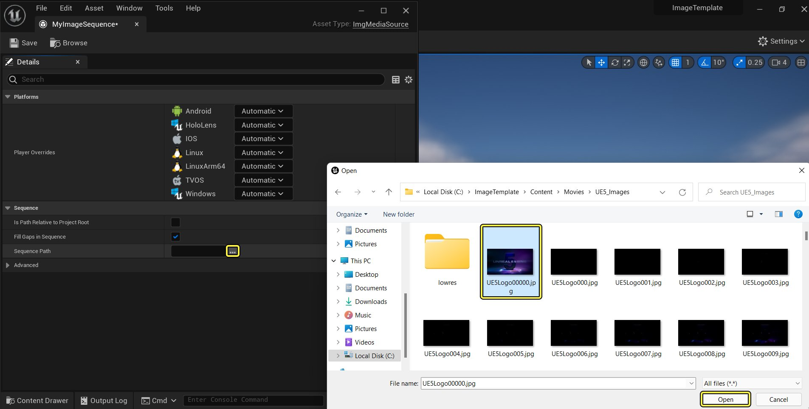
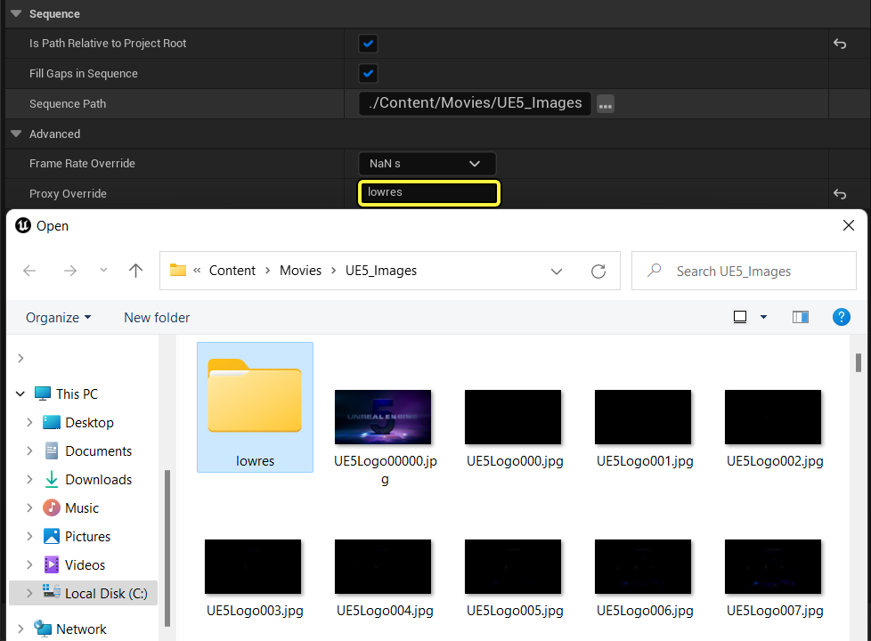
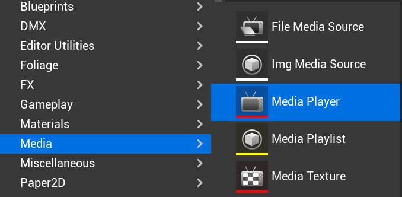

# 播放图像序列

> 路径：虚幻引擎5.7文档 / 使用媒体 / 媒体集成 / 媒体框架 / 媒体框架教程 / 播放图像序列

> 原始页面：https://dev.epicgames.com/documentation/unreal-engine/play-an-image-sequence-in-unreal-engine

作为媒体框架工具的一部分，**图像媒体源（Image Media Source）** 资源提供了一种在虚幻引擎5（UE5）中播放图像序列的方法。 图像媒体源（Image Media Source）类似于[文件媒体源（File Media Source）](../play-a-video-file/index.md)，你可以指定图像序列文件的路径以便进行播放，而不是指向视频的链接。 命名约定十分重要，建议你按图像顺序进行命名，如_Image_01*、_Image_02*、*Image_03*，确保它们按正确顺序播放。

在本操作指南中，我们将应用并使用图像媒体源（Image Media Source），以在关卡中的静态网格体上播放图像序列。

> [!NOTE]
> **Electra媒体播放器** 目前还不支持图像序列播放。

> [!TIP]
> 本教程介绍了图像序列的手动工作流程。5.1的用户也可以使用[媒体板Actor](https://dev.epicgames.com/documentation/404)。后者提供了拖放媒体源的额外功能，并优化了对预构建网格体的流送。

## 步骤

> [!NOTE]
> 在本操作指南中，我们使用启用了 **初学者内容包** 的 **蓝图第三人称模板（Blueprint Third Person Template）** 项目。 你还需要一个图像序列，如果你没有，可以单击右键并下载本教程中使用的[样本图像序列](https://d1iv7db44yhgxn.cloudfront.net/documentation/attachments/3e5fb700-3b09-4101-85c8-7fc38734ebc7/ue5_images.zip)。

1. 在 **内容浏览器** 中，展开 **源（Sources）** 面板，然后在 **内容（Content）** 下面，创建一个新文件夹 **电影（Movies）**。

   
2. 右键单击 **电影（Movies）** 文件夹，然后选择 **在资源管理器中显示（Show in Explorer）**。

   

   > [!NOTE]
   > 虽然不是强制性要求，但为了正确打包项目并部署媒体文件，建议你将媒体文件放在 **Content/Movies** 文件夹中。
3. 将图像序列的图像放在 **Content/Movies** 文件夹中。

   

   在上图中，我们在 **Content/Movies** 中创建了一个新文件夹，名为 **UE5_Images**，并在其中放置了JPG图像。 我们还创建了另一个文件夹，名为 **lowres**，其中包含序列中图像的较低分辨率版本。 媒体框架工具为你提供了一种方法，供你在开发期间通过媒体源代理处理（通常）较低分辨率版本的图像。 这样效率更高，并可以尽量减少在处理较大图像序列和文件大小时的性能问题。
4. 返回到 **编辑器（Editor）**，在虚幻引擎5项目内部，单击 **自动导入（Auto-Import）** 对话框上的 **不导入（Don't Import）** 按钮。

   

   无需将图像导入到项目中，因为我们可以指向它们在项目目录中的位置。
5. 右键单击 **Content/Movies** 文件夹，然后在 **媒体（Media）** 下面，选择 **图像媒体源（Img Media Source）**，并命名为 **MyImageSequence**。

   
6. 在新的 **MyImageSequence** 资源中，单击 **序列路径（Sequence Path）** 旁边的 **...** 按钮，并将其指向图像序列中的第一个图像。

   
7. 单击 **高级选项（Advanced Options）** 滑出按钮来展开 **序列（Sequence）** 选项，并在 **代理覆盖（Proxy Override）** 下面输入 **lowres**。

   

   这里我们指向名为 **lowres** 的文件夹，这个文件夹包含用于开发的较低分辨率图像。 使用较低分辨率图像将减少内存需要，并提供优于完整分辨率文件的体验。

   > [!WARNING]
   > "代理覆盖（Proxy Override）"路径必须指向与完整分辨率图像相同目录结构中的同名文件夹才能找到它。
8. 在 **Content/Movies** 文件夹中单击右键，然后在 **媒体（Media）** 下面选择 **媒体播放器（Media Player）**。

   

   媒体播放器（Media Player）资源将用来播放我们所创建的图像序列。
9. 在 **创建媒体播放器（Create Media Player）** 窗口中，启用 **视频输出媒体纹理资源（Video output Media Texture asset）** 选项，然后单击 **确定（OK）** 按钮。

   > 图片已省略：Video Output Media Texture Asset

   这样将创建并自动指定 **媒体纹理（Media Texture）** 资源，这个资源与将用来播放图像序列的这个媒体播放器关联。
10. 将 **媒体播放器（Media Player）** 资源命名为 **MyPlayer**（将自动命名媒体纹理）并双击以将其打开。

    > 图片已省略：My Player Asset
11. 在 **媒体编辑器（Media Editor）** 中，在 **细节（Details）** 面板中，启用 **循环（Loop）** 选项。

    > 图片已省略：Enable Loop Option

    启用该选项将使媒体播放器持续循环播放图像序列。
12. 双击 **MyImageSequence** 资源以开始播放图像序列。

    > 图片已省略：Start Playing the Image Sequence

    你的图像序列将开始在媒体编辑器中播放，如果你单击 **信息（Info）** 选项卡，将看到有关所播放图像序列的信息。 在我们的示例中，我们可以看到图像序列的 **尺寸（Dimension）** 是 **640 x 360**，因为我们目前使用的是 **lowres** 图像。
13. 在 **内容浏览器** 中，打开 **MyImageSequence** 资源，清空 **代理覆盖（Proxy Override）** 部分。

    > 图片已省略：Clear Out the Proxy Override Section

    这样我们就可以切换到完整分辨率图像，如果再次打开媒体播放器资源并播放图像序列，**尺寸（Dimension）** 值就会有所不同。

    > 图片已省略：Full Resolution Images

    > [!NOTE]
    > 播放器窗口底部的 **图像缓存（Image Cache）** 进度条反映的是内存中缓存的内容量（绿色表示完全就绪并已加载，黄色表示当前正在加载，灰色表示正在计划加载）。 根据系统硬件，缓存量和颜色可能有所不同。有关更多信息，请参阅[媒体框架概述](../../media-framework-overview/index.md)的"图像媒体"部分。
14. 从主编辑器的 **放置Actor（Place Actors）** 面板的 **形状（Shapes）** 选项卡中，将 **平面（Plane）** 拖到关卡中并根据需要调节大小和位置。

    > 图片已省略：Plane Actor

    你可以使用[变换工具](../../../../../understanding-the-basics/actors-and-geometry/transforming-actors/index.md)根据需要来移动、旋转或伸缩平面。
15. 从 **内容浏览器**，将 **MyPlayer_Video** 媒体纹理资源拖到关卡中的 **平面（Plane）** 上面。

    > 图片已省略：Add My Player Video Media Texture Asset

    这样将自动使用该媒体纹理创建 **材质** 并将其应用于关卡中的这个平面上，继而将用来播放我们的图像序列。
16. 从主工具栏，单击 **蓝图（Blueprints）** 按钮，然后选择 **打开关卡蓝图（Open Level Blueprint）**。

    > 图片已省略：Open Level Blueprint

    在开始测试之前，将使用[蓝图](../../../../../blueprints-visual-scripting/index.md)告诉我们的媒体播放器，在游戏开始时打开图像媒体源资源以便开始播放。
17. 在 **我的蓝图（MyBlueprint）** 面板中，创建 **媒体播放器引用（Media Player Reference）** 类型的变量并命名为 **MediaPlayer**，然后将 **MyPlayer** 指定为 **媒体播放器（Media Player）**。

    > 图片已省略：Variable Media Player

    > [!NOTE]
    > 创建变量后，需要单击 **编译（Compile）** 来为 **媒体播放器（Media Player）** 指定 **默认值（Default Value）**。
18. 按住 **Ctrl** 键并将 **媒体播放器（MediaPlayer）** 变量拖到图形上，然后单击右键并创建 **事件开始播放（Event Begin Play）** 节点。

    > 图片已省略：Drag the Media Player
19. 从 **媒体播放器（Media Player）** 变量拖出引线，使用 **打开源（Open Source）** 节点，将 **媒体源（Media Source）** 设置为 **MyImageSequence** 并按图所示进行连接。

    > 图片已省略：Set Media Source
20. **编译（Compile）** 并 **保存（Save）**，然后从主编辑器，单击 **播放（Play）** 按钮来在编辑器内部播放。

## 最终结果

在编辑器中播放后，图像序列将开始在关卡中的静态网格体播放并循环播放。

该示例使用的是JPG文件，但你可以使用图像媒体源中[支持的文件类型](../../media-framework-technical-reference/index.md)的任何图像文件。
