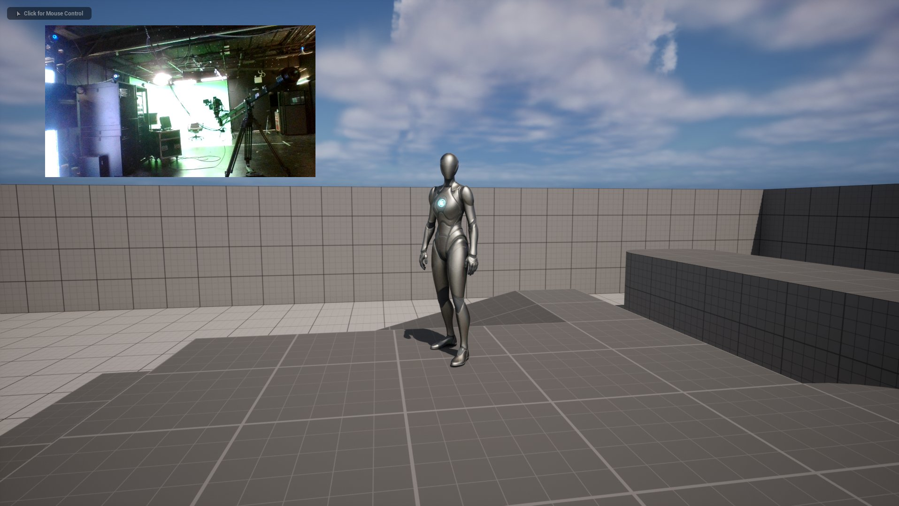
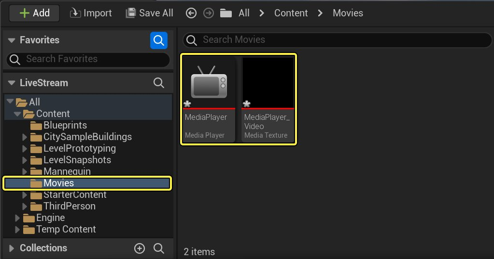
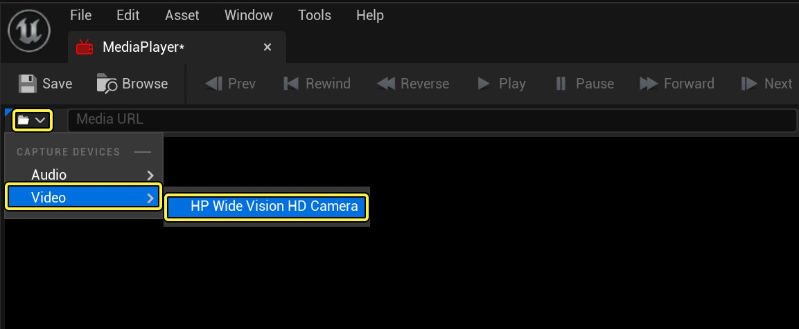
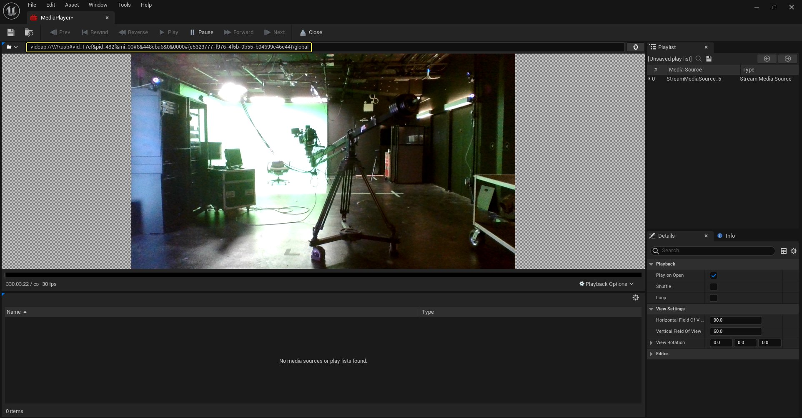
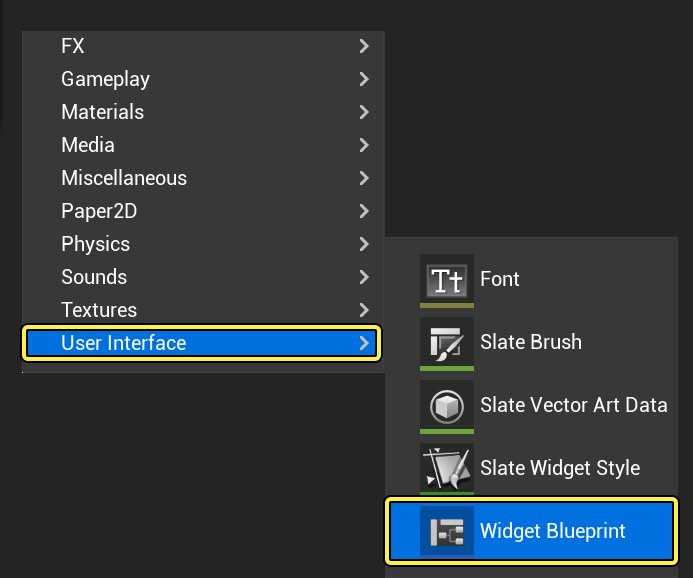
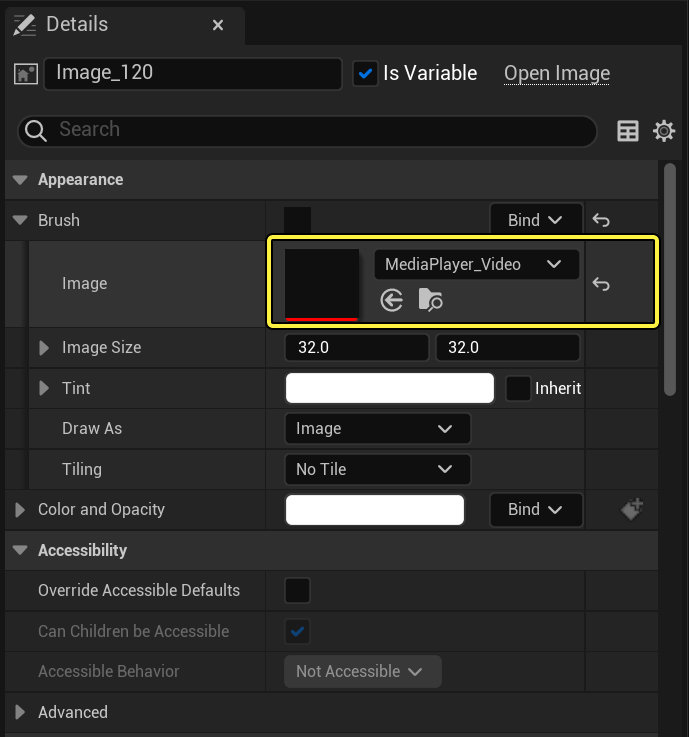
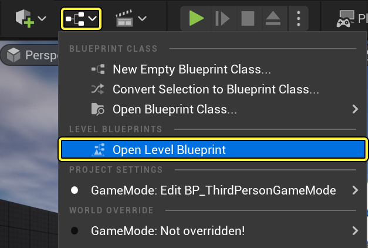
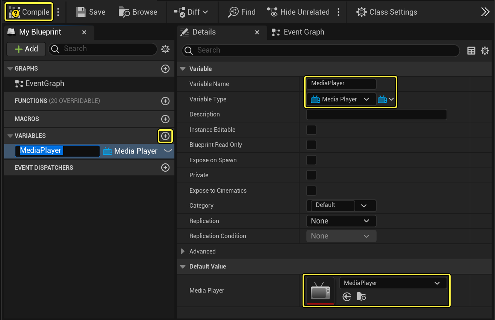

# 播放实时视频采集画面

> 路径：虚幻引擎5.7文档 / 使用媒体 / 媒体集成 / 媒体框架 / 媒体框架教程 / 播放实时视频采集画面

> 原始页面：https://dev.epicgames.com/documentation/unreal-engine/playing-live-video-captures-in-unreal-engine

虚幻引擎（UE）中的媒体框架以能够在引擎中播放的媒体格式支持视频和音频采集设备。 例如，你可以从网络摄像头获取实时视频，然后在UE4的静态网格体上或作为HUD的一部分直接播放。 或者，你可以将项目部署到移动设备，并检索前置或后置摄像头视频，并在应用程序中播放。

在本示例中，你将从网络摄像头获取视频采集馈送，在游戏期间作为HUD的一部分播放这个视频。

> [!NOTE]
> Electra媒体播放器目前不支持实时视频捕获（Live Video Capture）的播放。

## 步骤

> [!NOTE]
> 本教程使用启用了 **初学者内容包** 的 **蓝图第三人称模板（Blueprint Third Person Template）** 项目。 你还必须在电脑上连接网络摄像头。

1. 展开 **源（Sources）** 面板，创建名为 **电影（Movies）** 的文件夹，然后在该文件夹中，创建 **媒体播放器（Media Player）** 并链接名为 **MediaPlayer** 的 **媒体纹理（Media Texture）** 资源。

   
2. 打开 **MediaPlayer** 资源，然后在 **媒体URL（Media URL）** 字段旁边，单击并展开 **采集设备（Capture Devices）**，在 **视频（Video）** 下找到你的摄像头。

   

   > [!NOTE]
   > 根据你的电脑设置，显示的采集设备数量和名称可能与截图不同。

   在选择你的视频采集设备时，来自摄像头的视频将显示在媒体播放编辑器内部。
3. 高亮显示并单击右键，复制"媒体URL（Media URL）"字段中显示的 **媒体URL** 字符串。

   

   点击查看大图

   > [!NOTE]
   > 根据你的电脑设置，显示的URL字符串可能与截图不同。
4. 在 **内容浏览器** 单击右键，在 **用户界面（User Interface）** 下面，选择 **控件蓝图（Widget Blueprint）** 并命名为 **HUD**。

   

   你将在该用户界面内部使用 **媒体纹理（Media Texture）** 来显示从网络摄像头获取视频的画中画风格HUD。
5. 打开 **HUD** 控件蓝图，然后在 **内容侧边栏** 中，将 **MediaPlayer_Video** 纹理拖入HUD图表。你会发现视频填充了 **外观（Appearance）** 下面的 **图像（Image）** 字段。

   
6. 关闭 **HUD** 控件蓝图，然后从主编辑器工具栏中，单击 **蓝图（Blueprints）**，并选择 **打开关卡蓝图（Open Level Blueprint）**。

   

   虽然你并没有直接打开媒体源，而是复制媒体URL，但仍需要将其打开以便在运行时播放。
7. 在 **我的蓝图（My Blueprint）** 面板中，创建一个 **媒体播放器对象引用（Media Player Object Reference）** 类型的变量并命名为 **媒体播放器（Media Player）**，然后分配 **媒体播放器（Media Player）**。

   

   点击查看大图

   > [!NOTE]
   > 你可能需要单击 **编译（Compile）** 按钮来编译蓝图，然后再分配"媒体播放器（Media Player）"变量的 **默认值（Default Value）**。
8. 按住 **Ctrl** 键并将 **媒体播放器（MediaPlayer）** 变量拖到图形上，然后单击右键并添加 **事件开始播放（Event BeginPlay）** 节点。

   > 图片已省略：拖动媒体播放器

   你已经创建了想要对其执行操作的媒体播放器的引用和用于指示游戏开始的[事件](../../../../../blueprints-visual-scripting/specialized-blueprint-visual-scripting-node-groups/events/index.md)。
9. 单击右键并添加 **创建控件（Create Widget）** 节点（以 **HUD** 作为 **类（Class）**），然后拖出 **返回值（Return Value）** 引脚，使用 **添加到视口（Add to Viewport）** 并按图所示进行连接。

   > 图片已省略：创建控件节点

   我们在这里要表达的是，当游戏开始时，创建HUD控件蓝图，然后将其添加到玩家视口。
10. 拖出图形中 **媒体播放器（Media Player）** 节点引脚，使用 **打开URL（Open URL）** 并粘贴在 **第3步** 复制的URL，并按图所示进行连接。

    > 图片已省略：Use Open URL

    点击查看大图

    如果你现在在编辑器中播放，来自网络摄像头的视频将会出现在你在所需位置放置的HUD图像上。

    在此示例中，要打开的媒体URL是指定好的，但需要知道的是，实际情况并非总是如此。 你可能会将项目打包并通过这种功能分发给其他人，然后想要获取最终用户连接的采集设备并使用其中的一个设备。 或者，你可能想将项目部署到移动设备，并需要前置或后置摄像头视频来用作媒体源。 你可以使用 **列举采集设备（Enumerate Capture Devices）** 功能来返回所有连接的采集设备，并获取有关这些设备的信息。
11. 在图形中单击右键，搜索并添加 **列举视频采集设备（Enumerate Video Capture Devices）** 函数。

    > 图片已省略：例举视频采集设备

    有一些用于音频、视频和网络摄像头采集设备的列举元素（网络摄像头用于移动设备，因为你可以获取前置或后置摄像头）。
12. 拖出 **过滤器（Filter）** 引脚并使用 **创建位掩码（Make Bitmask）** 节点。

    > 图片已省略：添加创建位掩码节点

    使用"创建位掩码（Make Bitmask）"将使你能够筛选出一组特定的设备子集。
13. 选中 **创建位掩码（Make Bitmask）** 节点，在 **细节（Details）** 面板中，将 **位掩码列举（Bitmask Enum）** 更改为 **EMediaVideoCaptureDeviceFilter**，然后在过滤器中启用它们。

    > 图片已省略：启用每个过滤器

    这里你将筛选每一个启用的选项来返回采集设备（你可以排除想要省略的设备，缩小返回设备列表）。
14. 从 **输出设备（Out Devices）**，使用 **获取副本（Get Copy）** 节点并拖出其输出引脚，使用 **Break MediaCpatureDevice** 节点并连接到 **打开URL（Open URL）**，如图所示。

    > 图片已省略：Break MediaCpatureDevice

    点击查看大图

    该过程将查找第一个可用采集设备，并返回其URL，之后将通过"打开URL（Open URL）"使用这个URL来打开视频源进行播放。
15. **编译（Compile）** 并关闭关卡蓝图，然后单击主工具栏中的 **播放（Play）** 按钮来在编辑器中播放。

## 最终结果

当你在编辑器中播放时，来自你的摄像头的视频将会通过引擎推送并显示在你的HUD上。

要获取移动设备上的前置或后置摄像头：

- 使用

  列举视频采集设备（Enumerate Video Capture Devices）

  节点，然后将

  位掩码列举（Bitmask Enum）

  设置为

  EMediaWebcamCaptureDeviceFilter

  选项。
- 在

  创建位掩码（Make Bitmask）

  节点上，标出你想要获取的摄像头。

> 图片已省略：标记摄像头
