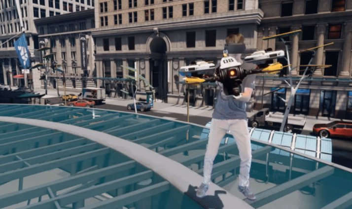
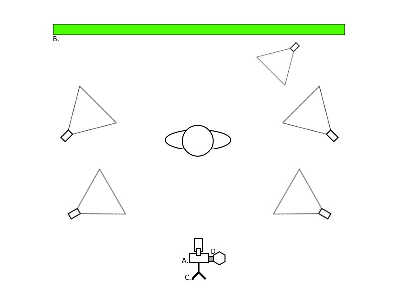
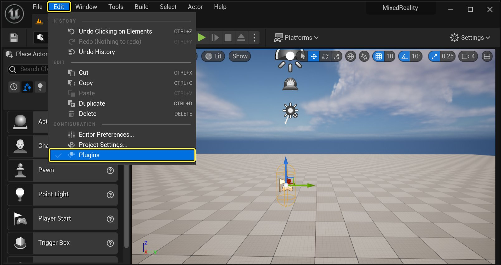
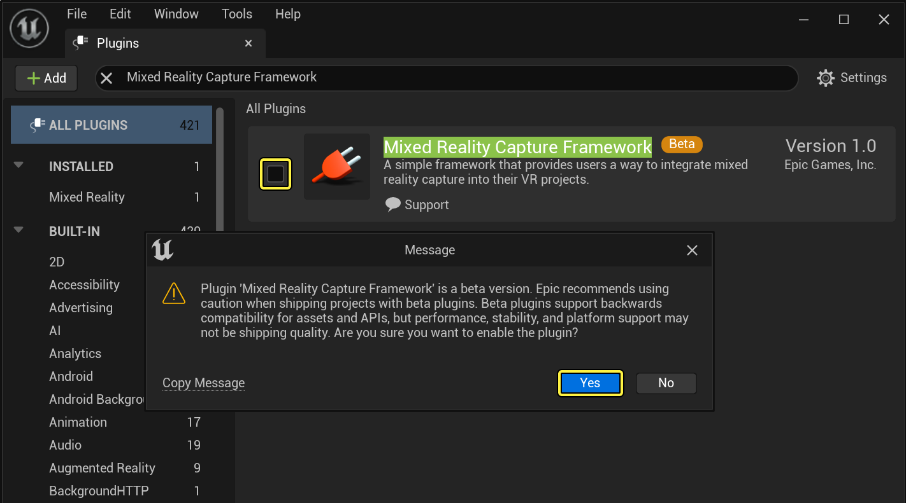
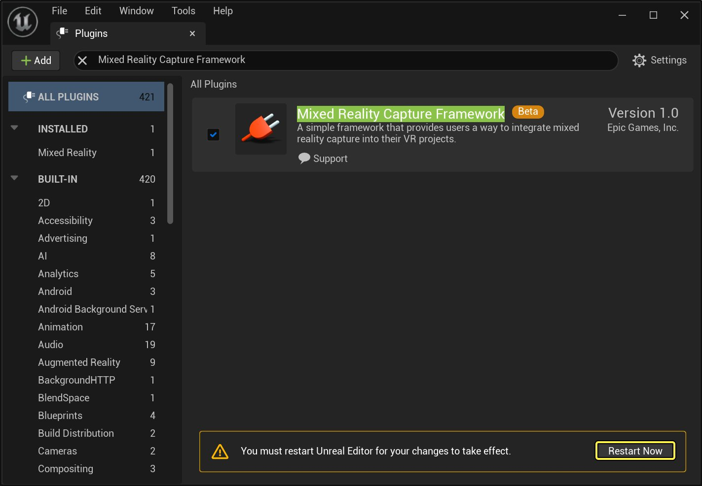
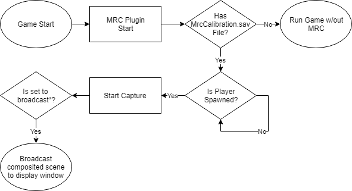

# 混合现实捕捉快速入门

> 路径：虚幻引擎5.7文档 / 使用媒体 / 媒体集成 / 混合现实捕获 / 混合现实捕捉快速入门

> 原始页面：https://dev.epicgames.com/documentation/unreal-engine/mixed-reality-capture-quick-start-for-unreal-engine

本教程结束时，你将完成用于混合现实捕捉（MRC）的系统设置和校准。

## 1 - 设置绿幕和摄像机

需要具备合适的设备才能开始捕捉。我们将在此简单介绍一下所需的设备，并提供一些设置设备的提示。

1. **视频摄像机** UE5仅支持一组特定的视频捕捉设备，请参阅[受支持的视频设备](../supported-video-devices-for-mixed-reality-capture/index.md)以获取受支持的设备的最新列表。使用列表中包含的设备，并将它连接到PC以进行流送。
2. **色度背景** 色度镶迭通常使用绿幕。布置绿幕时，需要确保将它拉紧，以尽量减少褶皱，尤其是主体后面的区域。如果设置光照，应确保不在对象后面直接投射阴影。需要确保颜色平滑、单一。背景中绿色阴影区域越多，色度镶迭就越困难。让拍摄对象尽可能远离背景会很有帮助。如果你打算对拍摄对象的脚进行拍摄，请考虑在地板上也使用绿幕。
3. **摄像机架设** 进行初始架设（校准）时，摄像机需要保持静止不动。如果你使用网络摄像头，只需将其连接到你的桌面/显示器即可。另一种选择是将摄像机固定到三脚架上。
4. **支架 + 追踪器（可选）** 如果你打算在拍摄期间四处移动摄像机，最好将跟踪设备（例如HTC Vive Tracker）连接到摄像机。另外，你还可以使用[多重安装](https://www.bhphotovideo.com/c/product/1062513-REG/desmond_d3d_1_stereo_camera_bracket.html)将摄像机和跟踪器牢固地安装在一个地方。

## 2 - 校准物理和虚拟摄像机

布置好物理空间和设备后，就可以从头至尾执行校准了。运行时，游戏需要知道摄像机相对于虚拟场景所处的位置。对于每次布置，该配置都是不同的，因此需要从头至尾执行校准过程。为了简化校准过程，我们制作了独立的校准工具（MRCalibration.exe），可以单击[此处](http://epic.gm/mrccal)来下载它。

> [!TIP]
> 校准过程非常复杂，因此我们创建了独立的[如何使用混合现实捕捉校准工具](../how-to-use-the-mixed-reality-capture-calibration-tool/index.md)主题，其中包含有关使用该校准工具的详细说明。

校准过程完成后，该校准工具会生成校准设置文件（*MrcCalibration.sav*）。校准设置文件（*MrcCalibration.sav*）位于该校准工具的*/Saved/SaveGames/*文件夹中。开始进行混合现实捕捉时，游戏会使用此设置文件。只要物理布置保持不变，就无需从头执行校准过程。可以在多个游戏中使用相同的校准设置文件。

> [!TIP]
> 如果你的摄像机镜头可调整，要注意不要在完成校准后调整变焦。调整变焦将更改物理摄像机的视野（FOV），但不会更改虚拟摄像机的视野。虚拟摄像机将使用校准过程中使用的FOV。如果在完成校准后调整了摄像机的变焦，需要重复校准过程。

## 3 - 将校准文件添加到游戏项目中

在上一步骤中，我们介绍了如何使用MRC Calibration Tool生成*MrcCalibration.sav*文件。*MrcCalibration.sav*文件生成好后，将其复制到游戏的*/Saved/SaveGames/*文件夹中。如果你的游戏尚没有SaveGames目录，需要手动创建该目录。

如果已在游戏中启用了混合现实捕捉框架插件，游戏会在启动时检查校准设置文件。

## 4 - 启用混合现实捕捉框架插件

将混合现实捕捉（MRC）框架集成到项目中的过程非常简单，只需启用混合现实捕捉框架插件即可。在已启用MRC插件并且已将校准设置文件复制到正确的位置后，游戏应会在MRC模式下启动，并且会在旁观者窗口中显示合成的场景。 默认情况下，MRC播放使用[VR观众画面](../../../../sharing-and-releasing-projects/developing-for-xr-experiences/sharing-xr-experiences/virtual-reality-spectator-screen/index.md)来显示合成的场景。如果游戏不处在VR模式下，那么就不会显示混合现实捕捉。MRC插件在进行捕捉，只是不会显示。

> [!TIP]
> 只要启用了MRC插件，混合现实捕捉在编辑器（VR PIE）和打包的游戏中都受支持。

1. 在 **编辑** 菜单下，选择 **插件**。

   

   Click image to expand.
2. 使用搜索栏查找混合现实捕捉框架（Mixed Reality Capture Framework）插件。
3. 点击 **启用（Enabled）** 复选框，然后在警告弹窗上点击 **好（Yes）**。

   

   Click image to expand.
4. 必须重新启用虚幻编辑器以便彻底重启插件。

   

   Click image to expand.

#### 在MRC模式下启动

当MRC插件启动时，它会在游戏的*/Saved/SaveGames/*文件夹中检查校准设置文件（*MrcCalibration.sav*）。如果MRC插件找不到校准设置文件，它将不会在MRC模式下启动。以下示意图显示了游戏如何确定是否在MRC模式下启动。

## 5 - 录制混合现实捕捉

MRC框架不会为捕捉录制视频。MRC框架只负责处理场景合成并将合成输出到显示窗口中。必须使用第三方软件（例如，[OBS](https://obsproject.com/)或[Nvidia ShadowPlay](https://www.nvidia.com/en-us/geforce/geforce-experience/shadowplay/)）来对捕捉进行录制。

## 6 - 自己动手！

创建混合现实捕捉时，最困难的部分就是做到正确地校准。一旦完成后（如果未更改布置），你就可以重复使用校准文件。只需复制文件并运行即可。

> [!NOTE]
> 如果你的设备设置发生变动，就需要使用混合现实捕捉校准工具重新校准。
