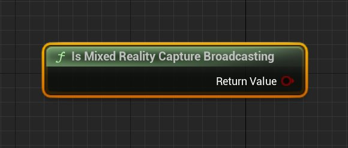
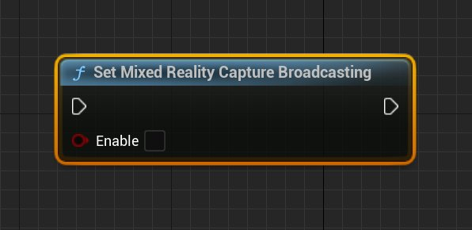
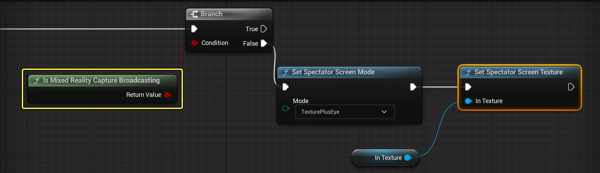

# 混合现实捕捉的故障排除

> 路径：虚幻引擎5.7文档 / 使用媒体 / 媒体集成 / 混合现实捕获 / 混合现实捕捉的故障排除

> 原始页面：https://dev.epicgames.com/documentation/unreal-engine/troubleshooting-mixed-reality-capture-in-unreal-engine

此页面提供混合现实捕捉（MRC）的故障排除信息。

## 捕捉时闪烁

根据MR捕捉目标的分辨率（默认值是1080p），你的应用程序可能会受到其渲染目标存储池容量的限制。默认情况下，渲染目标会被设置为"按需要重新分配"，这会导致出现乒乓效应和闪烁，因为MR捕捉目标会与立体渲染目标冲突。(如以下视频所示)

如果发现这种行为，可以将渲染目标大小调整规则更改为"增加"（在engine.ini文件中，请这样设置：*r.SceneRenderTargetResizeMethod=2*）。进行这一更改应该会解决这一问题。

## 捕捉在旁观者模式中不显示

MRC框架使用[虚拟现实旁观者模式](../../../../sharing-and-releasing-projects/developing-for-xr-experiences/sharing-xr-experiences/virtual-reality-spectator-screen/index.md)来显示合成的场景。这意味着混合现实捕捉仅当在虚拟现实下运行时才会显示。如果你的项目也使用观众画面，那么你需要使用条件语句对使用它们的位置进行校正检查。存在有助于实现这一检查的MRC方法：

**Get Mixed Reality Capture Texture** 返回Capture Texture，如果不存在，则返回空指针。

**Is Mixed Reality Capture Broadcasting** 如果系统将捕捉纹理发送到观众画面，返回true。

**Set Mixed Reality Capture Broadcasting** 切换捕捉系统是否将捕捉纹理发送到观众画面的设置。

**使用MRC方法的一个示例**

Click image to expand.

## 校准过程中控制器/扳机没有响应。

如果在校准过程中控制器输入没有响应，原因可能有以下几种。

- 头盔传感器未覆盖好。

  如果头盔传感器未覆盖好，控制器可能就无法激活。
- 应用程序窗口需要具有焦点。

  如果MRCalibration窗口不是当前活动窗口，校准系统可能无法捕捉控制器动作。
- **Oculus系统可能未配置为允许从未知来源（Unknown Sources）运行。**目前处于测试阶段，校准系统仍在积极开发中，Oculus尚未审查。

  
