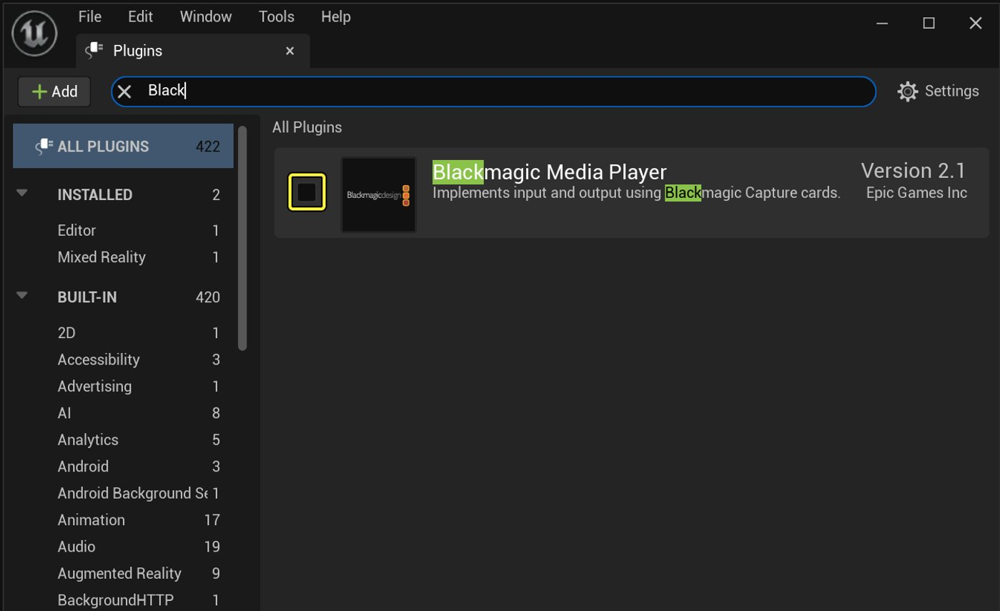
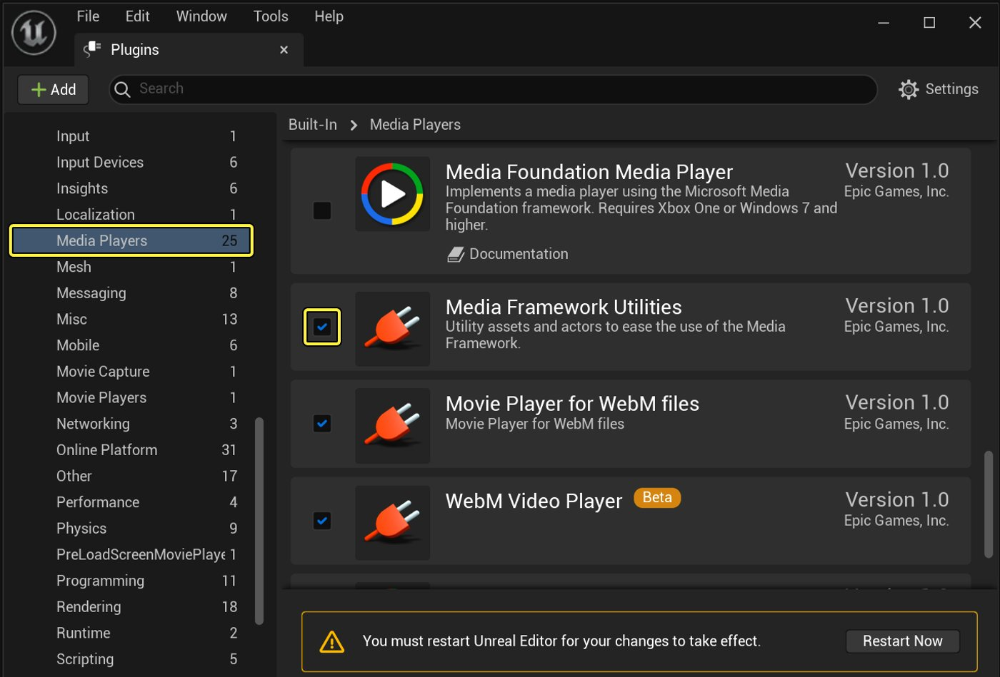
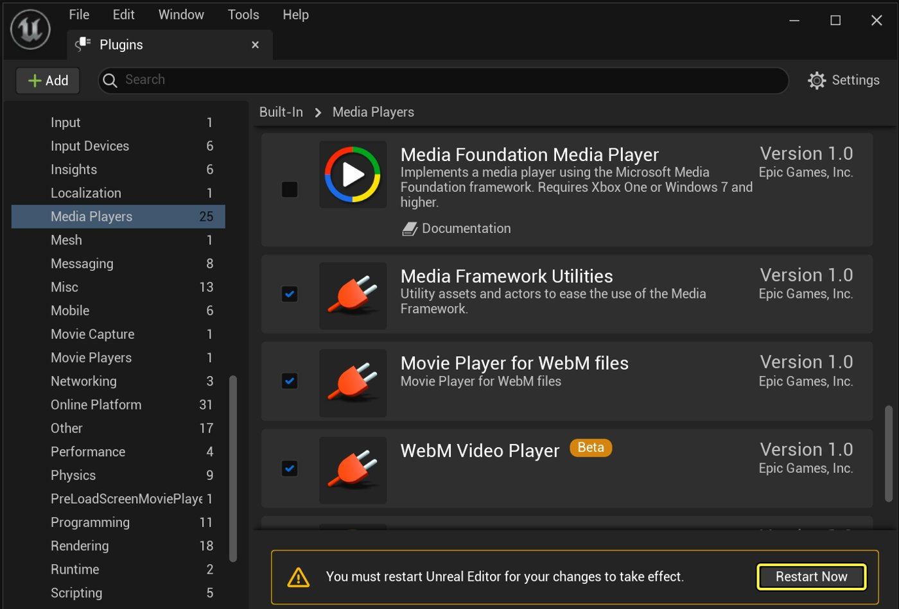
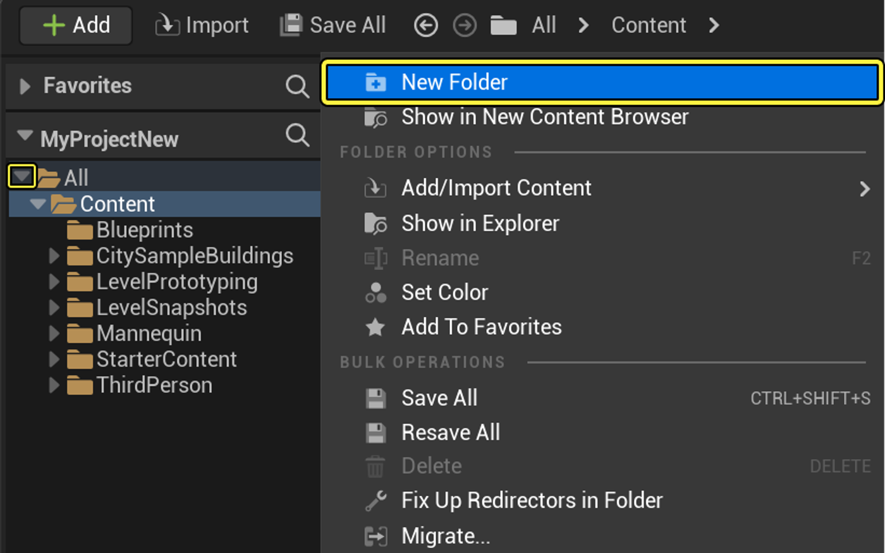
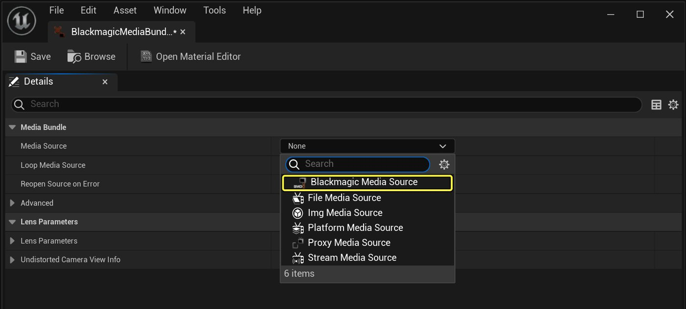
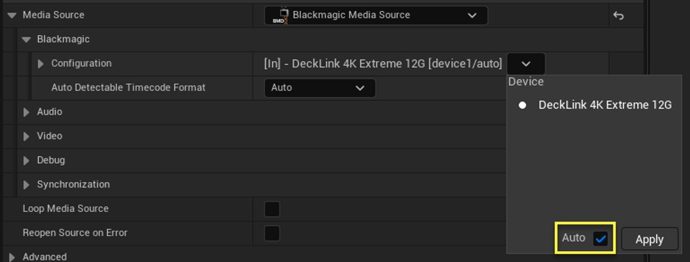
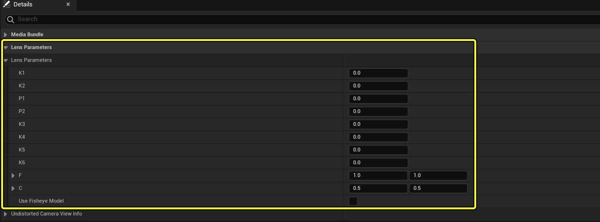
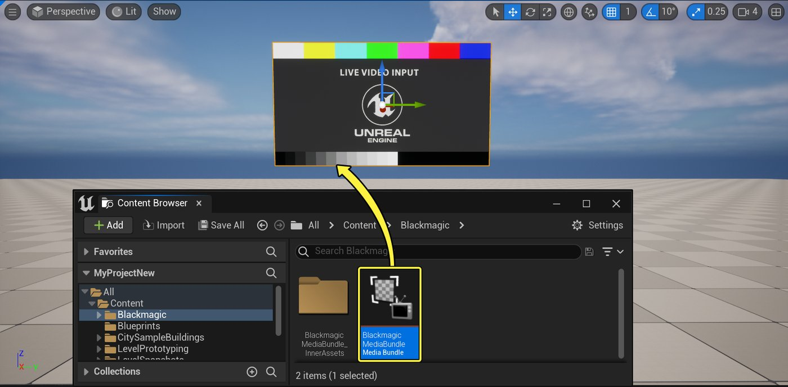

# Blackmagic Video输入/输出快速入门

> 路径：虚幻引擎5.7文档 / 使用媒体 / 媒体集成 / 专业视频I/O / Blackmagic Video输入/输出快速入门

> 原始页面：https://dev.epicgames.com/documentation/unreal-engine/blackmagic-video-io-quick-start-for-unreal-engine

在这个快速入门指南中，我们将介绍如何设置虚幻引擎项目以使用Blackmagic Design的专业视频卡。 在本指南的最后：

- 你将在你的虚幻引擎项目内播放来自Blackmagic卡的视频输入。
- 你将可以使用编辑器和运行时应用程序捕获摄像机视点，并将它们发送到Blackmagic卡上的SDI端口。
- 当你想为视频输入设置更高级的调整时（比如校正镜头变形和应用色度抠像效果），你会知道该在何处进行这些操作。

> [!TIP]
> 如需了解展示了下文大量元素在实践中的有效示例，请参阅Epic Games启动器示例（Samples）选项卡所提供的**[虚拟工作室](../../../../samples-and-tutorials/engine-feature-examples/virtual-studio-sample-project/index.md)**演示项目。

> [!NOTE]
> **先决条件：**
>
> - 确保你拥有Blackmagic Design支持的显卡，并安装了必要的驱动程序和软件。 详情请参阅[Blackmagic媒体框架参考指南](../blackmagic-media-reference/index.md)页面。
> - 确保你的显卡正常工作，并且将视频输入传递到该卡的至少一个SDI端口中。
> - 打开要集成视频源的虚幻引擎项目。 此页面显示了**第三人称**蓝图模板中的步骤，但这套步骤在任何项目中都同样适用。
>
> 本指南中使用的Blackmagic Design组件以[媒体框架](../../media-framework/index.md)为基础而编译，而我们将使用[蓝图](../../../../blueprints-visual-scripting/index.md)在运行时编写视频捕获过程的脚本。 建议事先学习一些本主题的预备知识，但不是强制性要求。

## 1 - 设置项目

在你从Blackmagic卡获取视频放入到虚幻引擎关卡中，并通过Blackmagic卡的某个SDI端口发送来自虚幻引擎的输出之前，你需要做一些基本设置来为项目启用Blackmagic媒体播放器插件。

> [!TIP]
> 如果你用**影视与现场活动（Film, Television, and Live Events）**类别下的模板启动虚幻引擎项目，那么系统可能已经启用了必要的插件。 如果没有，请按以下步骤启用它们。

### 步骤

1. 在虚幻编辑器中打开你想要使用Blackmagic视频输入/输出的项目。
2. 在主菜单中选择**编辑（Edit） > 插件（Plugins）**。
3. 在**插件（Plugins）**窗口中，在**媒体播放器（Media Players）**类别下找到**Blackmagic媒体播放器（Blackmagic Media Player）**插件。 勾选**启用（Enabled）**复选框。

   

   点击查看大图。
4. 在**媒体（Media）**类别下找到**媒体框架工具（Media Framework Utilities）**插件。 勾选该插件的 **启用（Enabled）** 复选框（如果尚未勾选）。

   

   点击查看大图。
5. 点击**立即重启（Restart Now）**以重启虚幻编辑器，并重新打开项目。

   

   点击查看大图。

### 最终结果

你的项目现在已经准备好接受来自Blackmagic卡的视频，并将渲染的输出发送到该卡。 在接下来的章节中，我们将准备好并开始播放视频。

## 2 - 在虚幻引擎中渲染视频输入

在这个过程中，我们将使来自Blackmagic卡的视频输入在虚幻编辑器的当前关卡中可见。 此过程会用到媒体数据包这种资产。媒体数据包会将媒体框架中涉及的几种不同类型的资产打包在一起，从而为你提供对某些高级功能的控制，如镜头变形、色度抠像、颜色校正等。

### 步骤

1. 转到**内容浏览器（Content Browser）**，展开**源（Sources）**面板。 点击右键并从上下文菜单中选择**新建文件夹（New Folder）**。

   

   将新文件夹 重命名为**Blackmagic**。
2. 打开该新文件夹，右键点击**内容浏览器（Content Browser）**并选择**媒体（Media）> 媒体数据包（Media Bundle）**。
3. 内容浏览器会自动选择新资产的名称，因此你可以为其提供描述性的名称： 键入一个新名称，例如**BlackmagicMediaBundle**，然后按**Enter**键。 系统将在媒体数据包旁边自动创建媒体框架资产的新文件夹，并使用后缀**_InnerAssets**命名。 稍后我们将查看这些资源。
4. 点击**内容浏览器**中的**全部保存（Save All）**按钮以保存新资产。
5. 双击新媒体数据包以编辑其属性。 媒体束能够播放来自引擎支持的任何媒体源的视频，因此你需要告诉它你想从Blackmagic卡获取视频。 转到**媒体源（Media Source）**属性，从下拉列表中选择**Blackmagic媒体源（Blackmagic Media Source）**：

   

   点击查看大图。
6. 确定你希望媒体数据包处理的媒体源类型后，你就可以设置该类型的源所提供的配置属性。 你可以让虚幻引擎自动匹配传入视频信号的格式和帧率。 要启用自动格式检测功能，请点击**配置（Configuration）**下拉菜单，勾选**自动（Auto）**并点击**应用（Apply）**。 单击箭头以打开设置子菜单，选择与你的设置匹配的选项，然后单击子菜单中的 **应用（Apply）**。

   

   点击查看大图。

   根据所安装的设备，你看到的选项可能有所不同。 如需详细了解你可以为Blackmagic媒体源设置哪些属性，请参阅[Blackmagic媒体引用](../blackmagic-media-reference/index.md)页面。
7. 如果你想对传入的视频应用补偿以弥补镜头失真问题，请在**镜头参数（Lens Parameters）**分段中设置镜头的物理属性。

   

   点击查看大图。

   这些镜头参数只是设置了镜头的物理属性。 稍后编辑媒体束使用的材质实例时，你将实际激活镜头补偿。 设置完媒体束的属性后，保存并关闭媒体束。
8. 将你的**BlackmagicMediaBundle**资产从**内容浏览器**拖到关卡视口中。

   

   点击查看大图。

   你将看到一个新的平面出现，显示当前在为你的媒体数据包配置的端口上播放的视频。使用视口（Viewport）工具栏中的变形工具来移动、旋转和调整大小。 如果你的媒体数据包没有自动开始播放，选请将其选中，在 **细节（Details）** 面板中点击 **媒体数据包（Media Bundle）> 请求播放媒体（Request Play Media）** 按钮。
9. 现在我们将了解如何为视频流应用抠像和合成效果。 回到媒体数据包编辑器中，点击工具栏中的**打开材质编辑器（Open Material Editor）**按钮，编辑此媒体数据包将其传入视频源绘制到关卡中对象上所用的材质实例。

   > 图片已省略：打开材质编辑器

   > [!TIP]
   > 此材质实例会被保存在**BlackmagicMediaBundle_InnerAssets**文件夹中，该文件夹是用你的媒体数据包自动创建的。
   >
   > > 图片已省略：材质实例
   >
   > 点击查看大图。
10. 在材质实例编辑器中，你将看到许多公开的属性，以供你配置抠像、剪辑和颜色校正等操作，以及激活你在媒体数据包中设置的镜头失真校正。

    > 图片已省略：材质实例编辑器

    点击查看大图。

    当你在材质实例编辑器中调整设置时，你可以看到你的更改对在主关卡视口中播放的视频源的影响。

    > [!TIP]
    > 你可能会发现，在材质实例编辑器的预览面板中 查看所做更改的效果更为方便。 为此， 请临时启用**IsValid**设置，并将其值设为`1.0`。
    >
    > > 图片已省略：有效
    >
    > 点击视口工具栏左上角的箭头，并在菜单中启用**实时（Realtime）**选项。
    >
    > > 图片已省略：实时视口
    >
    > 通过将预览网格体更改为平面或立方体，你将能够更轻松地评估更改的效果。 使用视口底部的控件：
    >
    > > 图片已省略：预览网格体（Preview mesh）
    >
    > 完成后，请将**IsValid**设置还原为其之前的值。
11. 更改完材质实例属性后，点击工具栏中的 **保存（Save）**按钮。

### 最终结果

此时，你应该正在虚幻引擎关卡内的SDI端口上播放视频，并且应该了解如何设置更高级的功能，如镜头变形和色度抠像。

如果你已经熟悉媒体框架，那么另一种将视频引入关卡的方法是在项目中创建一个新的 **BlackmagicMediaSource** 资产，并使用你在上文过程中为媒体数据包设置的源属性对其进行设置。 接着，创建你自己的 **MediaPlayer** 和**MediaTexture** 资产，以便在你的关卡中处理该源的播放。 详情请参阅 [媒体框架](../../media-framework/index.md) 文档。 但是，我们建议使用上述媒体束，以在易用性和专业高质视频特性之间取得最佳平衡。

## 3 - 从虚幻编辑器输出捕获项

在此过程中，你将设置一个Blackmagic媒体输出对象，并使用虚幻编辑器中的**媒体捕获（Media Captures）**面板将关卡中所选摄像机的视图输出到你的Blackmagic卡中。

### 步骤

1. 在内容浏览器中点击右键，选择**媒体（Media） > Blackmagic媒体输出（Blackmagic Media Output）**。

   > 图片已省略：新的Blackmagic媒体输出

   点击查看大图。

   将你的新资产命名为 **BlackmagicMediaOutput**。
2. 双击你的新资产以将其打开以供编辑。 和创建Blackmagic媒体源时一样，你必须设定 **配置（Configuration）** 属性来控制虚幻引擎发送到Blackmagic卡的视频源属性。 点击箭头以打开子菜单，选择与你的视频设置匹配的选项，然后点击子菜单中的 **应用（Apply）**。

   > 图片已省略：Blackmagic媒体输出配置

   点击查看大图。

   根据所安装的设备，你看到的选项可能有所不同。 如需详细了解你可以为Blackmagic媒体输出设置的属性，请参阅[Blackmagic媒体引用](../blackmagic-media-reference/index.md)页面。 完成后，保存并关闭你的媒体输出。
3. 现在我们将在关卡中放置两个摄像机，为我们将发送到Blackmagic卡的输出提供视点。 转到**放置Actor（Place Actors）**面板，打开**过场动画（Cinematic）**选项卡，并将**过场动画摄影机Actor（Cine Camera Actor）**的两个实例拖放到视口中。

   > 图片已省略：拖放过场动画摄像机Actor

   将相机放置在关卡中你想要的位置，这样它们就能显示场景上的不同视点。

   > [!TIP]
   > **导航（Piloting）**摄像机是一种完全按照你想要的方式来设置摄像机视点的快速而简便的方法。 详情请参阅[在视口中导航Actor](https://dev.epicgames.com/documentation/unreal-engine/using-editor-viewports-in-unreal-engine?application_version=5.7)。
4. 转到主菜单，选择**窗口（Window） > 虚拟制片（Virtual Production） > 媒体捕获（Media Capture）**。 你将使用**媒体捕获（Media Capture）**窗口来控制编辑器何时向你的Blackmagic设备发送输出，以及它在关卡中应该使用什么摄像机。

   > 图片已省略：媒体捕获窗口
5. 在**媒体视口捕获（Media Viewport Capture）**区域下，找到**视口捕获（Viewport Captures）**功能按钮。 点击添加**添加（+）**按钮，将新的捕获内容添加到此列表。

   > 图片已省略：添加视口捕获
6. 展开新条目。 首先，我们将添加捕获所用的摄像机。 转到**锁定的摄像机Actor（Locked Camera Actors）**功能按钮，点击**添加（+）**按钮添加新条目。

   > 图片已省略：添加摄像机Actor

   然后，使用下拉列表选择你放置在关卡中的相机之一。

   > 图片已省略：选择摄像机Actor

   重复相同的步骤将另一个相机添加到列表中。
7. 现在，设置这些摄像机要采集的输出。 将**媒体输出（Media Output）**功能按钮设为指向你在上方创建的新Blackmagic媒体输出资产。 为此，你可以在下拉列表中选择它，或者从内容浏览器中拖动Blackmagic媒体输出资源并将其放入此槽中。

   > 图片已省略：设置Blackmagic媒体输出
8. 点击窗口顶部的**捕获（Capture）**按钮。

   > 图片已省略：开始捕获

   你将在窗口底部看到一个新框架，该框架显示要发送到Blackmagic卡的输出预览。 如果你已经将这个端口连接到另一个下游设备，你应该会开始看到输出。

   > 图片已省略：激活媒体捕获
9. 针对此视口捕获而添加到锁定的摄像机Actor（Locked Camera Actors）列表中的摄像机由视频预览上方的对应按钮表示。 点击这些按钮即可在两个视图之间来回切换捕获。

   > 图片已省略：切换摄像机

   点击查看大图。

### 最终结果

现在你已经设置虚幻编辑器，以将你关卡中的相机输出流送到Blackmagic卡上的端口。 接下来，我们将看到如何在正在运行的虚幻引擎项目中使用蓝图脚本执行相同的操作。

## 4 - 在运行时输出捕获项

你在上一小节中使用的**媒体捕获（Media Capture）**窗口是一种向Blackmagic卡发送捕获项的实用且简单的方法。 然而，它仅可在虚幻编辑器中使用。 要在将项目作为独立应用程序运行时执行相同的操作，需要使用媒体输出提供的蓝图API。 在这个过程中，我们将在关卡蓝图中设置一个简单的切换开关，在玩家按下键盘上的某个键时，该开关会启动或停止采集。

> [!TIP]
> Epic Games启动器的**示例（Samples）**选项卡所提供的**[Virtual Studio](../../../../samples-and-tutorials/engine-feature-examples/virtual-studio-sample-project/index.md)**演示项目包含了一个UMG界面控件，该控件演示了如何通过屏幕上用户界面控制捕获过程。

### 步骤

1. 在虚幻编辑器中的主工具栏中，选择**蓝图（Blueprints） > 打开关卡蓝图（Open Level Blueprint）**。

   > 图片已省略：打开关卡蓝图
2. 我们需要从你创建的Blackmagic媒体输出资产开始，你将在该资产中标识输出的目标端口。 在**我的蓝图（My Blueprint）**面板的**变量（Variables）**列表中，点击**添加（+）**按钮以添加新变量。

   > 图片已省略：新增变量
3. 在**细节（Details）**面板中，将**变量名（Variable Name）**设为**BlackmagicMediaOutput**，并使用**变量类型（Variable Type）**下拉列表将其指定为**Blackmagic媒体输出对象引用（Blackmagic Media Output Object Reference）**。
4. 启用**可编辑实例（Instance Editable）**设置(1)，并编译蓝图。 然后转到**默认值（Default Value）**分段，将变量设为指向你在内容浏览器(2)中创建的Blackmagic媒体输出资产。
5. 按住**Ctrl**并将**我的蓝图（My Blueprint）**面板的变量列表中的**BlackmagicMediaOutput**拖放到**事件图表（Event Graph）**中。

   > 图片已省略：按下Ctrl并拖动BlackmagicMediaOutput
6. 点击并从**BlackmagicMediaOutput**变量节点的输出端口拖动内容，选择**媒体（Media） > 输出（Output） > 创建媒体捕获（Create Media Capture）**。

   > 图片已省略：创建媒体捕获

   将你的节点连接到**Event BeginPlay**节点，如下所示：

   > 图片已省略：事件开始播放

   这将从Blackmagic媒体输出创建一个新的媒体采集对象。 媒体捕获提供了两个主要的蓝图函数，即**Capture Active Scene Viewport**和**Stop Capture**。我们将使用这两个函数来控制捕获行为。
7. 首先，我们将把新媒体捕获对象保存到它自己的变量中，这样我们就可以在其他地方再次访问该对象。 点击并从**Create Media Capture**节点的输出端口拖动，并选择**提升为变量（Promote to Variable）**。

   > 图片已省略：提升为变量

   在**我的蓝图（My Blueprint）**面板的变量列表中，将新变量重命名为**MediaCapture**。

   > [!TIP]
   > 务必在这里将媒体采集保存为变量。 如果不这样做，虚幻引擎的垃圾回收器可能会在你用完它之前自动销毁它。
8. 按住**Ctrl**并将**MediaCapture**变量拖动到**事件图表（Event Graph）**中。

   > 图片已省略：按下Ctrl并拖动MediaCapture
9. 点击并拖动**MediaCapture**变量节点的输出端口的内容，选择**媒体（Media） > 输出（Output） > 捕获活动场景视口（Capture Active Scene Viewport）**。 重复一次操作，并选择**媒体（Media） > 输出（Output） > 停止捕获（Stop Capture）**。

   > 图片已省略：开始和停止捕获
10. 右键点击**事件图表（Event Graph）**，选择**输入（Input） > 键盘事件（Keyboard Events） > P**。 点击并拖动 **P** 点的 **已按下（Pressed）** 输出，然后选择 **流程控制（Flow Control） > FlipFlop**。

    > 图片已省略：FlipFlop
11. 将**FlipFlop**节点的**A**输出连接到**Capture Active Scene Viewport**节点的输入事件，将**FlipFlop**节点的**B**输出连接到**Stop Capture**节点的输入事件，如下图所示：

    > 图片已省略：连接这些节点
12. 编译并保存蓝图，并尝试运行你的项目。 点击 主工具栏上运行按钮旁边的箭头，选择 **新建编辑器窗口（在编辑器中运行）（New Editor Window (PIE)）**或**独立游戏（Standalone Game）**选项。

    > 图片已省略：启动项目

> [!NOTE]
> 只有当你以**新建编辑器窗口（在编辑器中运行）（New Editor Window (PIE)）**或**独立游戏（Standalone Game）**模式运行项目时，来自编辑器的视频捕获才会工作。 它不能以默认的**选中的视口（Selected Viewport）**或**模拟（Simulate）**模式工作。 此外，项目的视口分辨率（即虚幻引擎生成的每个帧的渲染图像大小）必须与活动媒体描述文件中的输出分辨率集匹配，使它是输出视频源的正确大小。

项目启动后，你应该能够按键盘上的**P**按钮来切换输出，将引擎的输出发送至Blackmagic卡。

### 最终结果

至此，你应该对如何使用Blackmagic媒体源、媒体束和媒体采集系统有了基本的了解，并且应该了解所有这些元素如何协力工作，以在虚幻引擎中输入和输出专业视频。

## 自行尝试

现在你已经了解了使用Blackmagic卡交换视频输入和输出的新项目的基本知识，你可以继续自学：

- 在你的媒体数据包创建的材质实例中，探索引擎内抠像解决方案。 尝试将一些绿屏视频传递到卡的输入端口，并使用材质实例中的抠像控件来移除背景。
- 浏览**[Virtual Studio](../../../../samples-and-tutorials/engine-feature-examples/virtual-studio-sample-project/index.md)**的演示项目，看看它在基本设置中都添加了什么，比如供在运行时切换摄像机并控制视频捕获的屏幕上UI等。
