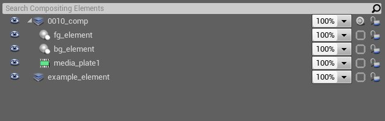
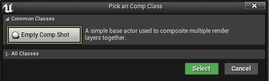
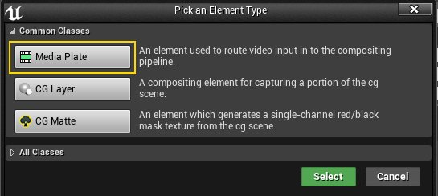
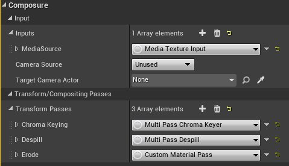
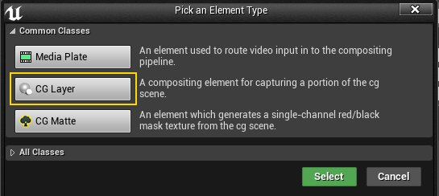
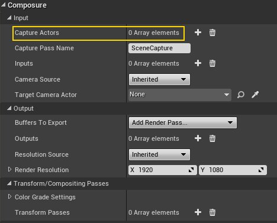
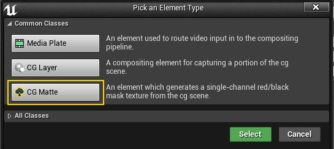
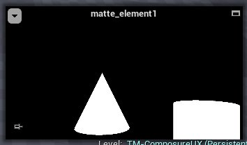

# 合成元素参考

> 路径：虚幻引擎5.7文档 / 使用媒体 / 媒体集成 / Real-Time Compositing with Composure / 合成元素参考

> 原始页面：https://dev.epicgames.com/documentation/unreal-engine/compositing-elements-reference-for-unreal-engine

元素是用于构造合成的单个构建块。每个元素代表合成的一层，或者合成本身。它们是关卡actor，分别负责渲染合成场景的一个部分。

有许多不同的元素类型。所有类型均可配置和修改。元素可设置蓝图，您也可以创建继承自 `ACompositingElement` （或其子类）的自定义元数。

## 基础合成元素

### 空白合成镜头

这是大多数合成的起点。它不含任何通道，需要用户进行填充。

### 媒体板元素

这个预设元素自带将视频放入合成系统、并在其上方应用 **色度镶迭** 所需要的全部通道。

### CG图层元素

这个预设元素负责渲染来自虚拟场景的actor对象。使用 **采集Actor（Capture Actors）** 属性可指定要包括/排除的actor。

### CG遮片元素

这个元素类似于一个普通的 **CG图层** 元素，但是它将CG对象渲染为一个黑/白遮罩纹理。这有助于垃圾遮片，或设置一个与镶迭器同用的持续遮罩。

> 图片已省略：image17.png

修改元素的 **遮片类型（Matte Type）** 属性来翻转遮罩。

### 纹理元素

此元素是一个工具元素，用于将外部纹理导入合成系统中。

> 图片已省略：image2.png

## 高级元素类型

在 **新元素（New Element）** 对话中切换 **所有类（All Classes）** 即可选择高级元素。这些额外的元素通过蓝图创建，可进行修改来满足特定的使用情况。

> [!NOTE]
> 对于要列出的高级元素，首先必须加载其各自的蓝图。在内容浏览器中合成插件的Blueprints/CompositingElements文件夹下可找到高级元素蓝图（确保内容浏览器设为查看引擎和插件内容）。

### 深度元素

深度元素与CG图层元素相似，但会生成一张展现所包含actor深度的图像。

> 图片已省略：image19.png

> 图片已省略：image10.png

### 圆形元素

> 图片已省略：image9.png

> 图片已省略：image16.png

### 渐变元素

> 图片已省略：image15.png

> 图片已省略：image6.png

### 凹版绘制元素

> 图片已省略：image18.png
