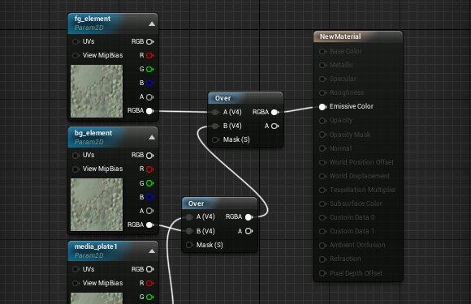
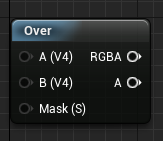
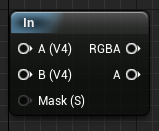
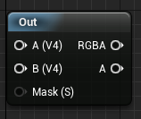
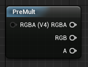
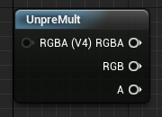
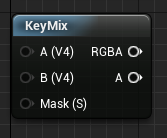

# 合成材质节点参考

> 路径：虚幻引擎5.7文档 / 使用媒体 / 媒体集成 / Real-Time Compositing with Composure / 合成材质节点参考

> 原始页面：https://dev.epicgames.com/documentation/unreal-engine/compositing-material-nodes-reference-for-unreal-engine

为了简化合成操作，我们添加了一系列节点来提供最常见的一些合成操作。我们将在这里简要地重点介绍各个节点及其用途。

> [!NOTE]
> 合成材质节点需要 **float4** 输入，因此确保传递 **RGBA**，而不仅仅是 **RGB**。

## Over

该节点使用输入A的alpha将一个图像（A）叠加到另一个图像（B）。

> [!NOTE]
> 该节点需要输入颜色通道预乘图像的alpha。

## In

该节点返回A在B形状以部的部分。

## Out

该节点返回A在B形状以外的部分。

## PreMult

该节点将输入的RGBA通道乘以其alpha。

## UnPreMult

该节点将用输入的RGBA通道除以其alpha。

## KeyMix

该节点使用指定的遮罩将两个图像叠加在一起。

