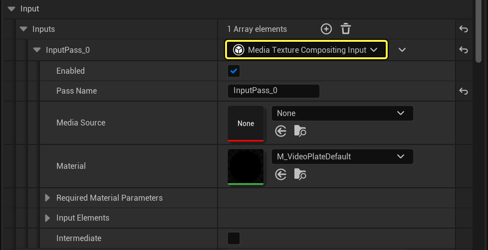
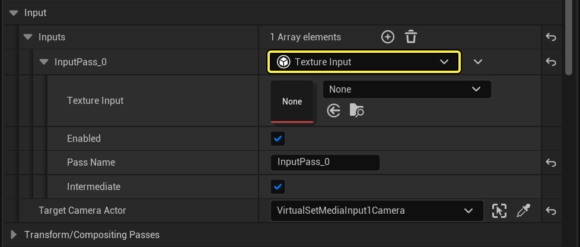
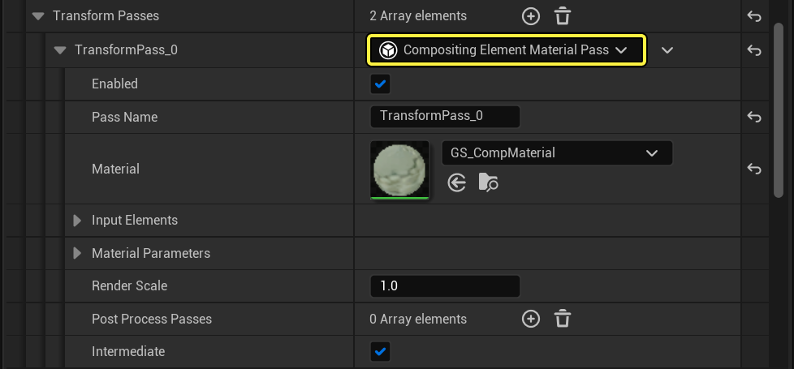
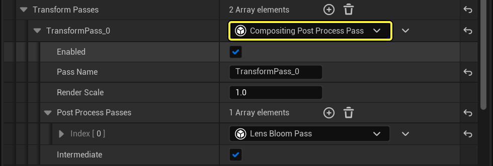
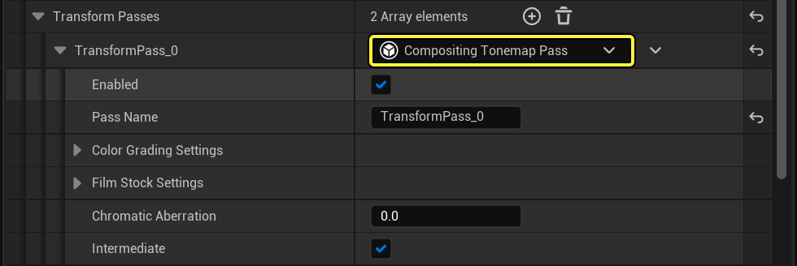
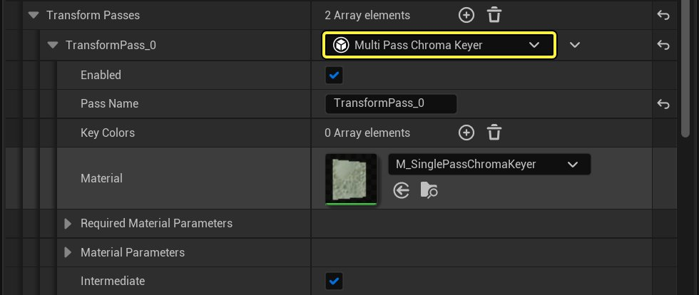
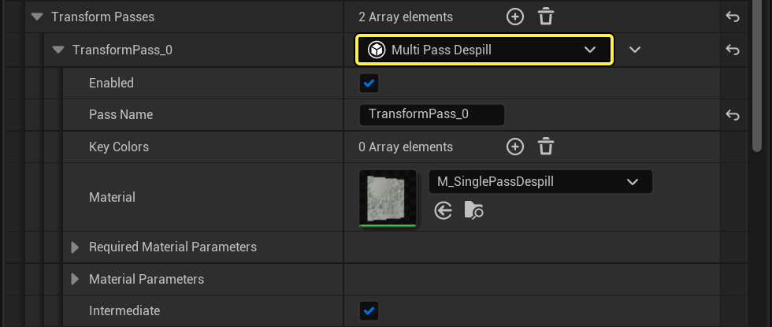
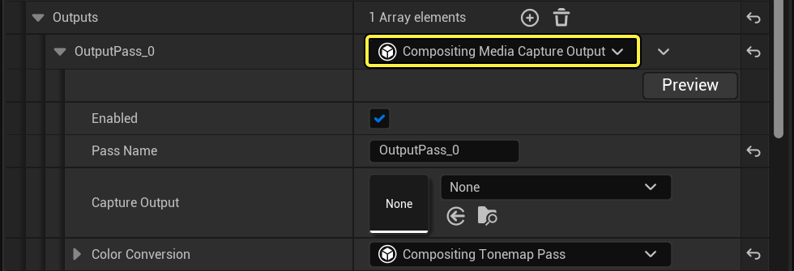

# 合成通道参考

> 路径：虚幻引擎5.7文档 / 使用媒体 / 媒体集成 / Real-Time Compositing with Composure / 合成通道参考

> 原始页面：https://dev.epicgames.com/documentation/unreal-engine/compositing-passes-reference-for-unreal-engine

合成通道是属于合成元素的对象。通道是渲染元素时执行的单个步骤，并按顺序运行。

有3种合成通道类型：

- 输入
- 变换
- 输出

多数通道负责渲染图像。对输入和变换而言，这些图像可用于后续的通道，并可在渲染材质时引用。

## 可设蓝图

通道可以设置蓝图，因此您可以轻松地创建自己的通道，并将其结合合成系统一起使用。只需创建蓝图，并从 **CompositingElementInput*、**CompositingElementTransform**或**CompositingElementOutput** 继承即可。

## 共享设置

每个通道自身皆有一套属性，但每个通道均共享下列属性：

| 属性 | 描述 |
| --- | --- |
| **启用（Enabled）** | 和元素一样，单个通道可被禁用。关闭时，元素的行为将把通道视为不存在。 |
| **通道名称（Pass Name）** | 通道拥有名称，以便被其他后续通道引用。如果要在渲染材质中引用通道，则必须对其进行唯一命名。 |
| **中间（Intermediate）** | 将对每个渲染通道分配一个渲染目标。默认情况下，其假定您只需要通过下个通道获得该结果。之后，为了节约渲染资源，它释放它的渲染目标，以便它可被另一个通道使用。如果需要更长时间访问通道的结果，请取消勾选此框。 |

## 输入

### 媒体纹理输入

本通道负责将视频输入到合成系统中。它需要媒体纹理来引用。其媒体源通过通道的材质来进行处理。

没有 **媒体源**，媒体通道将为空。但是，您可以在游戏配置文件中设置一个默认静止图像：`[/Script/Composure.ComposureGameSettings] StaticVideoPlateDebugImage="/Game/Path/To/My/TextureAsset"`

### 纹理输入

本通道为您提供了一个将源静态纹理导入合成系统的简单方法。

## 变换

变换负责获取输入图像并输出处理后的图像。传统意义上，这是进行合成的地方——引用子元素并对其进行组合的材质通道。

### 自定义材质通道

此通道允许用户编写自定义材质，在该材质中可以引用其他元素/通道。这是合成系统的主要部分。

### 后期处理通道集

此通道在之前的通道上应用一组后期处理效果（如果是第一个通道，则无法进行操作）。

只有某些效果可用（泛光和色调映射）。用户可以创建 **ComposurePostProcessPassPolicy** 子类来创建更多效果。

### 色调映射

本通道在前一个通道上应用完成的后期处理色调映射。

这有助于将图像从线性色彩空间转换回图像。它可用作预览变换，或用于输出通道（中间材质操作需要线性颜色）。

### 多通道色度镶迭器

**媒体板元素** 使用此通道来镶迭图像。 **镶迭颜色（Key Colors）** 属性指定要变为透明的颜色。

如果需要，您可以使用 **所需材质参数（Required Material Parameters）** 域中列出的参数来为您自己的色度镶迭器切换出材质。

> [!NOTE]
> 此通道运行多次，每种镶迭颜色运行一次。

### 多通道防溢出

此通道可消除图像中的色度反弹（绿屏上的"溢出"）。

和 **色度镶迭器通道** 一样，可以指定要删除的 **镶迭颜色**。也和 **色度镶迭器通道** 一样，此通道运行多次——每个镶迭运行一次。您可以为自己的防溢出进程切换出材质（它只需要"所需材质参数"域中列出的参数）。

> [!TIP]
> 您可以在[此博文]（https://www.unrealengine.com/en-US/blog/setup-a-chroma-key-material-in-ue4）中找到更多关于色度镶迭和防溢出更多信息。

## 输出

输出通道定义一个目的地，以便元素的全处理图像能广播到此。部分输出在转存图像之前将执行其自身的变换。

### 媒体采集

此通道将元素的结果转存到媒体采集目标。**采集输出（Capture Output）** 域需要媒体输出资源，这是一个配置文件，详细说明将图像转存到何处（采集卡、端口ID、像素格式等）。

此通道拥有与之关联的 **颜色转换** 变换，此变换在输出图像之前运行。

### 图像序列

此通道将为元素渲染的每个帧将.EXR图像文件保存到硬盘驱动中。

> 图片已省略：11-exrfile-compositing-output.png

> [!WARNING]
> 一旦拥有 **输出目录** 后，此通道就会开始写出图像（每帧一张图像）。如要进行更多控制，请先禁用此通道。

### 玩家视口

使用此通道可接管玩家在游戏中的视口，并将显示替换为元素的结果。

> 图片已省略：12-player-viewport-compositing-output.png

此通道拥有与其相关联的 **颜色转换** 变换，其在显示图像之前运行。在编辑器中运行来查看它的操作。

### 渲染目标资源

此通道将把元素的结果写入到渲染目标。

> 图片已省略：13-render-target-compositing-output.png

使用 **渲染目标（Render Target）** 域来指定哪些资源。
