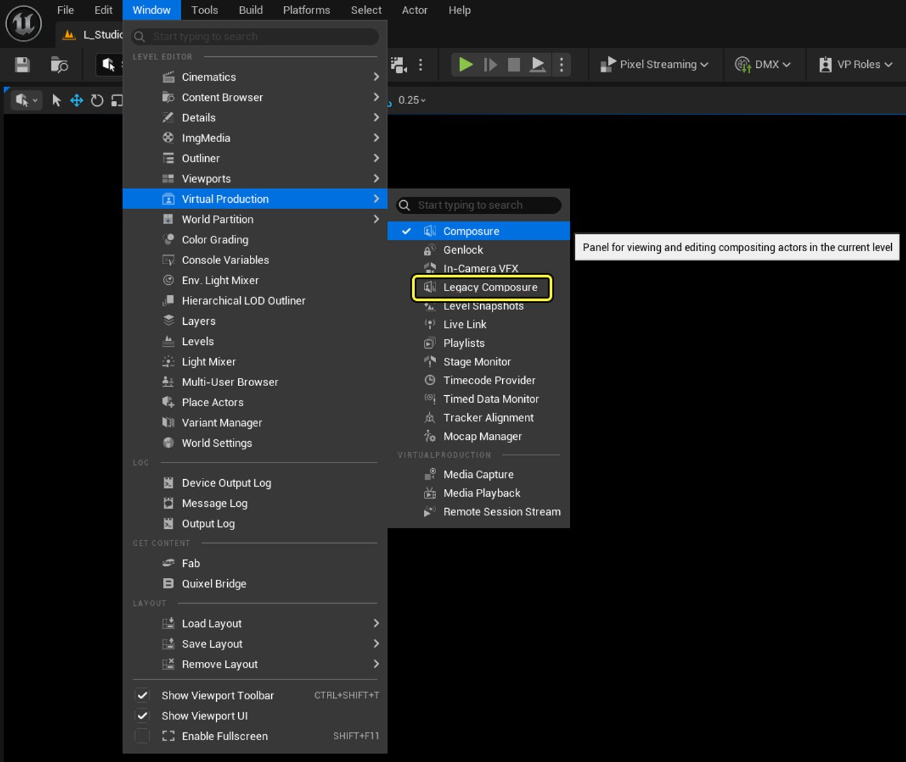
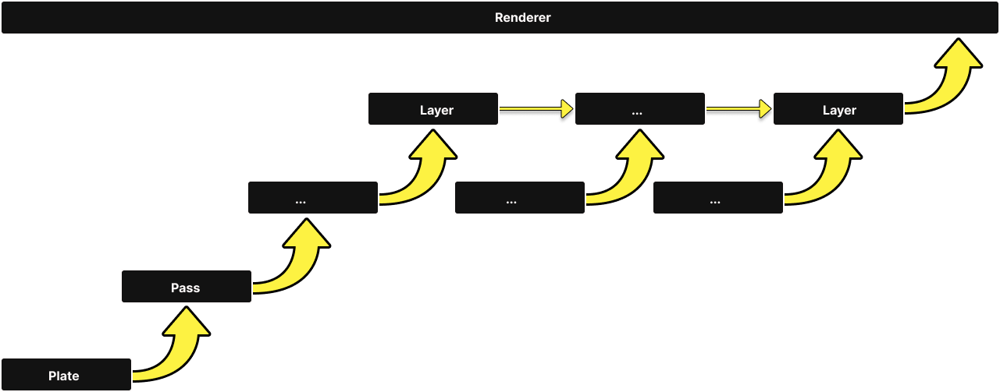
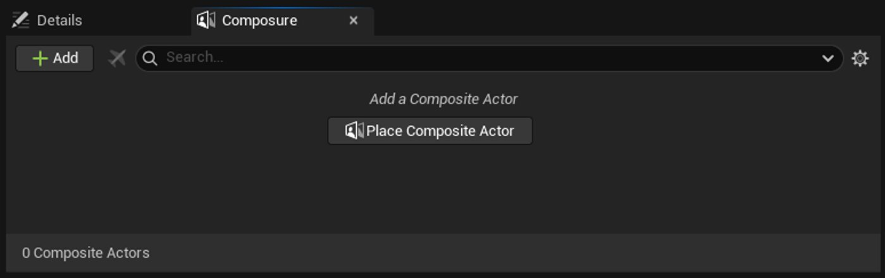
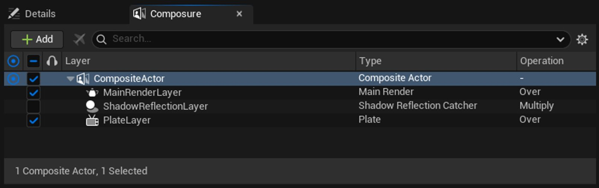
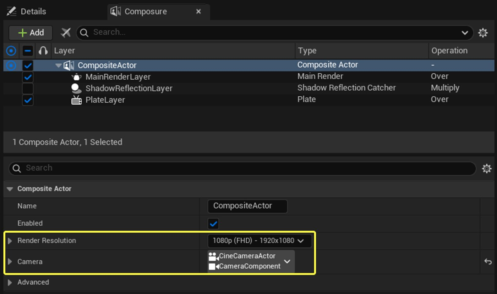
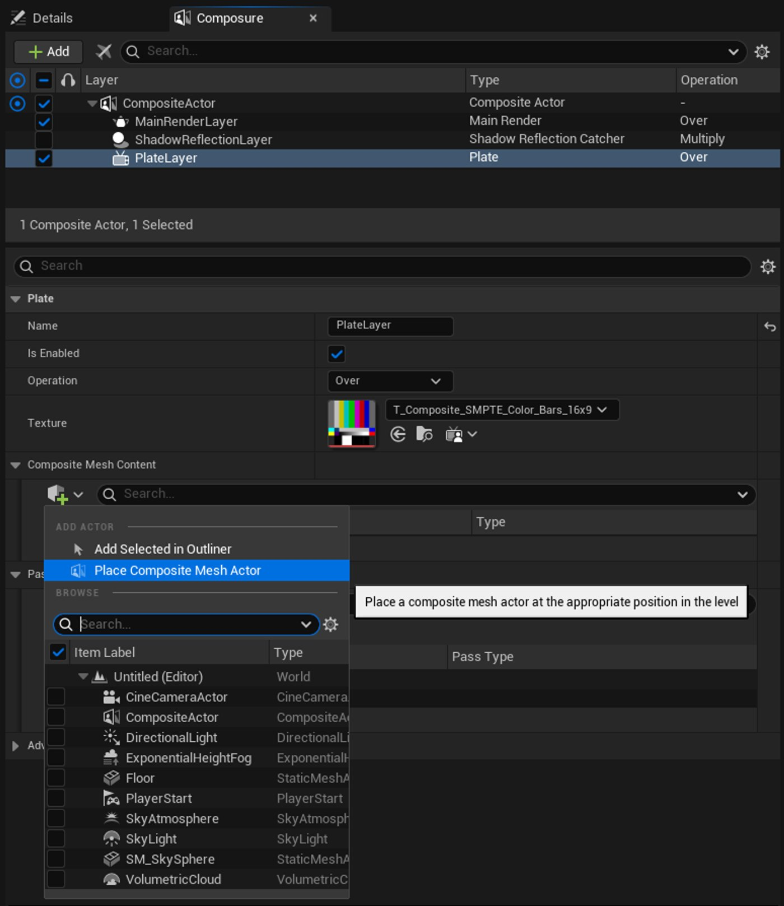
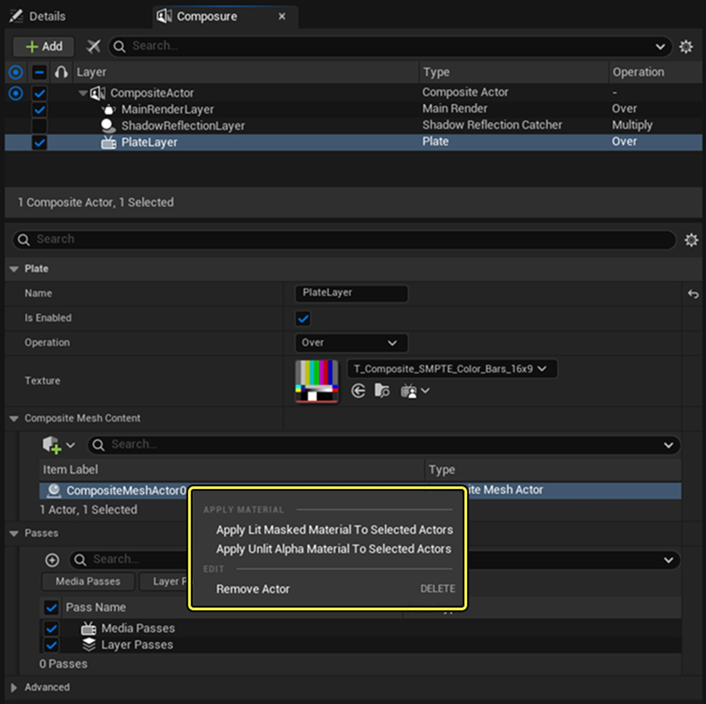
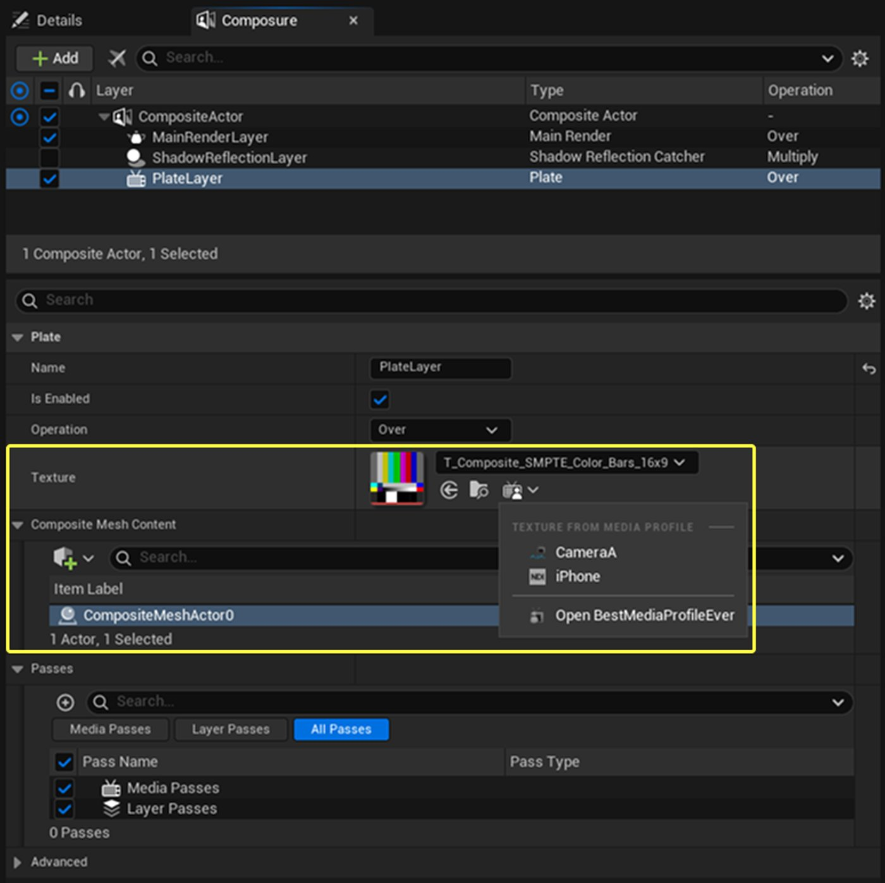

# Composure

> 路径：虚幻引擎5.7文档 / 使用媒体 / 媒体集成 / Real-Time Compositing with Composure / Composure

> 原始页面：https://dev.epicgames.com/documentation/unreal-engine/composure

该页面没有可用的官方中文版本；以下内容保留原文，并按本项目人工译文规则逐步回译。

### 设计动机

**Composure（实时合成）** 为 live video input 以及 file / image media plate 提供了可行的实时合成平台，填补了 Unreal Engine **virtual production（虚拟制片）** 能力中的关键空白。

### 范围说明

Unreal Engine 5.7 以 Experimental 形式重新引入 Composure，作为更新后的实时合成系统。新的 Composure 是一个基于 layer 的工具，相比旧系统有多项改进，包括：

- 重新设计的用户体验和精简后的工作流。
- 高性能 **Shadow and Reflection（阴影和反射）** 集成，可结合 live-action footage 使用 **Custom Render Pass（自定义渲染 Pass）**.
- 改进的 **Keyer（抠像器）**.

旧版 Composure 仍然可用，但不再维护，并会在后续逐步淘汰。

### 适用人群

一般来说，Composure 和实时合成最适用于使用 live-action footage 的工作. Sophisticated **Computer-Generated（CG）** 合成仍更适合使用 Nuke 和 After Effects 等专用离线工具. Composure 旨在支持的两类最常见镜头是：

- 将 greenscreen / bluescreen 前景素材叠加到 CG（Unreal Engine）背景上。
- 将 CG（Unreal Engine）前景元素 / 角色叠加到 live-action 背景素材上。

虽然最终质量的合成镜头是可能的，但影视制作更可能先将 Composure 用于现场制作期间的 Simulcam 风格预览/电视制作会在现场制作期间将 Composure 用于 Simulcam 风格预览，并在剪辑阶段用于 post-vis. 广播场景（例如新闻、体育等）.) 也属于新 Composure 的候选使用方向.

### Legacy Composure

虽然 Unreal Engine 5.7 重新引入的 Composure 技术上属于 Experimental，但现有功能集已有官方文档，并优先记录以避免版本混淆。以后，之前 / 现有系统将标记为 **Legacy Composure**。Legacy Composure 的文档不会再更新。可以在 Unreal Engine 5.6 文档中找到 Legacy Composure：

[Real-Time Compositing/Composure（实时合成）](https://dev.epicgames.com/documentation/unreal-engine/real-time-compositing-with-composure-in-unreal-engine?application_version=5.6)

仍可从 **Virtual Production** 菜单访问之前 / 现有的 Legacy Composure，供仍依赖它的用户使用。旧系统可能会保留数个版本，直到新系统稳定采用。

## 概述

新的 **Composure（实时合成）** **plugin** 重新引入对 Unreal Engine 实时合成管线的支持，并计划替代 **Legacy Composure** **plugin**。其目标是简化 CG-over-video 或 CG 环境中的 keyed-video 等常见用例工作流。它通过将 footage 投射到场景中引入 3D 工作流，从而改善 footage 与 CG 之间的交互。与 Legacy Composure 相比，新插件利用近期引擎特性，在 scene capture、custom render pass、primitive alpha holdout、per-render material branching 和 render dependency graph 方面有所改进。

合成设置由 **Composite Actor（合成 Actor）**控制。它会编排 layer（用于合并图像）和 pass（用于处理图像）。它还会根据需要自动管理 scene capture 或 lightweight custom render pass，以从主摄像机视点重新渲染世界中的部分内容。

- **Layer** 决定要合并什么以及如何合并，例如将带 holdout mask 的 main render 合并到 plate 上。Layer 还可以注册 pass，在渲染期间的不同节点预处理 input。

  - **Main Render Layer（主渲染层）**
  - **Plate Layer（板层）**
  - **Scene Capture Layer（场景捕获层）**
  - **Shadow Reflection Catcher Layer（阴影反射接收层）**
  - **Single Light Shadow Layer（单灯阴影层）**
  - **Processing Layer（处理层）**
- **Pass** 是添加到每个 layer secondary input 上的小型可复用图像处理器，例如 media texture 或 scene capture render。

  - **Centered Scale Pass（居中缩放 Pass）**
  - **Color Grade Pass（颜色分级 Pass）**
  - **Color Keyer Pass（颜色抠像 Pass）**
  - **Distortion Pass（畸变 Pass）**
  - **Fast Approximate Anti-Aliasing（FXAA）Pass**
  - **Post-Process Material Pass（后处理材质 Pass）**
  - **OpenColorIO Pass（开放色彩 IO Pass）**
  - **Subpixel/Morphological Anti-Aliasing（SMAA）Pass**

layer 和 pass 的简化结构。在此初始版本中，graph 结构仍然相当固定。

当 layer 需要额外 render 时，例如 shadow / reflection matte 或所选 actor 的 custom render，Composite Actor 会代表 layer 自动生成并拥有 scene capture。

### 3D 与 2D 工作流

#### 使用 Composite Mesh 的 3D 工作流（推荐）

在 plate layer 上使用 composite mesh 可启用 3D 工作流。这些 mesh 可在 main render 中作为 holdout occluder，而投射的 media 会对虚拟 CG object 的 indirect lighting 和 reflection 产生贡献。

#### 仅 2D

用户可以跳过 mesh，并在 main render 上以 2D 方式合成 scene capture layer. 这对简单合成镜头有用，但会失去来自 plate 的可信 indirect lighting.

## 入门

1. 添加 **Cine Camera Actor** 到关卡中。该摄像机应匹配真实摄像机，并作为其它 render 的投射源。

   1. 可选：校准后的 lens file component。按照 [Lens Calibration/Quick Start Guide](https://dev.epicgames.com/documentation/en-us/unreal-engine/camera-lens-calibration-quick-start-for-unreal-engine) 匹配物理摄像机镜头与引擎 cine camera 之间的 lens distortion，以获得准确合成和遮挡。
   2. 可选：用于 tracking 与 FIZ data 的 Live Link component。
2. 打开 Composure 窗口，路径为 **Window > Virtual Production > Composure**.
3. 点击 **Place Composite Actor** 将其添加到关卡：

   

   1. 它应预配置 3 个 layer：

      

      1. Main Render Layer: `MainRenderLayer`
      2. Shadow & Reflection Catcher Layer（未选中）： `ShadowReflectionLayer`
      3. **Plate Laye****r**: `PlateLayer`
4. 将 **Composite Actor（合成 Actor）** 指向 `CineCameraActor`，并更新 **Render Resolution（渲染分辨率）** 以匹配所需输出分辨率。

   
5. Select the `PlateLayer` and click **+** to **Place** **Composite Mesh Actor（合成网格体 Actor）** 到关卡中。

   

   1. 右键点击 actor 并选择 **Default Lit Masked** 材质类型，以捕获 CG shadow 和 reflection，并通过 alpha-masked edge 进行粗略 keying。
   2. 右键点击 actor 并选择 **Default Unlit Alpha Composite** 材质类型，用于 keying plate，同时保持良好的 alpha 质量（没有 shadow 和 reflection）。
   3. 可选地更新其 **Material Type** 以符合用例，方法是右键点击添加的 mesh，或使用 Composite Mesh Actor 上暴露的 Material Type 选项。

      
6. On the `PlateLayer`, update the **Texture** 为 live video input 设置 Texture。

   1. 注意，这里可以直接选择（live video）media profile texture。

      
7. 添加 **Hero CG Mesh** 放入场景，例如 **SM_MatPreviewMesh_01**).
8. 可选：选择 `ShadowReflectionCatcher` layer，然后选择要从中捕获 shadow 和 reflection 的 CG actor。

   > [!NOTE]
   > 该 **Shadow Reflection Catcher** layer 是开销最高的 layer，因为它会创建两个 scene capture。可以用速度更快的 **Single Light Shadow（单灯阴影）** layer 替代，以用质量换取性能。

   > 图片已省略：Shadow-reflection-layer-selected
9. Pilot cine camera。

   > 图片已省略：Image-of-airplane-icon-in-the-composure-tab

合成结果示例：

> 图片已省略：Image-of-camera-over-color-bars-background

## Actor 和 Component

### Composite Actor（合成 Actor）

中央合成编排器管理所有合成逻辑、tick、layer、pass 和 component。

#### 属性

| Property | 说明 |
| --- | --- |
| **Enabled** | 是否启用 composite 行为。此属性会通过 multi-user 序列化并事务同步。 |
| **Render Resolution（渲染分辨率）** | 用于 layer 可能创建的 transient scene-capture/render-target size。 |
| **Camera** | 对用作投射源的摄像机的引用，该摄像机可选 tracking 和 calibration。如果存在 lens file，也会自动从中派生属性。 |
| **Enable Screen Space Reflections** | 在 post-processing 中自动更新 screen space reflection，使 plate 出现在 reflection 中。 |
| **Overrides View User Flags / View User Flags（覆盖视图用户标志 / 视图用户标志）** | 用于在 composite render pass 中更改 material 的自定义 User Flag 值. 默认设置为 1，使 Lit material 可以使用 branching. (See `TestPostVolumeUserFlag` material node.) |
| **Main Render Output** | 用于控制 render color space 和 encoding 的设置。Default（Tonemapped/Final Color LDR）带 Tone Curve 的 Linear HDRLinear HDR（高动态范围） |
| **Allowed View Modes** | 将 composite rendering 限制到特定 view mode，这对 multi-viewport 工作流可能有用。**Default**：允许在 Lit、Path Tracing 或 Unknown view mode 的 viewport 上进行 compositing。**Media Profile（Unknown）**：只允许在 media profile viewport（默认 Unknown view mode）上进行 compositing。**All View Modes**：允许在所有 view mode 中进行 compositing。 |

### Composite Mesh Actor 和 Component

一个 **Composite Mesh Actor（合成网格体 Actor）** 及其内置 composite mesh component 是用于在场景中接收 video plate 的便捷对象。其 material 可使用预配置选项更新：**Default Lit Masked** 或 **Default Unlit Alpha Composite**。

> 图片已省略：Material-type-for-the-composite-mesh-actor

> [!NOTE]
> 此 actor 只是为了方便访问插件 material 而暴露；任意 mesh / material 组合都可用作 plate layer composite mesh. 也可以从默认插件 material 创建 material instance，以调整以下属性： **Metallic**, **Specular** and **Roughness**.

### 自动管理的 Component

以下 component 由 **Composite Actor（合成 Actor）**自动管理，除特定用例外不需要用户输入。

|  |  |
| --- | --- |
| **View-Projection Component** | 每帧将 camera view-projection matrix 写入 **Material Parameter Collection（材质参数集合）**（从 `MatrixParameterName` 开始的 4 个 vector）。通过 component reference 指向任意 `CameraComponent` 或 `CineCameraComponent`。 |
| **Composite Scene Capture（合成场景捕获）****s** | 对系统 capture 所用标准 `USceneCaptureComponent2D` 的 wrapper。Layer 通过 **Composite Actor（合成 Actor）** 获取并管理这些对象。 |

## Layer

**Layer** 按每个 layer 指定的 merge operation 顺序合并 texture 或 render target。它们按自底向上的方式运行，如 **Composure（实时合成）** 窗口所示。以下从左到右逐列说明 Composure 表：

1. **Active**：active state 控制 **Composite Actor（合成 Actor）** 是否正在 actively rendering。它还强制同一时间只能激活一个 composite actor。加入 multi-user 时，actor 会自动停用，并需要手动重新激活（通过 blueprint script）。此属性不会事务同步。
2. **Enabled**：每个 layer 或 actor 的 transacted 和 serialized enabled state。
3. **Solo**：Solo layer 允许一次快速预览单个 layer。
4. **Object Name**
5. **Type**：Actor 或 layer type 名称。
6. **Operation**：与前一个 layer 进行 merge 或 blend 的 operation。

Merge operator 控制每个 layer 或 element 如何在 scene composition 中组合。可选项很多，当前支持的 merge operation 如下：

|  |  |
| --- | --- |
| **None** | 当前 layer A 替换之前 layer B。 |
| **Over** | 当前 layer A 覆盖在之前 layer B 上：A + B * (1-a)。 |
| **Under** | 当前 layer A 位于之前 layer B 下：A * (1-b) + B。 |
| **Add** | 当前 layer A 加到之前 layer B：A + B。 |
| **Subtract** | 从当前 layer A 中减去之前 layer B：A - B。 |
| **Multiply** | 当前 layer A 乘以之前 layer B：A * B。 |
| **Divide** | 当前 layer A 安全地除以之前 layer B：A / B。 |
| **Min** | 当前 layer A 与之前 layer B 之间按 component 取最小值。 |
| **Max** | 当前 layer A 与之前 layer B 之间按 component 取最大值。 |
| **In** | 当前 layer A 由之前 layer B 的 alpha 遮罩：A * b。 |
| **Mask** | 当前 layer A 的 alpha 遮罩之前 layer B：B * a。 |
| **Screen** | Screen 高级 blend mode。 |
| **Overlay** | Overlay 高级 blend mode。 |
| **Darken** | Darken 高级 blend mode。 |
| **Lighten** | Lighten 高级 blend mode。 |
| **ColorDodge** | Color dodge 高级 blend mode。 |
| **ColorBurn** | Color burn 高级 blend mode。 |
| **HardLight** | Hard light 高级 blend mode。 |
| **SoftLight** | Soft light 高级 blend mode。 |
| **Difference** | Difference 高级 blend mode。 |
| **Exclusion** | Exclusion 高级 blend mode。 |

### Layer Base Class

该 **Layer Base Class** 暴露默认属性，例如 **Enabled**, **Solo**, **Name**、merge **Operation** （默认 **Over**），以及用于注册 **Pass** proxy 并发送到 render thread 的接口。

> 图片已省略：Layer-base-class-and-passes-options

### Plate（板层）

`UCompositeLayerPlate`: 集成 2D texture 或 media texture 集成为 plate.

#### 属性

| Property | 说明 |
| --- | --- |
| **Composite Meshes（合成网格体）** | 接收投射的 plate texture，在 main render 中标记为 holdout，但会在内置 custom render pass 中单独重新渲染。单独 render 会自动 dilate，以隐藏平滑后的 **Temporal Super Resolution（TSR）** primitive alpha holdout edge 下的 aliasing artifact。 |
| **Texture** | Plate source texture（`Texture2D` 或 `MediaTexture`），通常从 **Media Profile** video input 中选择。 |
| **Media Pass** | 渲染前作为一系列预处理步骤应用到 plate 上的 pass。Media pass 通常承载以下 pass，例如 **Centered Scale（居中缩放）** pass（用于抵消 overscan）或 **Color Keyer（颜色抠像）** pass。 |
| **Layer Pass（图层 Pass）** | 在 post-processing 期间、与其它 layer 集成之前应用的 pass。 |
| **Mode** | **Composite Mesh（合成网格体）** mode 会采样内置 custom render pass，而 **Texture** mode 会直接采样处理后的 plate texture（见下方图示）。 |

> 图片已省略：Example render pipeline with media, scene, and layer passes.

包含 media、scene 和 layer pass 的 render pipeline 示例。

作为对比，当 plate layer 启用 **Texture** mode 时，pipeline 会变为：

> 图片已省略：The-pipeline-is-changed-since-the-texture-mode-is-applied

### Scene Capture（场景捕获）

`UCompositeLayerSceneCapture`: 从 composite 管理的 scene-capture 渲染 actor 子集并合并结果.

> 图片已省略：Scene-capture-options

#### 属性

| Property | 说明 |
| --- | --- |
| **Actors** | List of meshes that auto‑drives the capture’s `ShowOnlyComponents`. |
| **Custom Render Pass（自定义渲染 Pass）** | 可选地作为 **Custom Render Pass（自定义渲染 Pass）** 以内联方式与 main renderer 一起运行。Custom Render Pass 是快速、最小化的 scene capture，不包含 lighting 和 anti-aliasing。 |
| **Layer Pass（图层 Pass）** | Render target processing pass，例如 **SMAA** 或 **FXAA** 应用在有 aliasing 的 custom render pass 上。该 **Scene Capture（场景捕获）** layer 会自动在 **Composite Actor（合成 Actor）**上创建 scene capture component。其属性可根据需要进一步调整。 |

### Single Light Shadow（单灯阴影）

`UCompositeLayerSingleLightShadow`：捕获单个 light（当前为 Directional）的 shadow map（Percentage-Closure Filtering，PCF，non-cascaded），并构建 shadow matte。

> 图片已省略：Single-light-shadow-options

由于使用 custom render pass 进行 depth rendering，此 layer 明显快于替代方案 `UCompositeLayerShadowReflection`, 但会产生有限/lower quality shadows. 此 layer 不包含 reflection.

#### 属性

| Property | 说明 |
| --- | --- |
| **Light** | reference light，其精确 transform 会用于渲染 shadow map。请通过 **piloting the light**确保 light 与投射阴影的场景对齐。当前仅支持 directional light。 |
| **Orthographic Width** | shadow map view 的期望宽度（world unit）。如果 light 不是 directional，则忽略。减小尺寸，使其只包含 light 视图中的投射阴影几何体。 |
| **Shadow Map Resolution（阴影图分辨率）** | shadow map texture 的分辨率。较低分辨率会导致 shadow 更模糊，但需要更高 shadow bias。 |
| **Shadow Strength** | 基础 shadow strength multiplier，范围 0 到 1。 |
| **Shadow Bias（阴影偏差）** | 用于避免 shadow acne 的 shadow bias。增大该值直到不需要的阴影消失（由 `r.Shadow.CSMDepthBias` console variable 自动缩放）。 |
| **Shadow Casting Content** | （可选）：要从 main camera view 的 scene depth 中移除的 shadow casting actor 列表。这有助于创建更干净的 shadow matte，避免 CG object 周围出现 aliasing dark edge。 |

### Shadow & Reflection Catcher（阴影与反射接收层）

`UCompositeLayerShadowReflection`: Produces a shadow / reflection matte，用于乘到 plate 上. 它使用两个 capture：一个包含 CG，一个不包含.

#### 属性

| Property | 说明 |
| --- | --- |
| **Auto-Configure Actors** | 将 CG 标记为正常可见，或在 scene capture 中隐藏但启用 shadows / indirect while hidden。隐藏可以在 multiplicative matte 上获得更干净的边缘，但会丢失 screen space **Ambient Occlusion（AO）**. |
| **Actors** | 要从中捕获 shadow 和 reflection 的 CG actor 列表。 |

#### 当前已知限制

- 由于本质上是乘法，reflection 当前会在具有零 component 的颜色上消失。
- reflection 可能会拾取背景中的饱和颜色，从而出现错误染色。

#### 补充说明

- 对于 animated skeletal mesh，可能需要在 **Composite Actor（合成 Actor）** 托管的 reflection-shadow-catcher component（反射阴影接收组件） 上手动禁用 `TemporalAA`。这样可以防止移动阴影产生 temporal history ghosting。
- 此 layer 明显比 Single Light Shadow 更重，但尽管存在已知限制，仍应产生更高质量结果。

### Processing（处理）

`UCompositeLayerProcessing`: 特殊 layer，不添加新 input，只处理之前 layer 的输出.

> 图片已省略：Pipeline-with-a-special-layer

更多信息请参阅下一节： [Pass](index.md#passes).

> [!NOTE]
> 一个重要用例涉及两个 **OpenColorIO（OCIO）** pass，用于在强制 render 为 HDR Linear（在 Composite Actor 上）时保留 Unreal Engine 的 tonecurve 外观。如果没有 **Academy/Color Encoding Specification（学院色彩编码规范）（ACES 2.0）**，颜色无法被完美保留，但在实践中足够好用。

请参阅 Open Color IO 文档： [Color Management/Open Color IO（Open Color IO 色彩管理）（Open Color IO 色彩管理）（Open Color IO 色彩管理）（Open Color IO 色彩管理）（Open Color IO 色彩管理）（Open Color IO 色彩管理）（Open Color IO 色彩管理）（Open Color IO 色彩管理）（Open Color IO 色彩管理）（Open Color IO 色彩管理）（Open Color IO 色彩管理）（Open Color IO 色彩管理）（Open Color IO 色彩管理）](../../../managing-color/color-management-with-opencolorio/index.md).

> [!NOTE]
> 强制 main render 使用 HDR Linear 有助于避免不正确的 blending artifact，这些 artifact 可能表现为 alpha gradient 中过亮的颜色。

## Pass

**Pass** 是添加到每个 layer secondary input 上的小型可复用图像处理器，例如 media texture 或 scene capture render。

#### Color Keyer（颜色抠像）

`UCompositePassColorKeyer`: Production‑面向生产的 keyer，支持 chroma keying、clean‑plate、spill removal、可选 pre‑denoise 和多种 visualization mode.

#### 关键属性

| Property | 说明 |
| --- | --- |
| **Screen Type** | screen color 类型（必需）。keyer 在红、绿或蓝背景上效果最佳。 |
| **Key Color** | 静态背景 key color。 |
| **C****lean Plate** | Clean plate background，用于按像素计算颜色差异，而不是使用静态 key color。分辨率必须匹配 composite actor render resolution。 |
| **R****ed / Green / Blue Weights** | 前景通道对 key matte hardness 的贡献权重。 |
| **Alpha Threshold** | 将指定 threshold range 外的 alpha 值分别保持为 0 或 1，中间范围线性插值。 |
| **De-spill Strength** | spill reduction 强度，0.0 表示无，1.0 表示完整。 |
| **D****De-vignette（去暗角）Strength（去暗角强度）（去暗角强度）（去暗角强度）（去暗角强度）（去暗角强度）（去暗角强度）（去暗角强度）（去暗角强度）（去暗角强度）（去暗角强度）（去暗角强度）** | vignette removal 强度。用于改善 plate 均匀性并移除较暗角落。 |
| **Preserve Vignette After Key** | 启用后，在输出 keyed plate 前会撤销 de-vignetting。 |
| **Denoise Method** | keyer 之前应用的 denoising method（None、Median3x3）。 |
| **Visualization** | 可视化 alpha key 或 fill。 |
| **Invert Alpha** | 反转 alpha key。 |

### Centered Scale（居中缩放）

`UCompositePassCenteredScale`: 缩放 footage，以抵消 overscan 或带黑边的未裁剪 footage (top / bottom bars are letterboxing, left / right bars are pillarboxing). 属性可从 Composite Actor 自动派生’s camera component reference.

#### 属性

| Property | 说明 |
| --- | --- |
| **Scale Mode（缩放模式）** | 居中缩放计算模式，用于将带黑边的 media texture 重新缩放到已受约束的 aspect ratio viewport 中。**None**：不应用约束。**Automatic**：从 parent layer media texture 和 composite actor camera 自动派生 aspect ratio。**AspectRatio**：根据 source 和 target aspect ratio 计算 scaling factor。**Manual**：手动定义 scaling factor。 |
| **Source Aspect Ratio（源宽高比）** | source container aspect ratio（或分辨率）。 |
| **Target Aspect Ratio** | 嵌入的 target aspect ratio（或分辨率），不含黑边。 |
| **Scale Factor** | 手动 scale factor。 |
| **O****verscan Uncrop Mode** | 用于反裁剪被 overscan 裁入 viewport 的 uncrop calculation mode。**None**: No crop applied.**Automatic**：从父级 composite actor camera reference 自动派生 overscan crop factor。**Manual**：手动定义 overscan crop factor。 |
| **Overscan** | 用于 uncrop 的手动 overscan，取值 0.0 到 1.0，匹配 source camera overscan。 |

### Color Grade（颜色分级）

`UCompositePassColorGrade`：应用常规 Unreal Engine color grading。有关 color grading control，请参阅 tonemapper 文档： [Color Grading/Filmic Tonemapper](../../../../designing-visuals-rendering-and-graphics/post-process-effects/color-grading-and-the-filmic-tonemapper/index.md).

### OpenColorIO（开放色彩 IO）

`UCompositePassOpenColorIO`：应用 `OpenColorIO` transform。请参阅 `OpenColorIO` 文档： [OpenColorIO/Quick Start Guide](../../../managing-color/color-management-with-opencolorio/opencolorio-quick-start/index.md).

### FXAA

`UCompositePassFXAA`: 用于 CG 的 non-temporal anti-aliasing. Expose Quality (0–5).

### SMAA

`UCompositePassSMAA`: 用于 CG 的 non-temporal anti-aliasing. Expose Quality (0–5) analogous to `r.fxaa.quality` scale.

### Distortion（UCompositePassDistortion）

`UCompositePassDistortion`: 使用 镜头畸变 scene-view extension（镜头畸变场景视图扩展）（镜头畸变场景视图扩展）（镜头畸变场景视图扩展）（镜头畸变场景视图扩展） 应用 Distort.

> [!NOTE]
> 此 pass 会自动应用，只能通过 code 或 Blueprint 访问。请参考 [Lens Calibration/Quick Start Guide](https://dev.epicgames.com/documentation/en-us/unreal-engine/camera-lens-calibration-quick-start-for-unreal-engine) 了解 lens distortion 的更多信息。
