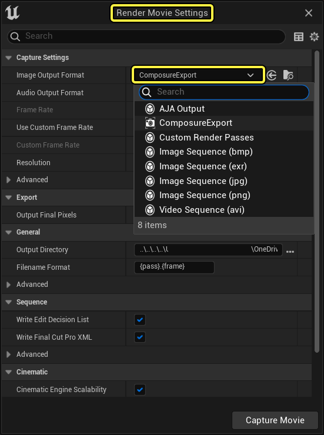
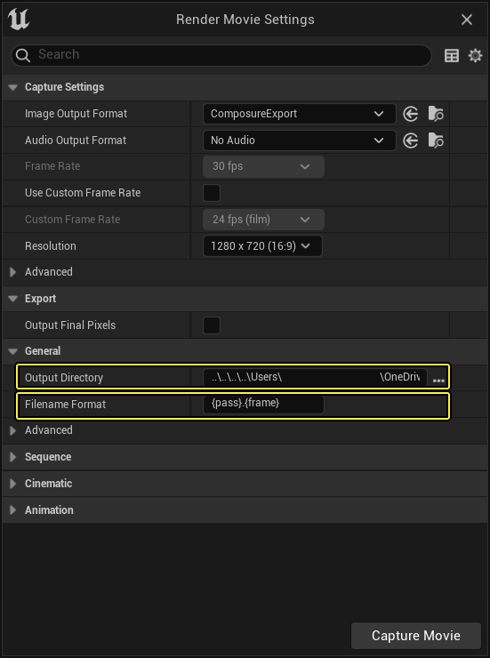

# 用Sequencer进行实时合成

> 路径：虚幻引擎5.7文档 / 使用媒体 / 媒体集成 / Real-Time Compositing with Composure / 用Sequencer进行实时合成

> 原始页面：https://dev.epicgames.com/documentation/unreal-engine/real-time-compositing-with-sequencer-in-unreal-engine

[Sequencer](../../../../animating-characters-and-objects/cinematics-and-movie-making/unreal-engine-sequencer-movie-tool-overview/index.md)是我们引擎中的过场动画编辑器，可与Composure合成系统结合使用。

Sequencer主要可用于：

1. 控制场景摄像机（由合成系统引用）。
2. 渲染合成内容及其贡献部分，包括任意输出值（AOV）。这实用于引擎之外的合成。

## 渲染元素和AOV

使用 **渲染影片设置（Render Movie Settings）** 对话框和 **Composure导出（ComposureExport）** 输出格式渲染序列时，可将任意Composure元素添加到序列中，指出其输出应被导出。

当这些元素作为此进程的一部分被渲染时，它们的最终输出将用对话框中指定的文件名格式作为EXR图像来写入磁盘。额外的格式说明符可以包含在 **{element}** 和 **{pass}** 的目录和文件名选项中。

> [!NOTE]
> 在Sequencer中为 **导出输出** 包含多个元素时，如果名称中不包含 **{element}**，则它们将写入到同一图像文件上。

在任意CG采集上配置 **要导出的缓冲（Buffers to Export）**，即可在每个元素上指定随每个元素导出的额外AOV。

添加新的缓冲显示材质，并使用以下格式将它们添加 `[Engine.BufferVisualizationMaterials]` 配置部分后，即可实现自定义AOV：

`CustomAOV=(Material="/Game/AOVs/CustomAOV.CustomAOV", Name=LOCTEXT("CustomAOV", "CustomAOV"))`

## 用Sequencer进行合成
