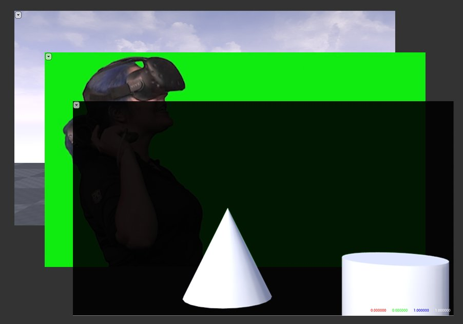
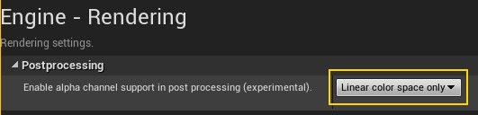
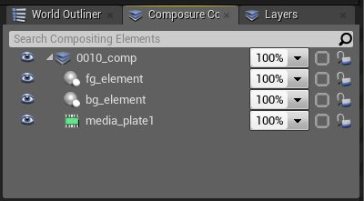

# 实时合成快速入门

> 路径：虚幻引擎5.7文档 / 使用媒体 / 媒体集成 / Real-Time Compositing with Composure / 实时合成快速入门

> 原始页面：https://dev.epicgames.com/documentation/unreal-engine/realtime-compositing-quick-start-for-unreal-engine

最基础的合成为三件式合成：CG背景、中间媒体（视频）板，以及CG前景。在本主题中，我们将展示如何使用Composure来构建一个基本的三件式合成。

## 1 - 加载Composure

### 步骤

1. 启用 **Composure插件**。
2. 启用插件后，打开合成树面板（在 **窗口（Window）** 菜单中显示为 **Composure合成**）。

## 2 - 添加根合成元素

然后将根元素添加至合成树。

### 步骤

1. 右键单击合成树面板，并在菜单中选择 **创建新合成（Create New Comp）**。然后，从 **选择合成类（Pick a Comp Class）** 对话框中选择 **空白合成镜头（Empty Comp Shot）**。

   此元素不会立即渲染任何内容，因为其代表最终合成。此元素将负责组合所有其他元素。

   > [!TIP]
   > 为保证可移植性，必须将元素添加到其自身的子关卡。由于元素是关卡Actor，此操作可在其他地图中加载合成树。

## 3 - 添加媒体/视频元素

拥有顶层合成元素后，需要添加子元素。子元素将填入其父元素（用于合成）。

### 步骤

1. 将 **媒体板** 添加至合成树。 右键单击合成树面板中的合成元素，然后在菜单中选择 **添加层元素（Add Layer Element）**。提示选择元素类型时，选择 **媒体板（Media Plate）**。

   > [!TIP]
   > 如无媒体源，**媒体板元素** 则为空。可在游戏配置文件中设置默认静态图像（如上方GIF所示）： `[/Script/Composure.ComposureGameSettings] StaticVideoPlateDebugImage="/Game/Path/To/My/TextureAsset"`
2. 设置 **媒体源**。 媒体元素默认不会连接到媒体源（如流送视频）。可将媒体纹理视作元素细节中的输入。选择新媒体元素，然后在细节面板中找到 **媒体源（Media Source）** 部分（在 **Composure**→**输入（Inputs）** 下）。 **MediaSource** 纹理属性将为空。

   > [!NOTE]
   > 利用采集卡将实况视频送入引擎来产生 **媒体纹理**。可以用同样的方法将其连接到合成系统中。如想了解设置方法的更多详情，请学习如何在虚幻引擎中使用采集卡和媒体包。
3. 配置 **色度镶迭颜色**。 **媒体板** 元素上有一组预定义的变换通道。这些通道用于媒体图像被合成之前调整媒体图像。其中第一个通道用于 **色度镶迭**。若要选择 **色度镶迭颜色**，在 **变换通道（Transform Passes）** 下找到镶迭通道，然后找到 **色度镶迭**。展开 **色度镶迭** 后可看到 **镶迭颜色** 属性。使用颜色框旁的选择器按钮可添加新的 **镶迭颜色**。

   单击选择器按钮将打开一个大型选择器窗口，以便选择颜色。在图像上任意处的单击鼠标对该像素进行采样即可选择颜色。单击并拖动将把采样的像素平均分配在一起，这样就可以得到更均匀的色度颜色。如对结果满意，请单击 **接受（Accept）**。

   > [!NOTE]
   > 可添加任意数量的镶迭颜色。当背景中有多个绿色阴影时，镶迭一种颜色不够时，此方法将有所帮助。但是，元素将对添加的每个 **镶迭颜色** 执行一次完整通道，对列表中的每个颜色运行一次镶迭材质。可能会产生一定性能问题。

   除镶迭颜色外，还可对许多其他设置进行调整，以完善镶迭。请查看通道中的 **材质参数** 部分。

   > [!NOTE]
   > 内置镶迭器需要图像在线性颜色空间中。如图像显示为不同颜色格式（如logC），那么必须在镶迭完成前添加颜色空间变换。此外，还可用自己的材质来代替镶迭器。

   除 **色度镶迭通道** 外，还有个单独的 **防溢出通道**，用于移除物体上的绿色反射。如需了解色度镶迭和防溢出的更多详情，请参见[此处](https://www.unrealengine.com/en-US/tech-blog/setting-up-a-chroma-key-material-in-ue4)的博文。
4. 预览结果。 有时很难了解镶迭器的工作成果。对于每个元素而言，都可以打开一个较大的预览窗口，并查看该图像的各个颜色通道。

   **镶迭选择器（Key Picker）** 窗口和 **关卡编辑器（Level Editor）** 预览窗格都拥有此功能。

   在这个进程中，不用担心其是否完美。预览整个合成场景时可随时对其进行调整。

## 4 - 添加CG元素

与添加媒体元素类似，需要添加前景和背景层的元素。

### 步骤

1. 添加 **CG层**。 右键单击树面板中的顶层合成元素，然后在菜单中选择 **添加层元素（Add Layer Element）**，并选择 **CG层（CG Layer）**。

   添加两个CG元素——一个用于前景物体，另一个用于背景物体，并将它们命名为：fg_element和bg_element。
2. 链接至场景摄像机。 CG元素需要场景中的摄像机进行提示：摄像机提示要渲染的视点。如场景中没有摄像机，CG元素将会显示"摄像机缺失（Missing Camera）"的警告消息。要解决此问题，在场景中添加一个摄像机Actor即可。

   > [!NOTE]
   > 如场景中有多个摄像机，可在元素的细节中指定要引用的摄像机（在 **输入（Input）** 下查找 **摄像机源（Camera Source）**）。
3. 设置Actor层。 现在已有两个CG元素（一个用于前景，另一个用于背景），需要指定每个Actor应渲染至哪些场景。 因此需要利用关卡编辑器的层系统。测试场景中已经添加了一些基础基元：一个立方体、一个椎体、一个球体和一个圆柱体。把椎体和圆柱体放在前景中，其他基元放在背景中。首先创建椎体和圆柱体的编辑器层。

   现在，在前景元素（fg_element）中找到 **采集Actor（Capture Actors）** 属性（在 **Composure**→**输入** 下），并向其中添加一个条目。**采集Actor（Capture Actors）** 列表指定要渲染的CG元素。

   在新的 **采集Actor（Capture Actors）** 条目中，将 **ActorSet** 属性设为之前创建的 **ConeAndCylinder** 层。因为条目的 **InclusionType** 被设为 **包括（Include）**，其将只渲染此类Actor。

   | 属性 | 描述 |
   | --- | --- |
   | **包括（Include）** | 仅渲染指定层中的Actor。 |
   | **排除（Exclude）** | 渲染除指定层中Actor外的所有项目。 |

   可向元素添加任意数量的 **采集Actor** 层。可混合/匹配包括项和排除项。 背景元素需要除 **ConeAndCylinder** 层外的所有内容。所以使用相同的层，但将 **InclusionType** 切换为 **排除（Exclude）**。

   > 动图已省略：image12.gif

   要使CG渲染拥有适当的合成不透明度，需将项目设置中的 **在后期处理中启用透明度通道支持（Enable alpha channel support in post processing）** 设为 **仅启用线性颜色空间（Linear color space only enable）**：

   

## 5 - 设置合成材质

现在已有了四个元素（顶层合成、**媒体板** 和两个CG元素），可将它们分层来生成合成。顶层合成元素负责合并所有其他元素。我们将把变换通道添加至合成元素，并对其进行设置，以便合成其他三个层。

### 步骤

1. 添加合成变换通道。 选择合成元素，然后在细节中查找 **变换通道（Transform Pass）** 属性。将条目添加到 **变换通道（Transform Pass）** 列表中。默认条目为 **自定义材质通道（Custom Material Pass）**，这正是所需的内容。
2. 创建合成材质。 2a. 新的通道需要用于渲染的材质。展开通道细节并新建其 **材质** 属性的材质。

   2b. 将新材质设为 **后期处理** 材质——此操作可确保结果输出到正确的通道。

   2c. 新材质中需要有三个子元素的纹理采样器。要进行此操作，创建三个纹理采样器参数，并将它们命名为与子元素匹配的名称。

   2d. 此类纹理参数将自动填充到三个子元素的结果中。要组合这三个元素，需要两个 **Over** 节点。 **Over** 节点获取 **输入A**，并将其叠在 **输入B** 上，使用 **输入A** 的alpha。需把媒体板夹在两个CG层之间。
3. - 设置一个Over节点，以便媒体板（**A**）在bg元素（**B**）上渲染。
   - 接下来，使用该Over节点的结果，将其插入到另一Over节点上的 **B** 中。
   - 最后，把**fg**元素插入第二个Over节点上的**A**中，将其置于顶部。
   - 第二个Over节点的输出应被插入材质的 **自发光颜色（Emissive Color）** 通道。
   - 保存并应用材质。

在合成窗口中查看结果。应出现一个合成了所有三个元素的单张图像。

> [!NOTE]
> Over节点需要一个 **float4** 输入，因此要使用纹理采样器的 **RGBA** 输出引脚，而非其顶部的 **RGB** 引脚。

> [!NOTE]
> Over节点使用输入 **A** 的alpha进行混合。默认情况下，项目将不会设为通过后期处理管线来传输alpha数据。因此必须启用此项目设置，才能使CG层正常工作。
>
> 

## 6 - 输出合成

如希望在编辑器中预览合成，请忽略这最后一步。但如希望将合成结果转存到硬盘或通过采集卡运行，请使用 **输出通道**。

本例将通过采集卡播放合成。

### 步骤

1. 在顶层合成元素的细节中，找到 **输出（Outputs）** 属性并将条目添加到该列表。默认为 **媒体采集**，这正是所需的内容。
2. 在新的输出通道中，您需要在通道的 **采集输出（Capture Output）** 属性中指定目标，并为其新建资源。

   为采集目标配置此资源，然后一切就绪。合成元素应会开始播放。

### 使用Sequencer

另外，也可使用引擎内置的动画编辑器[Sequencer](../../../../animating-characters-and-objects/cinematics-and-movie-making/unreal-engine-sequencer-movie-tool-overview/index.md)来渲染合成和AOV。如需了解更多详情，请参见[使用Sequencer进行实时合成](../real-time-compositing-with-sequencer/index.md)。
