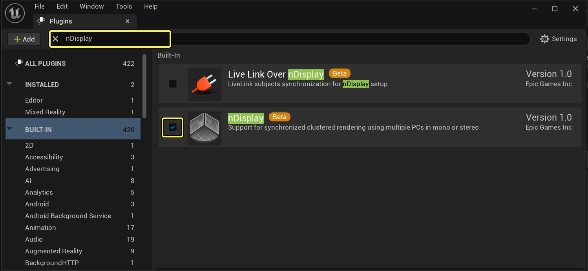
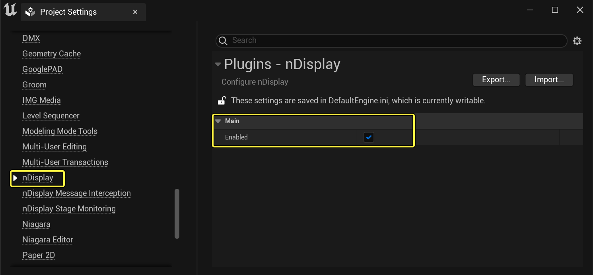

# 为现有项目添加nDisplay

> 路径：虚幻引擎5.7文档 / 使用媒体 / 媒体集成 / 使用nDisplay在多显示屏上进行渲染 / 为现有项目添加nDisplay

> 原始页面：https://dev.epicgames.com/documentation/unreal-engine/adding-ndisplay-to-an-existing-project-in-unreal-engine

无需使用nDisplay模板项目便可通过nDisplay进行渲染。如拥有已设置内容的项目，可直接调整该项目以使用nDisplay。

要设置现有项目以使用nDisplay：

1. 启用nDisplay插件。 在虚幻编辑器中，在主菜单中选择 **编辑（Edit）>插件（Plugins）**。搜索"nDisplay"，并选中 **已启用（Enabled）** 复选框。

   
2. 启用项目的nDisplay。 在主菜单中选择 **编辑（Edit）>项目设置（Project Settings）**，找到 **插件（Plugins）> nDisplay** 部分。选中 **已启用（Enabled）** 复选框。

   
3. 重新启动虚幻编辑器并重新打开项目。
4. 将生成的配置文件拖入 **内容浏览器**。它会被自动转换为 **UAsset**。或者，添加一个新的 **nDisplay配置** UAsset（位于 **nDisplay** 内容浏览器中的媒体分类中）
5. 浏览[快速入门指南](../ndisplay-quick-start/index.md)，继续学习剩余设置指南。
