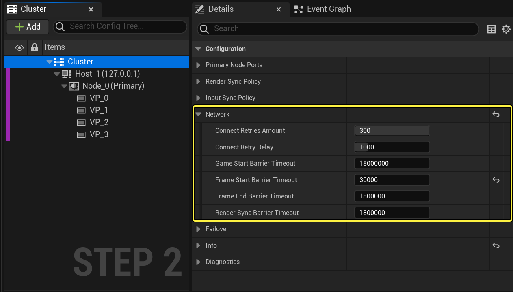

# 更改nDisplay通信端口

> 路径：虚幻引擎5.7文档 / 使用媒体 / 媒体集成 / 使用nDisplay在多显示屏上进行渲染 / 更改nDisplay通信端口

> 原始页面：https://dev.epicgames.com/documentation/unreal-engine/changing-ndisplay-communication-ports-in-unreal-engine

## 网络配置

**网络配置** 部分提供的设置可以用来控制超时和其他与nDisplay群集节点之间网络通信有关的设置。

要访问网络设置：

1. 在

   nDisplay 3D配置编辑器

   中打开你的nDisplay配置资产。
2. 在

   群集（Cluster）

   面板中，选择

   群集（Cluster）

   以打开其

   细节（Details）

   面板。
3. 在 **细节（Details）** 面板中，可以看到 **网络（Network）** 配置。

   

   Click image to expand.

### 参数

| 参数 | 默认值 | 说明 |
| --- | --- | --- |
| 连接重试次数（Connect Retries Amount） | 300 | 当非主要群集节点启动时，此设置将确定节点在主PC关闭之前尝试连接的次数。 |
| 连接重试延迟（Connect Retry Delay） | 1000 | 当非主要群集节点启动时，此设置将确定节点在每次尝试连接主PC失败之后的时间间隔，以毫秒为单位。 |
| 游戏启动屏障超时（Game Start Barrier Timeout） | 18000000 | 设置虚幻引擎应用程序在主节点上等待所有群集节点进入就绪状态的时间间隔，以毫秒为单位，之后将启动游戏循环的第一帧并开始渲染到主窗口。 这让你的所有群集节点都有机会连接到主PC，然后再开始渲染。在此期间，主窗口将黑屏。如果在此时间间隔结束时，有群集节点尚未成功连接到主PC，群集中的所有实例都将关闭。 如果你的群集花费了漫长的时间进行初始化，你可能需要增加此值。 |
| 帧启动屏障超时（Frame Start Barrier Timeout） | 30000 | 所有节点准备好在游戏线程上开始帧处理之前的等待时间。 |
| 帧结束屏障超时（Frame End Barrier Timeout） | 18000000 | 所有节点在游戏线程上完成帧处理之前的等待时间。 |
| 渲染同步屏障超时（Render Sync Barrier Timeout） | 18000000 | 设置渲染线程的屏障超时，以毫秒为单位。这是用于在群集节点之间同步渲染线程的屏障超时。此值会在每个帧中使用多次。 换而言之，在运行时会使用该值来检测任何节点变得无法访问的情况。如果发生无法访问的情况，群集状态的状态将被确定为无效，所有节点都会将自己关闭。 |

**连接重试次数（Connect Retries Amount）** 和 **连接重试延迟（Connect Retry Delay）** 设置将协同工作，从而确定你的群集节点在启动时尝试连接到主节点的最大时间长度。例如，假设你将 **连接重试次数（Connect Retries Amount）** 设置为10，并将 **连接重试延迟（Connect Retry Delay）** 设置为1000毫秒。在启动时，每个节点都尝试连接到主PC。如果该连接失败，它将等待1000毫秒再进行重试。如果该尝试失败，它将再等待1000毫秒。在连续十次失败之后，群集节点将自动退出。只要群集节点与主PC建立了连接，计数就会停止。

## nDisplay通信端口

nDisplay系统通过四个TCP/IP端口在主机之间进行通信：

- 41001，用于群集同步
- 41002，用于渲染同步
- 41003，用于JSON群集事件
- 41004，用于二进制群集事件

你需要确保在所有计算机上都打开这些端口。

如果你要自己更改端口号，可以在以下位置执行该操作。

- 运行时同步端口

  - 主节点使用两个端口与群集中的其他节点同步数据。要设置这两个端口，请参阅

  群集设置

  .
- 群集事件端口

  - 主节点始终使用同一个端口与连接的客户端交换群集事件。这包括nDisplay群集中的另外两个节点，以及你编写的用于发送和检索群集事件的任何外部应用程序。要设置这个端口，请参阅

  群集设置

  。
- Switchboard和SwitchboardListener端口

  - Switchboard和SwitchboardListener都需要配置为使用同一个通信端口。你可以在

  Switchboard设置

  指定此参数。 此外，你需要使用端口参数，自行在每个主机上启动SwitchboardListener应用，例如： SwitchboardListener.exe -port=2980
