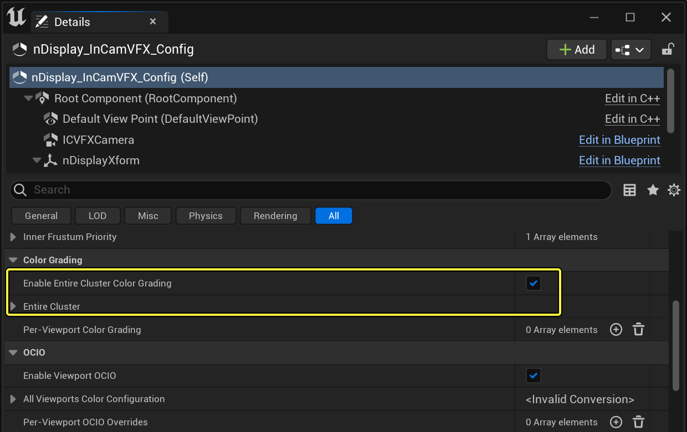
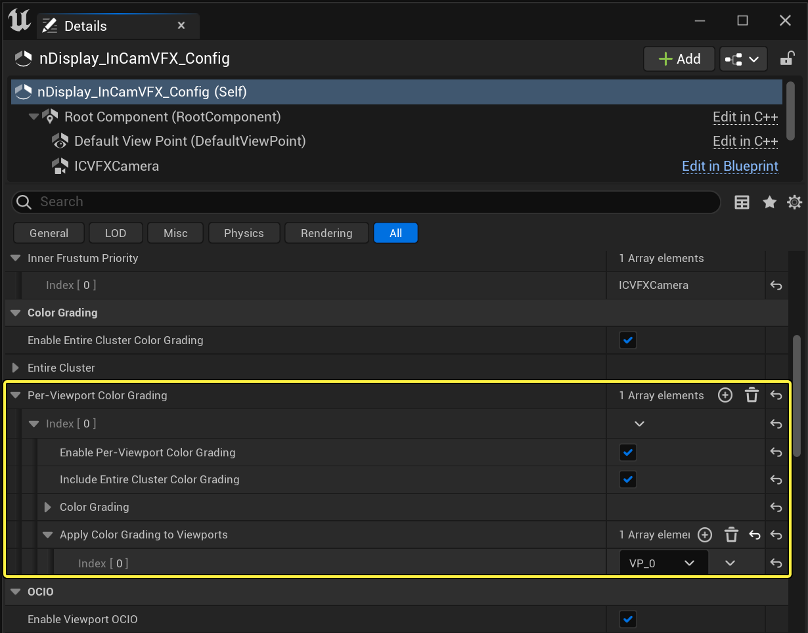
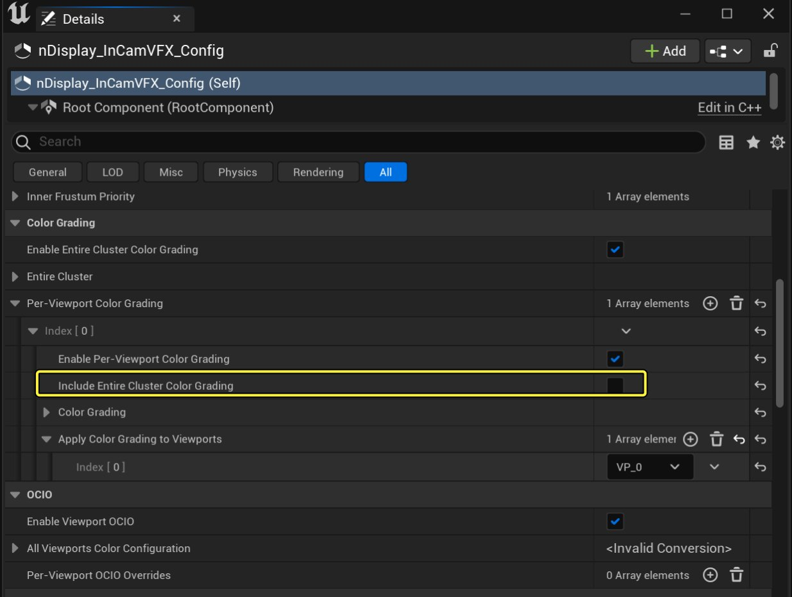
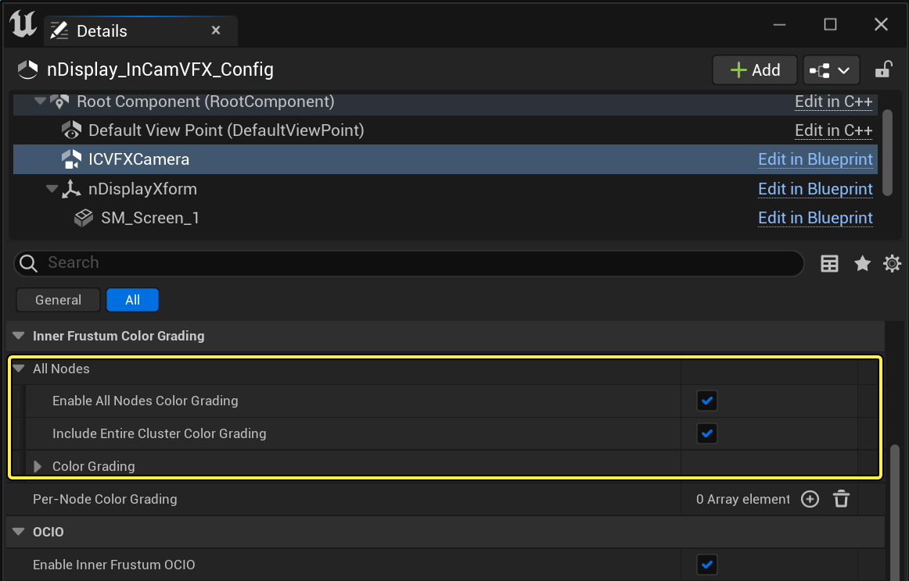

# nDisplay中的颜色管理

> 路径：虚幻引擎5.7文档 / 使用媒体 / 媒体集成 / 使用nDisplay在多显示屏上进行渲染 / nDisplay中的颜色管理

> 原始页面：https://dev.epicgames.com/documentation/unreal-engine/color-management-in-ndisplay-in-unreal-engine

nDisplay包含一些颜色管理工具，有助于你将颜色分级和OpenColorIO（OCIO）配置应用到显示设备上，而无需更改虚幻项目本身的整体外观。这些颜色设置可用于整个nDisplay群集，也可以用于单个视口和群集节点。

> [!TIP]
> 一般来说，在为项目实现所需的外观效果后，你可以试着使用这些nDisplay专用的颜色管理工具。这些工具对于调整内容在特定显示器上的外观非常有用。

这些设置在 nDisplay 3D 配置编辑器和 nDisplay Root Actor 中都被公开了，以便你进行快速迭代。对 nDisplay Root Actor 所做的更改可以通过[关卡快照](../../../../production-pipeline/collaboration-and-version-control/level-snapshots/index.md)进行跟踪。

> [!NOTE]
> 对 nDisplay 配置资产所做的更改保存在 UAsset 中。对 nDisplay Root Actor 所做的更改仅保存在配置资产的实例上，不会保存在 UAsset 中。

下述章节介绍了如何在nDisplay设置中使用颜色分级和OpenColorIO。

## 颜色分级

颜色分级选项的总体行为与[后期处理体积](../../../../designing-visuals-rendering-and-graphics/post-process-effects/color-grading-and-the-filmic-tonemapper/index.md#colorcorrection)相同，但是提供了额外选项，用于控制nDisplay不同视口以及不同群集节点之间的关系。有关 nDisplay 中被公开的设置的更多信息，请参见[nDisplay Root Actor参考指南](../ndisplay-root-actor-reference/index.md)。

颜色分级采用叠加算法：在启用多个颜色分级设置后，它们会像堆栈一样按顺序应用。例如，如果一个颜色分级设置应用了红色，另一个应用了蓝色，产生的颜色将是紫色，是两者的混合。

以下小节介绍了颜色分级应用于 nDisplay 群集不同部分后的行为。

### 视口

颜色分级会按以下顺序应用到视口中：

1. 后期处理体积
2. nDisplay Root Actor的整个群集的颜色分级
3. nDisplay Root Actor的逐视口颜色分级

当你为 nDisplay Root Actor 的整个群集启用颜色分级时，所有视口以及内部视锥都将应用相同的设置选项。下例展示了使用前后的效果：一个是禁用颜色分级的 nDisplay 群集，一个是应用蓝色的 nDisplay 群集。

禁用

启用

你还可以将颜色分级应用于 nDisplay 群集中的特定视口。当内容需要在不同型号以及不同品牌的显示器上显示不同颜色时，这很有用。

在下例中，只为天花板上的显示设备启用了颜色分级。最终颜色是紫色的，这是因为颜色分级是叠加的。单独用于该视口的红色会与用于整个群集的蓝色相混合。

你还可以单独选择视口是否应用"包含整个群集的颜色分级"。在下例中，天花板视口并未勾选 **包含整个群组的颜色分级（Include Entire Cluster Color Grading）**。天花板颜色是红色的，因为即使不包含整个群集的颜色分级，它仍然会应用逐视口的颜色分级。

### 内视锥体

如果被启用，颜色分级将按以下顺序应用到内视锥体上：

1. 后期处理体积
2. nDisplay Root Actor的"整个群集颜色分级（Entire Cluster Color Grading）"。
3. ICVFX摄像机组件的"所有节点颜色分级（All Nodes Color Grading）"
4. ICVFX摄像机组件的"逐节点颜色分级（Per-Node Color Grading）"

> [!NOTE]
> nDisplay Root Actor的"逐视口颜色分级"设置仅会应用于外视锥体。它不会影响内视锥体。

当在ICVFX摄像机组件上为所有节点启用调色时，这些设置将被应用到所有群集节点和视口的内层地壳上。

> 图片已省略：image alt text

你也可以对nDisplay群集中的特定群集节点应用颜色分级。当内容需要在不同型号以及不同品牌的显示器上显示不同颜色时，这很有用。

> [!NOTE]
> 在nDisplay群集中，对内视锥体的最佳调整粒度是逐节点调整。这是因为当mGPU被启用时，内视锥体可以在多个视口之间共享。

在下例中，我们为包含天花板面板的群集节点单独施加了一个颜色分级效果。当内视锥体从后面的面板移动到天花板上时，你可以看到内视锥体上的颜色变化。

> 图片已省略：Enabling per-node inner frustum color grading

> 图片已省略：image alt text

## OpenColorIO(OCIO)

nDisplay的OCIO设置的总体行为与编辑器的[OCIO](../../../managing-color/color-management-with-opencolorio/index.md)相同，并提供了额外选项，用于控制nDisplay视口之间以及群集之间的关系。有关nDisplay中被公开的设置的更多信息，请参阅[nDisplay根Actor参考](../ndisplay-root-actor-reference/index.md)。

与颜色分级不同，OCIO设置不是叠加的。通常，你可以为所有视口和内视锥体设置一个通用的OCIO配置文件，但你为每个视口或每个节点单独覆盖这些设置。你为nDisplay渲染内容设置的OCIO配置文件还会覆盖你为编辑器设置的OCIO配置文件。

我们在OpenColorIO插件中提供了一个通用的OpenColorIO配置，可作为你在项目中使用OCIO的起点。该配置适用于大多数摄像机和面板的组合，但你可能需要根据项目需求修改它。对于ICFVFCX场景来说，你通常需要为你的摄像机及面板组合设置一个单独的 **目的色彩空间（Destination Color Space）** 值。

下图显示了将OCIO配置应用于整个群集之前的nDisplay群集，以及应用配置之后的nDisplay群集。

> 图片已省略：禁用视口OCIO

> 图片已省略：启用视口OCIO

禁用视口OCIO

启用视口OCIO

与颜色分级类似，除了为整个群集应用OCIO配置，你还可以为nDisplay Root Actor上的每个视口应用OCIO配置。此外，你还可以对ICVFX摄像机组件上的所有（或部分）群集节点的内视锥体应用OCIO配置。

> [!TIP]
> 请确保同一视口（或节点）未被包含在多个OCIO覆盖中，因为你只能应用一个OCIO配置文件。如果你有多个覆盖连接到同一个视口或节点，最后那个覆盖中的OCIO配置文件将被应用。
