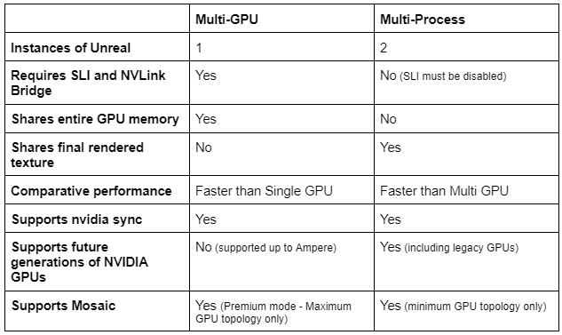

# 多进程渲染

> 路径：虚幻引擎5.7文档 / 使用媒体 / 媒体集成 / 使用nDisplay在多显示屏上进行渲染 / 多进程渲染

> 原始页面：https://dev.epicgames.com/documentation/unreal-engine/multi-process-rendering-with-unreal-engine

## 什么是多进程渲染？

**多进程渲染（Multi-Process Rendering）** 是利用多个GPU的算力进行nDisplay渲染的方法。这种方法允许在所有GPU上同时渲染特定的视口。例如可以用主GPU渲染外视锥体，同时用次GPU渲染内视锥体。

在绝大多数情况下（取决于场景），多进程渲染比4.27版本中引入的多GPU渲染性能更高。多进程和多GPU使用的物理硬件配置相同，因此切换到多进程工作流程没有弊端。多进程也是使用多个NVIDIA [ADA Lovelace](https://en.wikipedia.org/wiki/Ada_Lovelace) GPU进行渲染的推荐方式，因为它们不支持多GPU（mGPU）配置所推荐的NVLink。

顾名思义，多进程渲染就是在每个渲染节点上启动两个虚幻引擎的实例（或称进程）。第一个节点是普通的nDisplay节点。也即 **屏幕内节点（onscreen node）** ，因为它会渲染到LED墙上，并且渲染时在Windows中可见。第二个节点会作为单独的Windows进程运行，属于无头实例，不直接可见，因此被称为 **屏幕外节点（offscreen node）** 。

在上方的视锥体示例中，屏幕外节点将用次GPU渲染内视锥体，并将其作为纹理共享给屏幕内节点。屏幕内节点会用主GPU进行渲染，将内视锥体与外视锥体合成，并显示到LED墙上。

多进程只会通过CPU/主板在GPU之间共享最终渲染的纹理。共享渲染纹理比多GPU更高效，后者需要巨大的带宽才能通过NVLink和SLI共享所有GPU内存。

两种方法的对比见下表：

## 技术先决条件

- 至少两个

  GPU
- 必须禁用SLI

  （关于SLI的配置，请参阅

  Nvidia文档

  ）
- 如果使用Nvidia Mosaic，请确保未将其设置为Premium Mosaic，因为这会启用SLI
- 禁用Intel超线程/AMD同步多线程。

  建议这样做以确保最佳性能。请注意，禁用这两项功能可能会影响你正在使用的其他软件的性能。着色器编译时间可能因此延长。
- 当前支持的NVIDIA驱动程序和控制面板设置，包括同步。如需相关信息，请参阅我们的

  使用NVIDIA GPU进行nDisplay同步页面

  。

## 必备知识

- 熟悉

  ICVFX快速入门

  中的概念，包括如何创建新配置。

## 其他主题

- [多进程渲染快速入门](getting-started-with-multi-process-rendering/index.md)

- [从mGPU转换为多进程渲染](converting-from-mgpu-to-multi-process-rendering/index.md) - 转换现存的多GPU配置以供多进程渲染。

## 实用链接

- NVIDIA文件
- 使用NVIDIA GPU进行nDisplay同步
- ICVFX快速入门
