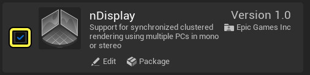
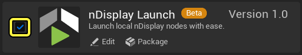
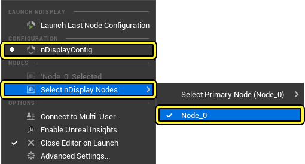
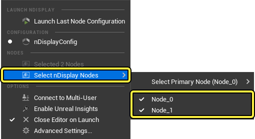
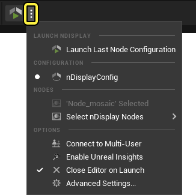
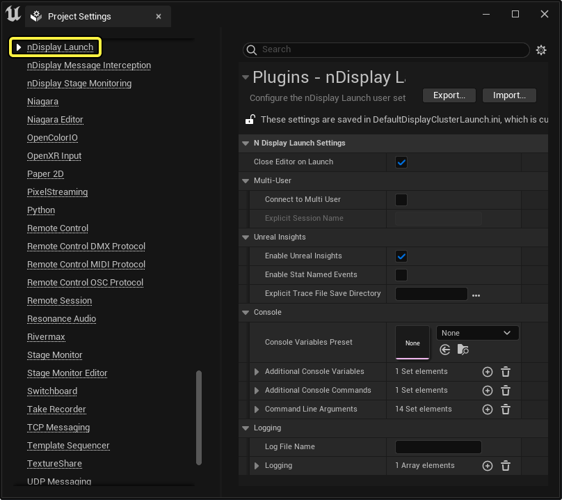

# nDisplay快速启动本地工具

> 路径：虚幻引擎5.7文档 / 使用媒体 / 媒体集成 / 使用nDisplay在多显示屏上进行渲染 / nDisplay快速启动本地工具

> 原始页面：https://dev.epicgames.com/documentation/unreal-engine/ndisplay-quick-launch-local-tool-in-unreal-engine

当你在 **虚幻引擎** 中创建虚拟制片项目时，可能会需要先在本地硬件上调试项目的外观和功能，而不是直接在虚拟制片舞台上启动。**nDisplay快速启动本地工具（nDisplay Quick Launch Local Tool）** 设计用于快速高效地启动你的虚拟制片项目，而不需要一个完备的虚拟制片舞台环境。这样可以为你提供一个安全、易于管理的环境来进行调试。

该文档将提供一个示例工作流程，向你展示如何在虚幻引擎中使用快速启动本地工具来启动虚拟制片项目。

#### 先决条件

- 启用

  nDisplay

  和

  nDisplau启动（nDisplay Launch）

  插件

  。在

  菜单栏（Menu Bar）

  中，找到

  编辑（Edit）

  >

  插件（Plugins）

  >

  虚拟制片（Virtual Production）

  ，然后找到

  nDisplay

  和

  nDisplau启动（nDisplay Launch）

  插件。你也可以使用

  搜索栏

  来查找。

- 启用这两个插件并且重启编辑器。
- 你必须有一个可用的虚拟制片项目，其中包含至少一个配置文件以及一个可用的簇显示节点。如果没有的话，可以使用[nDisplay模板](../ndisplay-template/index.md)项目。

## 设置nDisplay启动资产

安装好nDisplay和nDisplay快速启动插件后，便可以选择nDisplay配置资产，以及要用于启动和渲染虚拟制片项目的簇节点。

要设置nDisplay启动资产：

1. 在

   快速启动选项菜单（Quick Launch Options Menu）

   中，确保

   配置（Configuration）

   下的

   配置文件（Config File）

   已启用，并且

   节点（Nodes）

   >

   选择nDisplay节点（Select nDisplay Nodes）

   下选择了正确的

   簇节点（Cluster Node）

   。 在这个工作流程示例中，配置文件和簇节点都使用了默认的资产名称，分别是

   nDisplayConfig

   和

   Node_0

   。

> [!NOTE]
> 在使用多个簇节点的多显示实例中，你可以在 **选择nDisplay节点（Select nDisplay Nodes）** 菜单中单独切换每个节点。
>
> 
>
> 所有选中的显示节点都会在你的电脑上以它们自己的原生分辨率渲染。如果所有节点加起来的分辨率超出了你的显示器的分辨率，那么一些节点可能会渲染到显示器的视野之外。

1. 确保选中了正确的配置文件和节点后，

   保存

   你的项目。你现在便可以使用工具栏中的

   nDisplay启动

   按钮启动nDisplay。

要改善你的项目渲染性能，你可以启用[快速启动选项菜单](#quicklaunchoptionsmenu)中的 **启动时关闭编辑器（Close Editor on Launch）** 选项。

> [!TIP]
> 测试项目时仅运行一个nDisplay节点可以节省运算资源。

使用多用户项目时，多用户服务器会在你打开带有nDisplay启动工具的项目时自动启动。你还可以选择nDisplay快速启动选项菜单中的 **启用Unreal Insights（Enable Unreal Insights）** 来追踪你的项目数据和性能用于调试。要详细了解如何设置一个多用户项目，请参考[虚拟摄像机多用户快速入门指南](../../../../animating-characters-and-objects/cinematics-and-movie-making/movie-and-cinematic-cameras/virtual-cameras/virtual-camera-multiuser-quickstart-guide/index.md)文档。要了解如何创建多用户服务器会话，请参考[nDisplay多用户技术参考](ndisplay-multi-user-technical-reference/index.md)技术参考指南。

## 设置和选项

以下是用于nDisplay启动插件的设置。

### 快速启动选项菜单

通过 **nDisplay启动** 按钮旁的下拉菜单，你可以管理和设置配置文件、簇节点，以及nDisplay快速启动行为。

| 设置 | 描述 |
| --- | --- |
| **配置（Configuration）** | 选择启动nDisplay渲染时使用哪个 **配置文件（Config File）**。 |
| **连接到多用户（Connect to Multi-User）** | 启用后，nDisplay快速启动工具会试图连接到一个[多用户编辑环境](../../../../production-pipeline/multi-user-editing/index.md)。如果nDisplay启动项目设置中没有设置多用户会话，或者虚幻引擎无法连接到服务器，那么nDisplay快速启动工具会启动多用户服务器。 要手动设置一个会话名称，前往 **高级设置（Advanced Settings）** 中的 **多用户（Multi-User）** 属性。 |
| **启用Unreal Insights（Enable Unreal Insights）** | 启用后，**Unreal Insights** 调试工具会对nDisplay渲染进行读取和报告。 必须安装[Unreal Insight插件](../../../../testing-and-optimizing-content/unreal-insights/index.md)才能够使用该功能。 要设置Unreal Insights报告的文件目录和行为，请使用高级设置中的 **Unreal Insights** 属性部分。 |
| **启动时关闭编辑器（Close Editor on Launch）** | 启用后，虚幻编辑器会在启动nDisplay渲染时关闭。关闭编辑器可以减少计算机的运算负荷并且提升渲染性能。 我们建议你启动nDisplay时尽量使用少量的渲染节点，从而减少单个机器的运算负荷。 |
| **高级设置（Advanced Settings）** | 可以访问nDisplay启动工具[高级设置](#projectsettings)。你还可以前往 **菜单栏（Menu Bar）**，找到 **编辑（Edit）** > **项目设置（Project Settings）** 然后选择 **插件（Plugins）** 部分下的 **nDisplay设置（nDisplay Settings）**。 |

### 项目设置

以下是nDisplay启动插件设置。你可以通过[快速启动选项菜单](#quicklaunchoptionsmenu)中的 **高级设置（Advanced Settings）** 来访问。除此以外，你还可以前往 **菜单栏（Menu Bar）**，找到 **编辑（Edit）** > **项目设置（Project Settings）** 然后选择 **插件（Plugins）** 部分下的 **nDisplay设置（nDisplay Settings）** 来访问nDisplay启动设置。

| 设置 | 描述 |
| --- | --- |
| **启动时关闭编辑器（Close Editor on Launch）** | 启用后，虚幻编辑器会在启动nDisplay渲染时关闭。关闭编辑器可以减少计算机的运算负荷并且提升渲染性能。 |
| **连接到多用户（Connect to Multi-User）** | 启用后，nDisplay快速启动工具会试图连接到一个[多用户编辑环境](../../../../production-pipeline/multi-user-editing/index.md)。 要设置一个连接到的特定多用户会话名称，参考 **明确会话名称（Explicit Session Name）** 属性。 |
| **明确会话名称（Explicit Session Name）** | 为会话命名，在连接到一个[多用户编辑环境](../../../../production-pipeline/multi-user-editing/index.md)时使用。 如果该字段为空，编辑器会自动生成一个名称。 |
| **启用Unreal Insights（Enable Unreal Insights）** | 启用后，**Unreal Insights** 调试工具会对nDisplay渲染进行读取和报告。 必须安装[Unreal Insight插件](../../../../testing-and-optimizing-content/unreal-insights/index.md)才能够使用该功能。 要设置Unreal Insights报告的文件目录和行为，请使用高级设置中的 **Unreal Insights** 属性部分。 |
| **启用统计数据命名事件（Enable Stat Named Events）** | 启用Unreal Insight的 [统计数据命名事件](../../../../testing-and-optimizing-content/unreal-insights/unreal-insights-reference/index.md#controllingunrealinsights)功能。 |
| **明确Trace文件保存目录（Explicit Trace File Save Directory）** | 设置一个目录路径用于保存 **Unreal Insights Trace文件**。如果为空，Unreal Insights会自动将文件保存在本地。 如果你想要在本地保存Trace文件，必须安装并启用Unreal Insights插件。 要指定连接到的套接字，请使用指令行参数。 |
| **控制台变量预设（Console Variables Preset）** | 设置一个 **控制台变量资产（Console Variables Asset）** 来在nDisplay启动时默认应用。 设置的控制台变量资产中包含的全部可用指令和变量都会在 **额外控制台变量（Additional Console Variables）** 和 **额外控制台指令（Additional Console Commands）** 属性下定义的变量和指令之前执行。 要详细了解如何管理和编辑控制台变量，请参考[控制台变量编辑器](../../../../testing-and-optimizing-content/console-variables-editor/index.md)文档。 |
| **额外控制台变量（Additional Console Variables）** | 指定并设置额外的控制台变量。这些变量会在 **控制台变量资产（Console Variables Asset）** 中的变量之后定义和设置。 设置额外的控制台变量可以用于覆盖控制台变量资产中定义的变量。 |
| **额外控制台指令（Additional Console Commands）** | 指定并设置额外的控制台指令。这些变量会在 **控制台变量资产（Console Variables Asset）** 中的变量之后定义和设置。 设置额外的控制台指令可以用于覆盖控制台变量资产中定义的变量。 |
| **指令行参数（Command Line Arguments）** | 设置一个列表的Switchboard指令行参数，将由nDisplay启动工具执行，从而可以在单个工作站上模拟Switchboard应用的功能。 指令中不要包含连接号 ("-")。编辑器会在调用指令的时候自动添加连接号。 如果你的工作站装有不止一个GPU，你可以使用以下指令来让nDisplay启动工具使用多个GPU渲染你的项目。 `MaxGPUCount=2` 如果不手动指定该项的话，nDisplay将无法识别第二个GPU，并且像只有一个GPU的工作站一样运行。 |
| **日志文件名（Log File Name）** | 设置Unreal Insights记录启动的节点时使用的日志文件名。 如果不指定一个文件名，会自动生成和节点名称一样的日志文件。 |
| **日志记录（Logging）** | 设置哪个日志应该被记录在生成的日志文件中，以及日志的风格和详细度。 你还可以使用 (**+**) **添加** 来创建新的日志。 在提供的字段中输入日志类型可以选择日志 **类别（Category）**。 在对应的 **详尽度（Verbosity Level）** 下拉菜单中可以选择详尽度。 |
