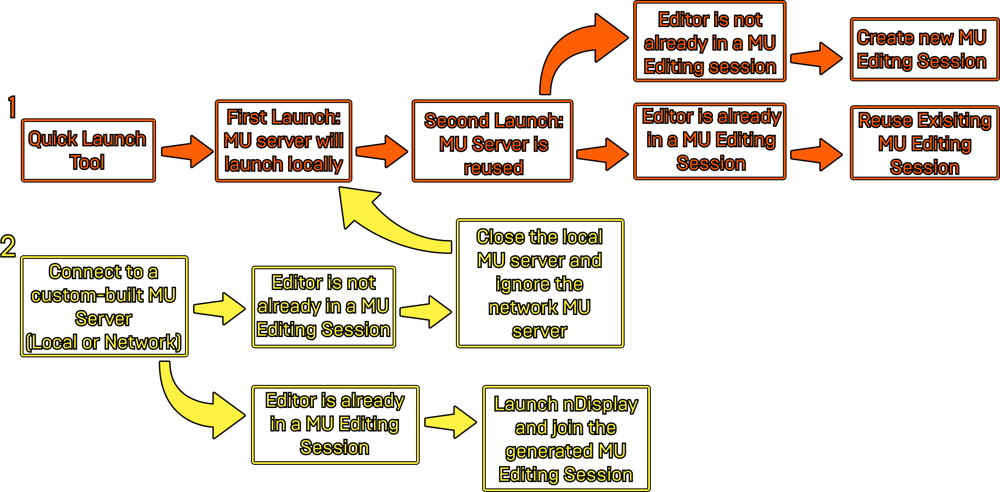

# nDisplay多用户技术参考

> 路径：虚幻引擎5.7文档 / 使用媒体 / 媒体集成 / 使用nDisplay在多显示屏上进行渲染 / nDisplay快速启动本地工具 / nDisplay多用户技术参考

> 原始页面：https://dev.epicgames.com/documentation/unreal-engine/ndisplay-multi-user-technical-reference-in-unreal-engine

用[nDisplay](../../ndisplay-overview/index.md)启动[多用户编辑会话](../../../../../production-pipeline/multi-user-editing/index.md)时， **虚幻引擎** 会自动创建一个本地服务器作为多个编辑用户同时使用的主机。

在该文档中，你将会了解到在虚幻引擎中使用nDisplay启动虚拟制片项目时，多用户服务器的连接逻辑。

## 多用户连接逻辑

第一次用nDisplay启动虚拟制片项目时，你可以使用[快速启动工具](../index.md)来自动启动一个本地服务器供多个用户连接。

第二次用nDisplay启动项目时，虚幻引擎会自动连接到已有的服务器，如果编辑器已经在会话中运行，还会重新使用已有的多用户编辑会话。如果编辑器没有在nDisplay多用户编辑会话中运行，虚幻引擎会在本地服务器上创建一个新的多用户编辑会话。

你还可以搭建你自己的自定义多用户服务器作为nDisplay多用户编辑会话的主机，用户可以通过本地连接或者通过网络连接。

试图加入一个基于网络的多用户服务器时，虚幻引擎会检查编辑器是否已经在一个多用户编辑会话中运行。如果编辑器正在编辑会话中运行，虚幻引擎会加入生成的多用户服务器和会话。如果编辑器没有在nDisplay多用户编辑会话中运行，那么虚幻引擎会关闭本地多用户服务器，忽视基于网络的多用户服务器，并且启动一个新的本地服务器。

你可以通过下方的示意图来更好地了解虚幻引擎多用户 (**MU**) 连接行为：

要进一步了解如何开始使用多用户编辑会话，请参考[多用户](../../../../../production-pipeline/multi-user-editing/index.md)文档。

要进一步了解如何用nDisplay启动虚拟制片项目，请参考[nDisplay](../../ndisplay-overview/index.md)文档。
