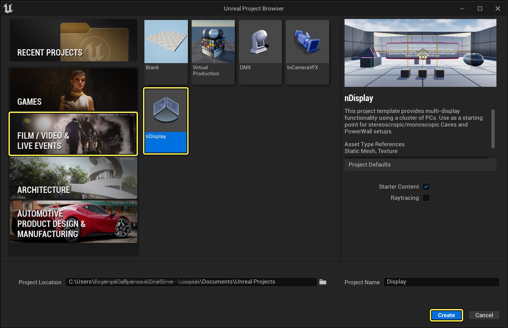
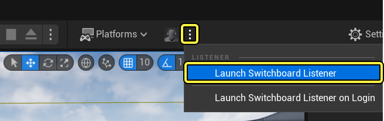
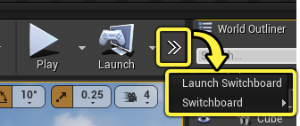
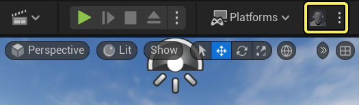
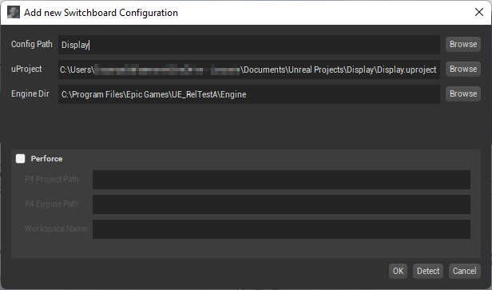
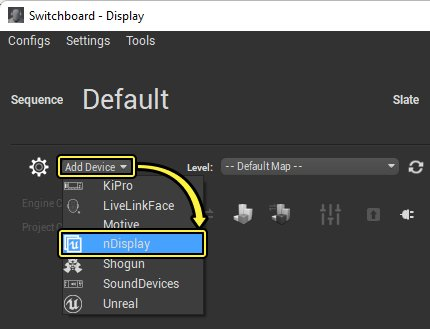
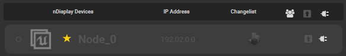
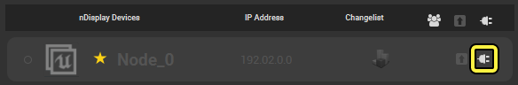

# nDisplay快速入门

> 路径：虚幻引擎5.7文档 / 使用媒体 / 媒体集成 / 使用nDisplay在多显示屏上进行渲染 / nDisplay快速入门

> 原始页面：https://dev.epicgames.com/documentation/unreal-engine/ndisplay-quick-start-for-unreal-engine

本页将介绍首次设置和运行nDisplay的方法。

> [!NOTE]
> **先决条件：**
>
> - 确保已设置物理设备（屏幕、投影仪等）并可正常工作。
> - 确保要在主计算机上使用的Windows帐户拥有要在nDisplay网络中使用的 *所有* 计算机的管理权限。
> - 确保要在nDisplay网络中使用的所有计算机都可通过端口41000、41001、41002和41003接收TCP/IP通信。（可转而使用不同端口；参阅[更改nDisplay通信端口](../changing-ndisplay-communication-ports/index.md)。）

## 步骤1 - 设置nDisplay的项目

设置项目以使用nDisplay的最简单方法是用 [nDisplay模板项目](../ndisplay-template/index.md)进行创建。你可以在新建项目窗口的 "电影、电视与实况活动" 分类中找到此模板：

点击查看大图

此模板将自动启用nDisplay和Switchboard插件，配置一些实用的额外设置，包括一些示例配置文件。

本文使用 **NDC_Basic** nDisplay配置资产来演示如何启动nDisplay（包含一个群集节点和一个视口）。

> [!NOTE]
> 如拥有要与nDisplay一同使用的现有项目，可手动进行相同的配置。参阅[为现有项目添加nDisplay](../adding-ndisplay-to-an-existing-project/index.md)。

## 步骤2 - 设置配置文件

模板项目已经包含一个nDisplay Root Actor，用于NDC_Basic配置。选中该Actor并在场景中移动它，以便在 nDisplay 群集配置中进行预览。这个实时配置预览旨在作为 nDisplay 设置的副本，供你在任何关卡或项目中预览。

要预览其他 nDisplay 配置，你只需将 nDisplay 配置资产从 **内容浏览器** 拖入 **视口。

## 步骤3 - 打包和部署

nDisplay的核心概念在于，它不会像你预期的那样点击"播放"就可以在编辑器中运行。实际上，nDisplay会作为虚幻引擎的单独实例运行，而我们会通过名为[Switchboard](../../../communicating-with-media-components-from/switchboard/index.md)的工具来启动实例。Switchboard及其随附的侦听程序还会在虚幻引擎外部运行。

> [!NOTE]
> 这些示例不使用回环地址127.0.0.1，因为它无法与其他非回环地址结合使用，例如属于其他电脑的地址（同一个Switchboard配置中）。回环地址可以使用，但只能在简单的配置中使用（即它是唯一地址），而且每个设备对于运行Switchboard的设备来说都是本地设备。在多机设置中混合使用环回和非环回地址会导致连接错误。

请以下步骤来启动nDisplay群集。

1. 在 **工具栏** 中，点击 **Switchboard** 旁的下拉箭头，选择 **启动SwitchboardListener**。SwitchboardListener会启动并立即最小化。SwitchboardListener需要在nDisplay群集中的每台计算机上启动。

   

   > [!TIP]
   > 如果你在工具栏中没有看到 Switchboard 选项，请单击双右箭头，查看更多选项。
   >
   > 
2. 在 **工具栏** 中，点击 **Switchboard** 按钮，启动电脑上的Switchboard应用程序。

   

   > [!TIP]
   > 首次启动Switchboard时，可能会出现一个命令提示窗口，用于在Switchboard窗口打开前安装所需的依赖项。
3. 当Switchboard打开后，会出现 **添加新的Switchboard配置** 窗口。在该窗口中，请确保 **配置路径**、**uProject** 和 **Engine Dir** 字段正确设置，然后单击 **OK**，打开一个空白配置。

   

   > [!NOTE]
   > Switchboard 配置本质是许多 Switchboard 设置的集合，保存在磁盘上。它们可以在任何时候被重新加载和切换。通常，你需要为每个项目创建一个Switchboard配置。
4. 在Switchboard中，点击左上方的 **添加设备（Add Device）**，选择 **nDisplay**，打开 **添加nDisplay设备（Add nDisplay Device）** 窗口。

   
5. 浏览并选择项目中的 **NDC_Basic.uasset** 配置文件，然后单击 **OK**，将配置资产中描述的所有nDisplay设备添加到Switchboard中。
6. 由于配置资产只指定了一个 nDisplay 群集节点，因此只有一个 nDisplay 设备会出现在 Switchboard 中（位于 **nDisplay设备** 中）。 将IP地址设置成你的计算机的外部IP地址。如果你想之后添加更多计算机到nDisplay集群中，你必须使用外部IP地址，而不是默认的localhost IP地址127.0.0.1，因为你无法在多机设置中同时使用环回和非环回地址。这些步骤使用 IP 地址 192.0.2.0 作为例子。

   
7. 单击 **连接监听器（Connect to listener）**，连接计算机的 SwitchboardListener。

   
8. 点击 **启动虚幻（Start Unreal）** 按钮，在电脑上启动虚幻和nDisplay渲染器。

   > 图片已省略：Click arrow button to launch the nDisplay instance
9. nDisplay 实例启动后，计算机上的所有其他窗口将最小化，留下 nDisplay 视口出现在桌面上。

> [!NOTE]
> 上述默认 Switchboard 启动机制使用了 -game 模式。你也可以使用烘焙好的版本。这需要你指定烘焙好的可执行文件的文件路径，而不是 uproject 文件的路径。
>
> 在处理烘焙好的版本时，你必须更新Switchboard设置，确保包含.exe文件的路径，并清空UProject路径。这样Switchboard就会忽略项目路径，转而烘焙好的 .exe 文件。
>
> > 图片已省略：Path to a cooked build

## 步骤4 - 自行尝试

本文介绍了在电脑上通过Switchboard设置和启动一个nDisplay群集节点的方法。

- 尝试使用

  nDisplay模板

  中的其他 nDisplay 配置，了解如何在多台机器上设置 nDisplay。确保你在每台机器上运行SwitchboardListener，以便从Switchboard连接到它们。
- 在多台显示器上创建无缝视图。请参阅

  nDisplay中的同步

  ，了解为设备设置显示器同步和genlock同步的方法。
- 如需在你的nDisplay群集中使用跟踪系统，你必须在群集配置中添加一个LiveLinkComponent。请参见

  Live Link

  了解更多信息。
