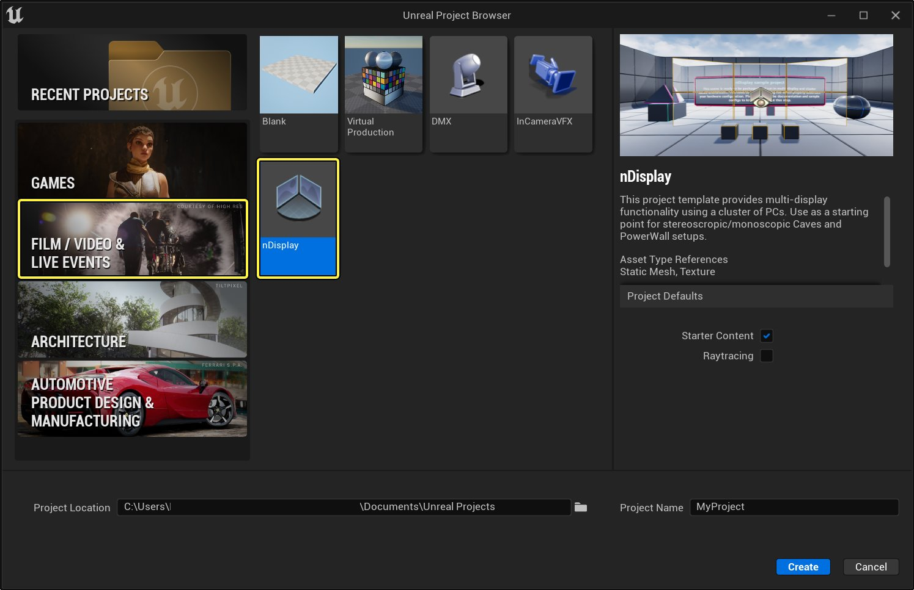
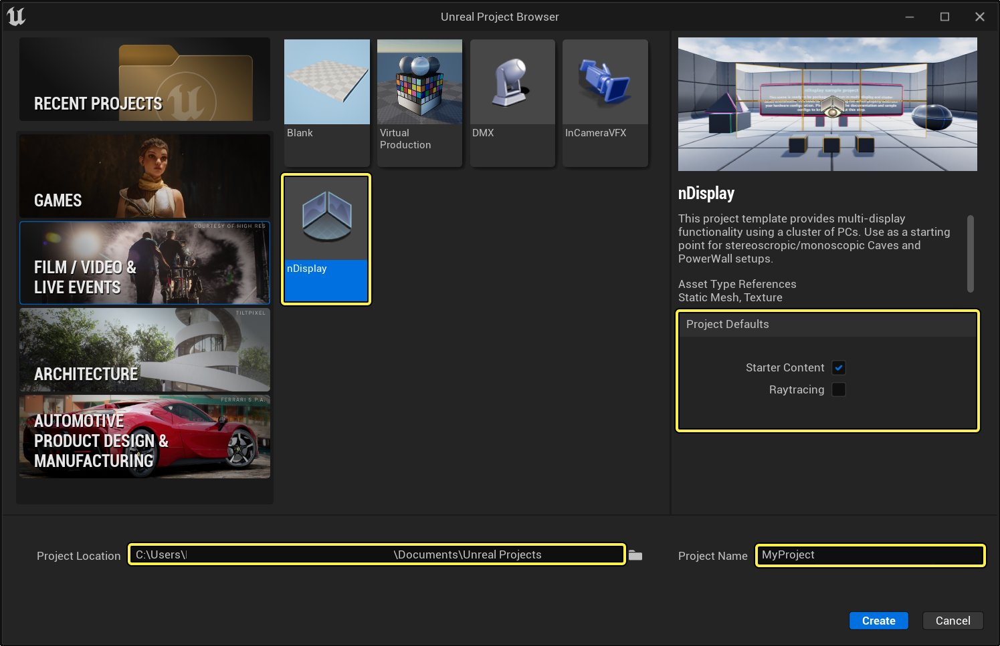
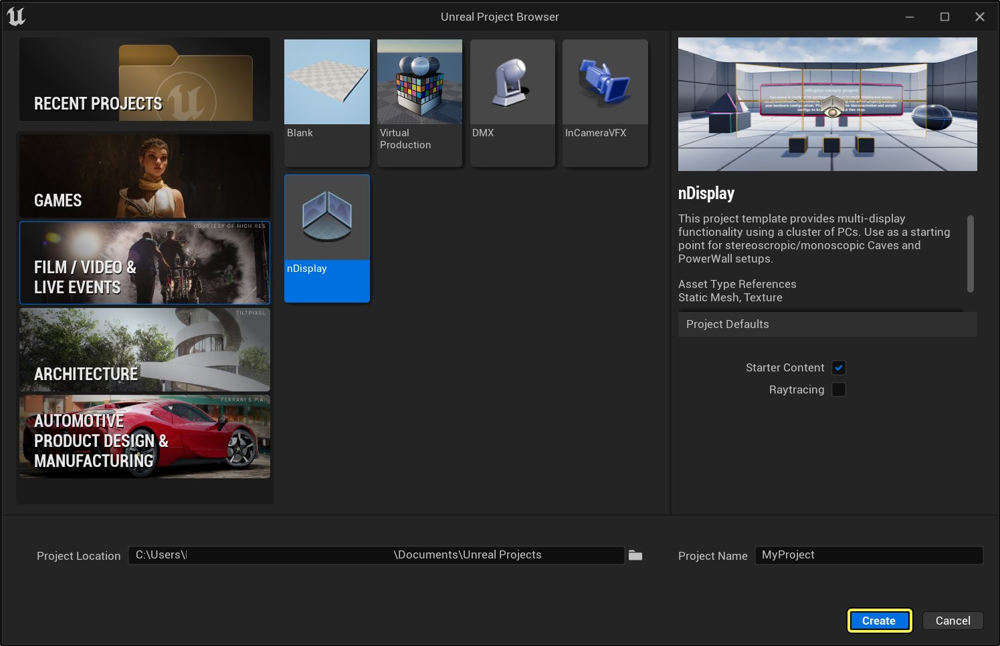
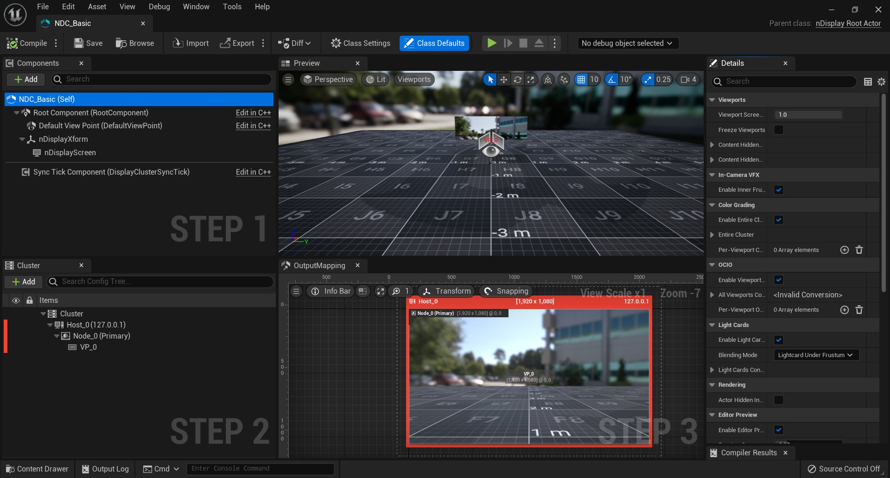
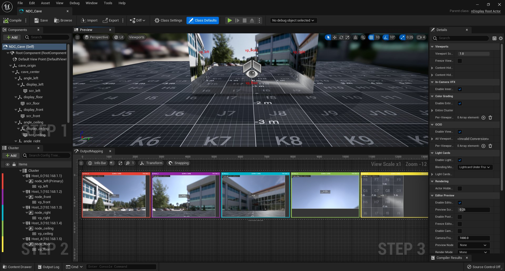
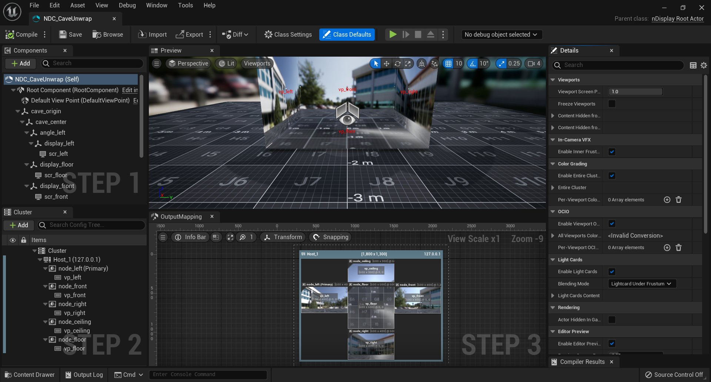
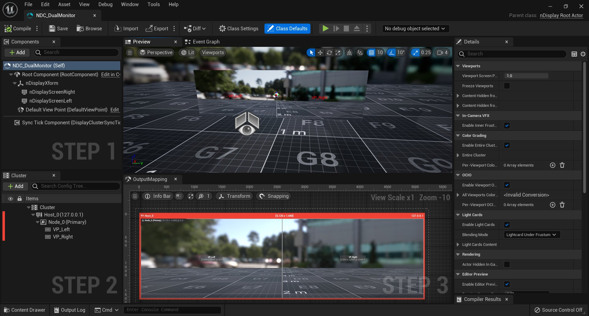
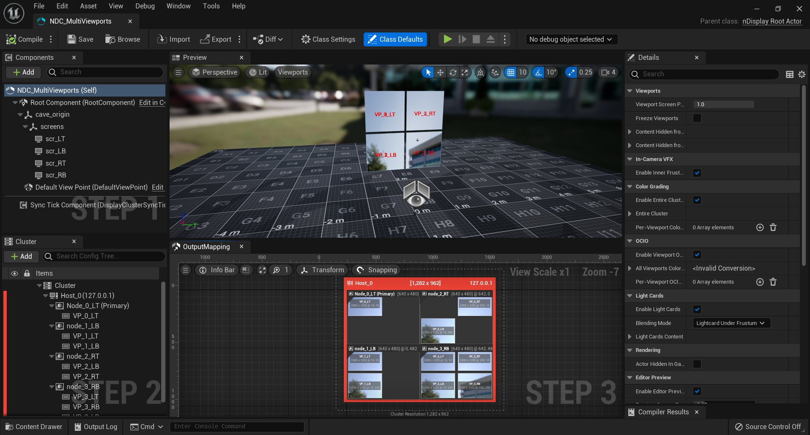

# nDisplay模板

> 路径：虚幻引擎5.7文档 / 使用媒体 / 媒体集成 / 使用nDisplay在多显示屏上进行渲染 / nDisplay模板

> 原始页面：https://dev.epicgames.com/documentation/unreal-engine/ndisplay-template-in-unreal-engine

在创建涉及复杂物理显示矩阵的影视类项目时，**nDisplay** 模板可作为项目的起点。该模板提供了大量常用的nDisplay设置，供你使用。

## 通过模板创建项目

1. 启动虚幻引擎，点击

   创建项目

   。
2. 选择 **影视活动（Film, Television, and Live Events）** 模板类型，然后点击 **下一步**。

   

   Click image to expand
3. 点击 **nDisplay**。选择是否包含初学者内容以及是否启用光追支持，然后确定项目路径何项目名称。点击 **下一步**。

   

   Click image to expand
4. Click **Create**.

   

   Click image to expand

## 模板功能

以下配置选项可在模板的 **ExampleConfigs** 目录中找到：

- NDC_Basic

  

  点击查看大图
- NDC_Cave

  

  点击查看大图
- NDC_CaveUnwrap

  

  点击查看大图
- NDC_DualMonitor

  

  点击查看大图
- NDC_MultiViewports

  

  点击查看大图
- NDC_WallCurved3x2

  > 图片已省略：undefined

  点击查看大图
- NDC_DualAppWindows

  > 图片已省略：undefined

  点击查看大图
- NDC_XRStage

  > 图片已省略：undefined

  点击查看大图
