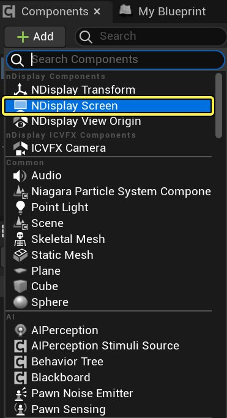
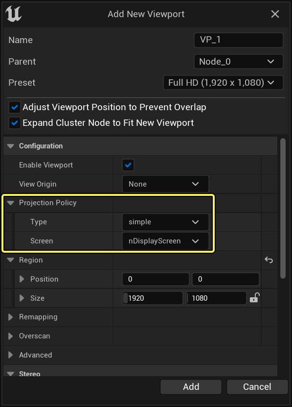
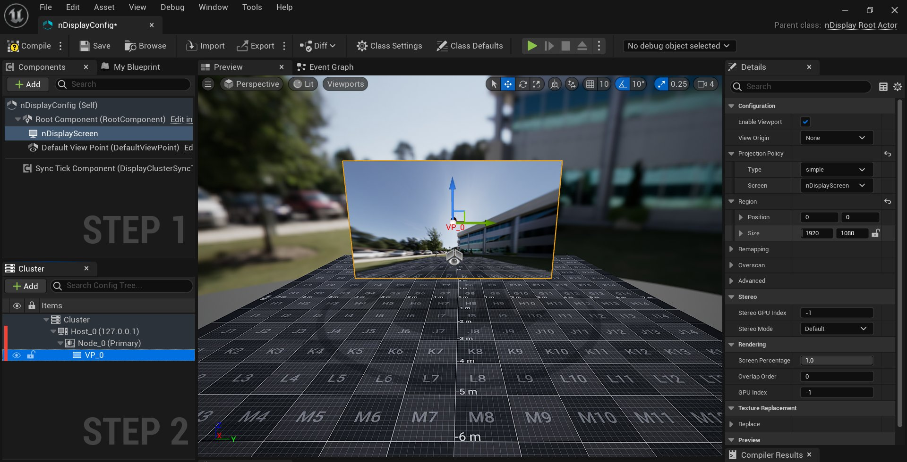
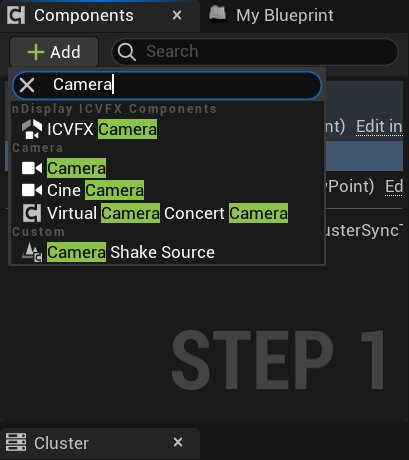
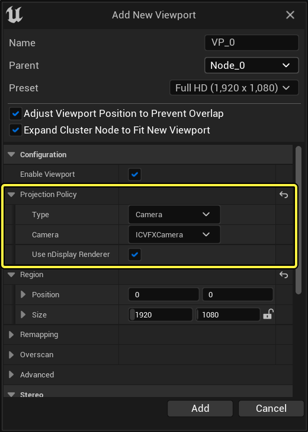
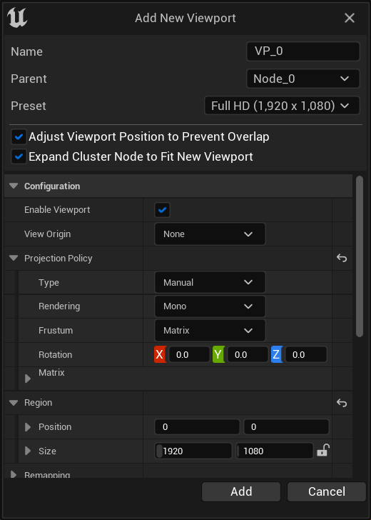
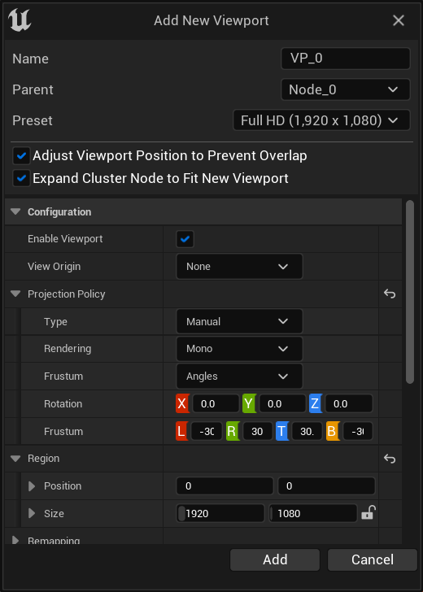
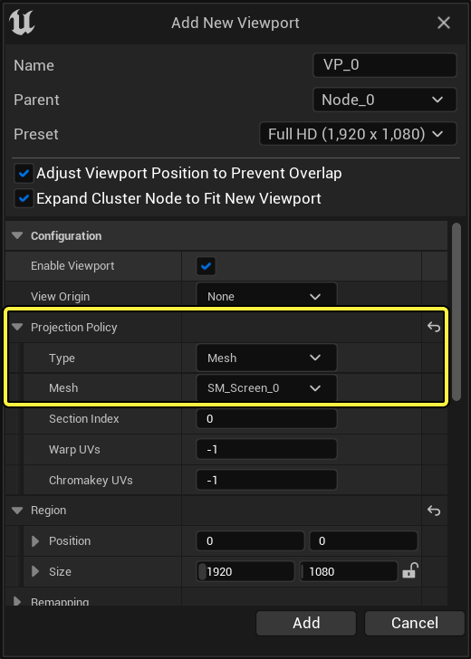

# nDisplay的投影策略

> 路径：虚幻引擎5.7文档 / 使用媒体 / 媒体集成 / 使用nDisplay在多显示屏上进行渲染 / nDisplay的投影策略

> 原始页面：https://dev.epicgames.com/documentation/unreal-engine/projection-policies-in-ndisplay-in-unreal-engine

## nDisplay中的投影策略

在开发新功能时，Epic Games采用的一种策略是评估能否用现有工具来为虚幻引擎添加新功能。经过反复研究，我们发现以下技术可以帮助我们实现"可缩放显示"这一目标。

## 简单策略

简单策略（Simple）是指用于在常规2D平面显示器上进行渲染的标准策略。此策略需要将3D空间中的矩形用于构建摄像机视锥。必须在配置文件中定义矩形（屏幕），然后在简单的投影策略中引用：

按照下面的步骤，在你的项目中使用简单策略。

1. 在nDisplay 3D配置编辑器中打开你的

   nDisplay3D配置编辑器

   。
2. 在 **组件（Components）** 面板中，选择 **添加组件（Add Component）**，然后选择 **NDisplay屏幕（NDisplay Screen）**。

   
3. 在

   群集（Cluster）

   面板中，选择

   添加新视口（Add New Viewport）

   。
4. 在

   配置（Configuration） > 投影策略（Projection Policy）

   下的添加新视口（Add New Viewport）窗口中，修改以下字段：

   - 将

     类型（Type）

     设置为

     简单（simple）

     。
   - 将 **屏幕（Screen）** 设置为你在第2步中创建的屏幕组件。在此示例中，屏幕名称是nDisplayScreen。

     
5. 验证屏幕正确渲染了视口。你可能需要在视口的 **细节（Details）** 面板中设置 **视图原点（View Origin）**，以查看测试场景。

   

   Click image to expand

## 摄像机策略

由于无法使用nDisplay从常规的虚幻引擎摄像机或电影摄像机获取视图，因此引入了 *摄像机策略*。你可以通过此策略将任何UE4摄像机的视图映射到nDisplay视口中。

按照下面的步骤，在你的项目中使用摄像机策略。

1. 在nDisplay 3D配置编辑器中打开你的

   nDisplay3D配置编辑器

   。
2. 在 **组件（Components）** 面板中，选择 **添加组件（Add Component）** 并选择摄像机组件中的一个：**ICVFX摄像机（ICVFX Camera）**、**摄像机（Camera）** 或 **电影摄像机（Cine Camera）**。

   
3. 在群集（Cluster）面板中，选择添加新视口（Add New Viewport）。
4. 在

   配置（Configuration） > 投影策略（Projection Policy）下的添加新视口（Add New Viewport）

   窗口中，修改以下字段：

   - 将

     类型（Type）

     设置为

     摄像机（Camera）

     。
   - 将

     摄像机（Camera）

     设置为你在第2步中创建的摄像机。在此示例中，摄像机命名为ICVFXCamera。
   - 为 "使用nDisplay渲染器" 选择设置。默认情况下，这将启用用于集群渲染的nDisplay渲染路径。禁用时，nDisplay 渲染器将被绕过，并会为此摄像机显示原生的UE像素。请在调试时禁用该项，或者在比较本地摄像机渲染与 nDisplay 集群渲染时禁用它。

     

验证摄像机正确渲染了视口。

## 手动策略

对于nDisplay还不支持的系统，通用的解决方案是引入新的 *手动投影策略*。关键理念在于用户为特定视口明确设置视锥。 立体渲染需要两个视锥。这可以通过投影矩阵或视锥角完成。如需详细了解nDisplay中的单一和立体渲染之间的差异，请参阅[nDisplay中的立体渲染](../stereoscopic-rendering-with-ndisplay/index.md)。

按照下面的步骤，在你的项目中使用手动策略。

1. 在

   nDisplay 3D配置编辑器

   中打开你的nDisplay配置资产。
2. 在

   群集（Cluster）

   面板中，选择

   添加新视口（Add New Viewport）

   。
3. 在

   配置（Configuration） > 投影策略（Projection Policy）

   下的

   添加新视口（Add New Viewport）

   窗口中，修改以下字段：

   - 将

     类型（Type）

     设置为

     手动（Manual）

     。
   - 将

     渲染（Rendering）

     设置为

     单一（Mono）

     、

     立体（Stereo）

     或

     单一和立体（Mono&Stereo）

     。
   - 将

     视锥（Frustum）

     设置为

     矩阵（Matrix）

     或

     角度（Angles）

     - 对于 **视锥矩阵**：设置 **旋转（Rotation）** 和 **矩阵（Matrix）** 字段（或者，如果选择了 **立体（Stereo）** 而非 **单一（Mono）**，则设置 **MatrixLeft** 和 **MatrixRight**）。

       
     - 对于 **视锥角度**：设置 **旋转（Rotation）** 和 **视锥（Frustum）** 字段（或者，如果选择了 **立体（Stereo）** 而非 **单一（Mono）**，则设置 **FrustumLeft** 和 **FrustumRight**）。

       
4. 验证视口正确渲染。

## 网格体

此投影策略简化了扭曲渲染工作流。现在已经不使用PFM（便携式浮动贴图）工作流，而是可以简单地指定网格体，以便有效地扭曲渲染输出。你可以使用NDisplayScreen，无论比率和像素密度如何，此方法都将创建2D显示，也可以使用 **静态网格体** 组件，组件可以是任意形状和外形的屏幕，用于指定所渲染的输出的形状。UV信道0用于扭曲映射。

按照下面的步骤，在你的项目中使用网格体策略。

1. 在

   nDisplay 3D配置编辑器

   中打开你的nDisplay配置资产。
2. 在

   组件（Components）

   面板中，选择

   添加组件（Add Component）

   并选择

   NDisplayScreen

   或

   StaticMesh

   。
3. 在

   群集（Cluster）

   面板中，选择

   添加新视口（Add New Viewport）

   。
4. 在

   配置（Configuration） > 投影策略（Projection Policy）

   下的

   添加新视口（Add New Viewport）

   窗口中，修改以下字段：

   - 将

     类型（Type）

     设置为

     网格体（Mesh）
   - 将 **网格体（Mesh）** 设置为你在第2步中创建的组件。在此示例中，它被分配到名称为SM_Screen_0的StaticMesh。

     
5. 验证视口在网格体上正确渲染。你可能需要在视口的细节（Details）面板中设置查看原件（View Origin），以查看测试场景。

   > 图片已省略：undefined

   Click image to expand

## MPCDI

对于那些依赖MPCDI行业协议标准的复杂项目来说，我们会集成MPCDI标准。

*MPCDI（多投影通用数据交换）* 标准由"VESA多投影仪自动校准"（MPAC）任务小组开发。这是投影校准系统与多显示器配置中的设备进行通信的标准数据格式。

该标准为多投影仪系统提供了一种生成数据的方法；通过利用该数据和各类设备，可以将单个显示组件组合成单一、无缝的图像。引入系统的任何新硬件都可以轻松地与标准集成。

MPCDI被行业中的内容生产商和供应商广泛使用，例如：

- Scalable Display Technologies
- VIOSO
- Dataton Watchout
- 7thSense Design

支持MPCDI标准使nDisplay能够以标准化和正规化的方式读取和存储描述复杂投影仪系统的数据，以便我们可以轻松地与行业内的其他工具进行通信和连接。编辑器预览和过扫描当前支持MPDC。

有两种使用mpcdi投影策略的方法。第一种是本机方法，用户必须指定要使用的.mpcdi文件、缓冲区和区域。第二种是用户明确指定存储在.mpcdi中的文件（本质上就是文件存档）。

### 使用.mpcdi文件

按照下面的步骤，在你的项目中针对MPCDI策略使用原生方法。

1. 在

   nDisplay 3D配置编辑器

   中打开你的nDisplay配置资产。
2. 在

   群集（Cluster）

   面板中，选择

   添加新视口（Add New Viewport）

   。
3. 在

   配置（Configuration） > 投影策略（Projection Policy）

   下的

   添加新视口（Add New Viewport）

   窗口中，修改以下字段：

   - 将

     类型（Type）

     设置为

     MPCDI

     。
   - 将

     MPCDI类型（MPCDI Type）

     设置为

     MPCDI

     。
   - 在

     文件（File）

     旁边，浏览到你的计算机上的

     .mpcdi

     文件。
   - 设置

     缓冲区（Buffer）

     和

     区域（Region）

     字段。
   - 将 **区域（Region）** 设置成 `.mpcdi` 文件缓存区中某个区域的名称。

     > 图片已省略：Configure the Projection Policy for MPCDI
4. 验证视口正确渲染。

### 明确规范

按照下面的步骤，在你的项目中明确指定如何使用MPCDI策略。

1. 1. 在

      nDisplay 3D配置编辑器

      中打开你的nDisplay配置资产。
2. 在

   群集（Cluster）

   面板中，选择

   添加新视口（Add New Viewport）

   。
3. 在

   配置（Configuration） > 投影策略（Projection Policy）

   下的

   添加新视口（Add New Viewport）

   窗口中，修改以下字段：

   - 将

     类型（Type）

     设置为

     MPCDI

     。
   - 将

     MPCDI类型（MPCDI Type）

     设置为

     显式PFM（Explicit PFM）

     。
   - 在

     文件（File）

     旁边，浏览到你的计算机上的.mpcdi文件。
   - 在

     Alpha遮罩（Alpha Mask）

     旁边，浏览到你的计算机上的.mpcdi文件。
   - 设置

     Alpha Gamma

     字段。
   - 在

     Beta遮罩（Beta Mask）

     旁边，浏览到你的计算机上的.png文件。
   - 设置

     比例（Scale）

     字段。
   - 如果要 **使用虚幻的轴**，请启用使用 **虚幻轴（Use Unreal Axis）**。

     > 图片已省略：Configure the Projection Policy for Explicit MPCDI
4. 验证视口正确渲染。

## EasyBlend（可扩展显示）

*EasyBlend* 校准数据的集成工作通过 *Scalable SDK* 完成，该SDK启用了扭曲、混合、梯形失真功能。这满足了使用多投影仪在非平面和复杂显示表面（例如曲面或圆顶形表面）上显示的要求。

*Scalable Display Technologies* 是一家专注于为复杂投影系统开发软件和SDK的公司。他们的SDK旨在通过扭曲和混合技术，为单幅图像的放大显示提供解决方案。考虑到Scalable Display Technologies已经有了现成的EasyBlend解决方案，并且可以处理大幅图像的扭曲和混合效果，因此我们选择将其集成到虚幻引擎中。

通过集成行业标准中间件Scalable SDK和EasyBlend，虚幻引擎支持扭曲和混合效果，适用于所有受支持模式、MPCDI的本地扭曲和混合、以及自定义实现。

我们实现了EasyBlend的集成，以便在配置复杂的投影系统方面提供无缝体验。使用第三方工具或软件完成校准后，用户只需在nDisplay配置文件中指定一些参数即可使其运行。

按照下面的步骤，在你的项目中使用EasyBlend策略。

1. 在

   nDisplay 3D配置编辑器

   中打开你的nDisplay配置资产。
2. 在

   群集（Cluster）

   面板中，选择

   添加新视口（Add New Viewport）

   。
3. 在

   配置（Configuration） > 投影策略（Projection Policy）

   下的

   添加新视口（Add New Viewport）

   窗口中，修改以下字段：

   - 将

     类型（Type）

     设置为

     EasyBlend

     。
   - 在

     文件（File）

     旁边，浏览到你的计算机上的.pol文件。
   - 设置 **原点（Origin）** 和 **比例（Scale）** 字段。

     > 图片已省略：Configure your Projection Policy for EasyBlend
4. 验证视口能根据EasyBlend校准文件正确渲染。渲染结果应该匹配供应商的参考图片。

## VIOSO

VIOSO校准数据的原生SDK集成可用于复杂表面上的投影器扭曲和软边缘融合。

使用VIOSO的工具和软件完成校准之后，按照下面的步骤在你的项目中使用VIOSO策略。

1. 在

   nDisplay 3D配置编辑器

   中打开你的nDisplay配置资产。
2. 在

   群集（Cluster）

   面板中，选择

   添加新视口（Add New Viewport）

   。
3. 在

   配置（Configuration） > 投影策略（Projection Policy）

   下的

   添加新视口（Add New Viewport）

   窗口中，修改以下字段：

   - 将

     类型（Type）

     设置为VIOSO。
   - 在

     文件（File）

     旁边，浏览到你的计算机上的.vwf文件。
   - 设置 **原点（Origin）** 和 **矩阵（Matrix）** 字段。

     > 图片已省略：Configure the Projection Policy for VIOSO
4. 验证视口能根据VIOSO校准文件正确渲染。渲染结果应该匹配供应商的参考图片。

## 穹顶投影

*穹顶投影（DomeProjection）* 的校准数据的原生SDK集成可用于大型圆顶表面上的投影器扭曲和软边缘融合。使用DomeProjection的工具和软件完成校准之后，将一些参数添加到nDisplay配置文件，以便在你的项目中使用。

1. 在nDisplay 3D配置编辑器中打开你的nDisplay配置资产。
2. 在

   群集（Cluster）

   面板中，选择

   添加新视口（Add New Viewport）

   。
3. 在

   配置（Configuration） > 投影策略（Projection Policy）

   下的

   添加新视口（Add New Viewport）

   窗口中，修改以下字段：

   - 将

     类型（Type）

     设置为

     穹顶投影

     。
   - 在

     文件（File）

     旁边，浏览到你的计算机上的.xml文件。
   - 设置 **原点（Origin）** 和 **信道（Channel）** 字段。

     > 图片已省略：Configure the Projection Policy for DomeProjection
4. 验证视口能根据穹顶投影校准文件正确渲染。渲染结果应该匹配供应商的参考图片。
