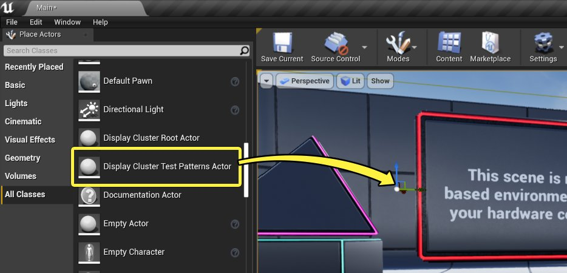
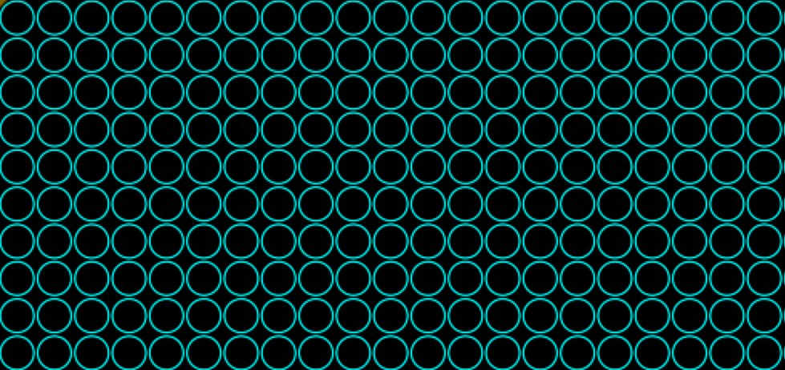
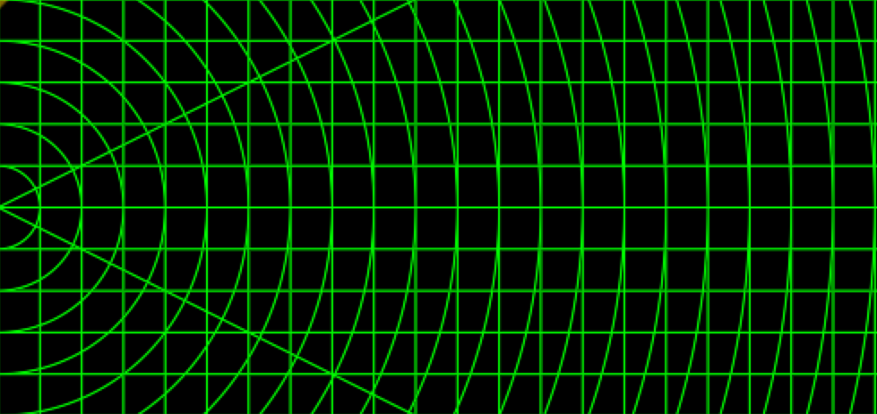
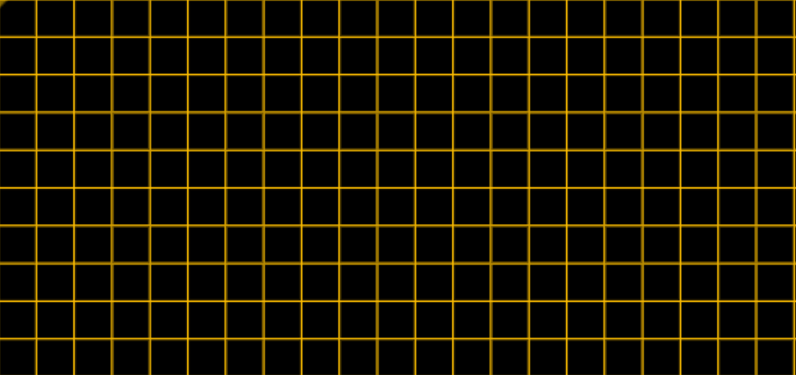

# 在nDisplay中使用校准测试图形

> 路径：虚幻引擎5.7文档 / 使用媒体 / 媒体集成 / 使用nDisplay在多显示屏上进行渲染 / 在nDisplay中使用校准测试图形

> 原始页面：https://dev.epicgames.com/documentation/unreal-engine/using-calibration-test-patterns-with-ndisplay-in-unreal-engine

在为新安装的设备设置nDisplay时，尤其是当多个视口分布在多块LED屏幕上时，有时可能会出现细微的显示问题，渲染3D虚拟场景时很难对它们进行检测和诊断。例如，相邻视口可能会出现撕裂，显示同步会出现问题，相邻视口间存在接缝，或相邻显示设备间存在轻微的颜色变化。

为了便于检测出此类问题，nDisplay提供了多种不同的2D测试图形，此类图形可平铺显示在显示设备上。此类测试图形的规律性有助于吸引你的注意力，以发现任何问题。如果你可确保Display装置能清晰地渲染测试图形而没有出现可见撕裂或同步问题，则当你使用设备来显示3D虚拟场景时，你可更加确信设备也会被同步锁定。

## 激活测试图形

1. nDisplay插件包括 **显示群集测试图形Actor（Display Cluster Test Patterns Actor）**。在 **放置Actor（Place Actors）** 面板中找到此Actor，并将其拖放到关卡视口中。

   
2. 请通过发出 `nDisplay.Calibration.Pattern` 控制台命令或向网络发送群集事件，激活你所选择的测试图形。有关详情，请参见下述[控制台命令语法](#%E6%8E%A7%E5%88%B6%E5%8F%B0%E5%91%BD%E4%BB%A4%E8%AF%AD%E6%B3%95)和[群集事件语法](#%E7%BE%A4%E9%9B%86%E4%BA%8B%E4%BB%B6%E8%AF%AD%E6%B3%95)章节。

   在这两种情况下，你都需要指定要激活的图形的名称，以及要显示的测试图形的视口。每个图形还提供其他可选参数，以便控制图形缩放和视口间移动速度等内容。

### 控制台命令语法

`nDisplay.Calibration.Pattern` 控制台命令的语法如下：

```
	nDisplay.Calibration.Pattern [pattern ID] [viewport IDs] [material parameter 1] … [material parameter N] 
```

其中包含下列参数

| 参数 | 说明 |
| --- | --- |
| **图形ID（pattern ID）** | 指定你希望激活的测试图形。此名称应该与分配给使用 **显示群集测试图形Actor（Display Cluster Test Patterns Actor）** 注册的一个测试图形的名称相匹配。如果此名称与此类测试图形均不匹配，则当前的测试图形将被移除。 |
| **视口ID（viewport IDs）** | 指定应显示测试图形的nDisplay视口。它必须是下列值之一： nDisplay校准文件中的一个视口部分的ID。 与nDisplay配置文件中的视口部分匹配的视口ID（以逗号分隔）列表。 特殊值 `*`，用于将测试图形应用于所有视口。 |
| **材质参数（material parameter）** | 覆盖所选图形的默认设置的参数和值列表。每个参数的形式应为 `<name>:<type>:<value>`，其中 `<name>` 是要设置的参数名称，`<type>` 是此参数管理的数据类型，`<value>` 是要设置的实际值。使用下面[测试图形和参数]Parameters](#testpatternsandparameters)部分的表格作为名称和类型参考。 `scalar` 类型的参数要求值为单个浮点数。 `color` 类型的参数要求值由四个用逗号分隔的浮点数组成。此类数字按以下 **RGBA** 顺序解译：红色、绿色、蓝色、alpha。 |

例如，此控制台命令将所有视口设为显示 `TPSCircles` 图形：

```
	nDisplay.Calibration.Pattern TPSCircles * 
```

此控制台命令仅在三个视口上显示 `TPSCircles` 图形，它们分别是 `vp1`、`vp2`、`vp3：

```
	nDisplay.Calibration.Pattern TPSCircles vp_1,vp_2,vp_3 
```

此控制台命令与上一个命令相同，但还会覆盖图形中线条宽度和颜色的默认值：

```
	nDisplay.Calibration.Pattern TPSCircles vp_1,vp_2,vp_3 LineWidth:scalar:0.2 LineColor:color:1,0,0,0 
```

### 群集事件语法

若要通过向nDisplay网络发送群集事件来激活测试图形，请按如下方式设置群集事件：

|  | 说明 |
| --- | --- |
| **事件类别（Event category）** | `nDisplay` |
| **事件类型（Event type）** | `Calibration` |
| **事件名称（Event name）** | `Pattern` |
| **参数1（Parameter 1）** | `PatternId = <pattern ID>` 其中 `<pattern ID>` 指定你希望激活的测试图形。此名称应该与分配给使用 **显示群集测试图形Actor（Display Cluster Test Patterns Actor）** 注册的一个测试图形的名称相匹配。如果此名称与此类测试图形均不匹配，则当前的测试图形将被移除。 |
| **参数2（Parameter 2）** | `ViewportId = <viewport IDs>` 指定应显示测试图形的nDisplay视口。`<viewport IDs>` 必须是下列值之一： nDisplay校准文件中的一个视口部分的ID。 与nDisplay配置文件中的视口部分匹配的视口ID（以逗号分隔）列表。 特殊值 `*`，用于将测试图形应用于所有视口。 |
| **其他参数（Additional parameters）** | 你可向群集事件传递其他参数来覆盖所选图形公开的默认设置。传递的每个参数的形式应为 `<name>:<type>:<value>`，其中 `<name>` 是要设置的参数名称，`<type>` 是此参数管理的数据类型，`<value>` 是要设置的实际值。使用下面[测试图形和参数]Parameters](#testpatternsandparameters)部分的表格作为名称和类型参考。 `scalar` 类型的参数要求值为单个浮点数。 `color` 类型的参数要求值由四个用逗号分隔的浮点数组成。此类数字按以下 **RGBA** 顺序解译：红色、绿色、蓝色、alpha。 |

## 测试图形和参数

本节介绍nDisplay预装的测试图形以及可为每个图形指定的参数。

> [!TIP]
> 如果你在关卡视口或 **世界大纲视图（World Outliner）** 中选择了 **显示群集测试图形Actor**，则你将在 **显示群集（Display Cluster）> 校准图形（Calibration Patterns）** 属性下的 **详情（Details）** 面板中看到所有可用校准图形列表。

### TPSCircles



| 名称 | 类型 |
| --- | --- |
| Repeats | 标量 |
| LineWidth | 标量 |
| LineColor | 颜色 |

### TPSColoredBars


| 名称 | 类型 | 注释 |
| --- | --- | --- |
| Shades | 标量 |  |
| Direction | 标量 | 设置长条的方向。接受下列值： `0`：垂直 `1`：水平 |

### TPSGrayBars


| 名称 | 类型 | 注释 |
| --- | --- | --- |
| Shades | 标量 |  |
| Direction | 标量 | 设置长条的方向。接受下列值： `0`：垂直 `1`：水平 |

### TPSGridCircles



| 名称 | 类型 |
| --- | --- |
| Repeats | 标量 |
| LineWidth | 标量 |
| LineColor | 标量 |

### TPAChevron


| 名称 | 类型 |
| --- | --- |
| Repeats | 标量 |
| LineWidth | 标量 |
| LineColor | 标量 |
| Speed | 标量 |

### TPAGrid



| 名称 | 类型 |
| --- | --- |
| Repeats | 标量 |
| LineWidth | 标量 |
| LineColor | 标量 |
| Speed | 标量 |

### TPAMirroredChevron


| 名称 | 类型 |
| --- | --- |
| Repeats | 标量 |
| Color1 | 颜色 |
| Color2 | 颜色 |
| Speed | 标量 |

### TPARadar

> 图片已省略：TPARadar

| 名称 | 类型 |
| --- | --- |
| Speed | 标量 |
| Power | 颜色 |

### TPAStrips

> 图片已省略：TPAStrips

| 名称 | 类型 | 注释 |
| --- | --- | --- |
| Repeats | 标量 |  |
| LineWidth | 标量 |  |
| LineColor | 标量 |  |
| Speed | 标量 |  |
| Direction | 标量 | 接受下列值： `0`：垂直 `1`：水平 |

> [!TIP]
> 你还可使用自己的自定义测试图形。在项目中新建一个后期处理材质，并将其添加到 **显示群集测试图形Actor** 的 **校准图形（Calibration Patterns）** 属性中。完成上述操作后，你即可使用控制台命令或上面所示的群集事件方法，在nDisplay群集中触发自己的测试图形。
