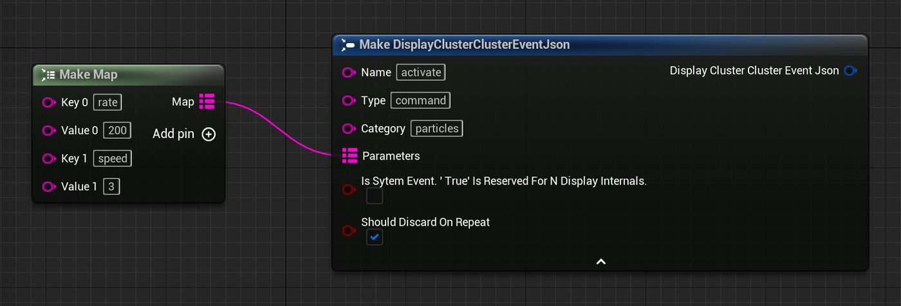
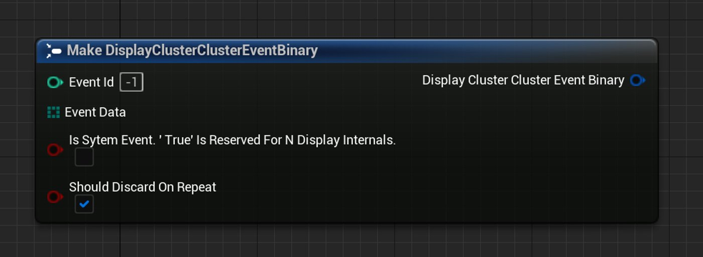
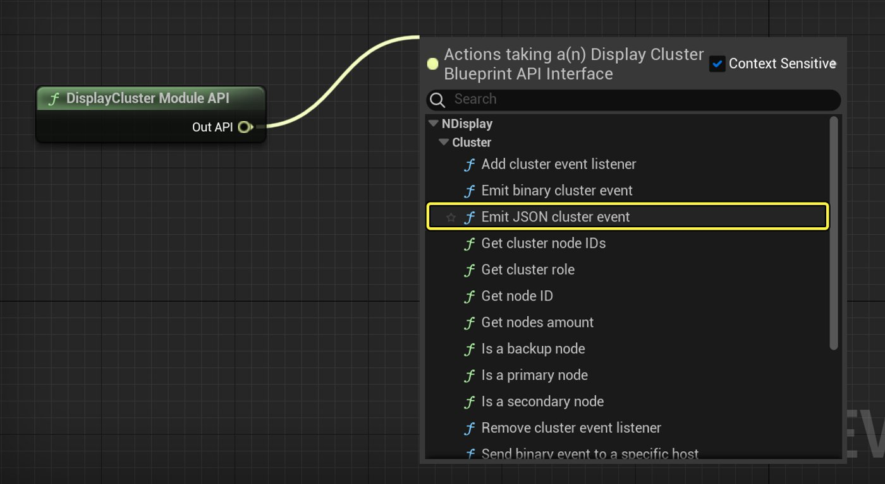
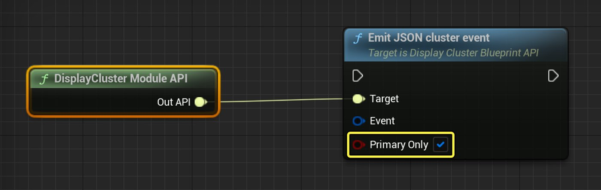
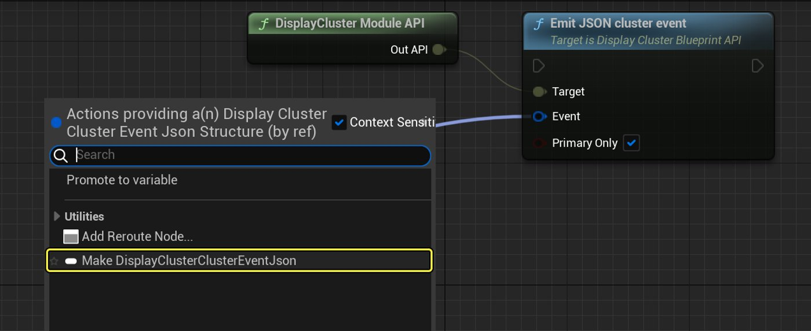
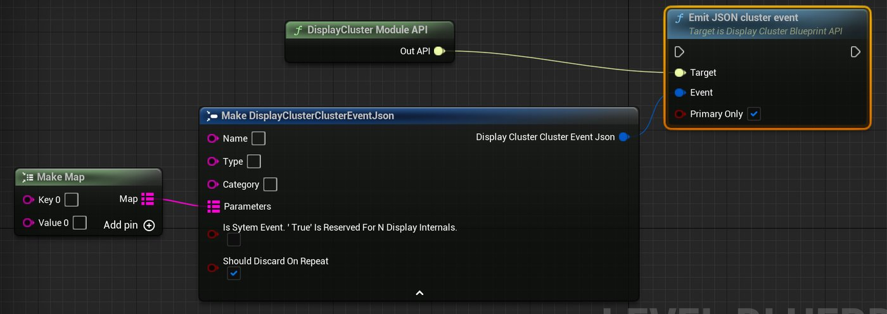
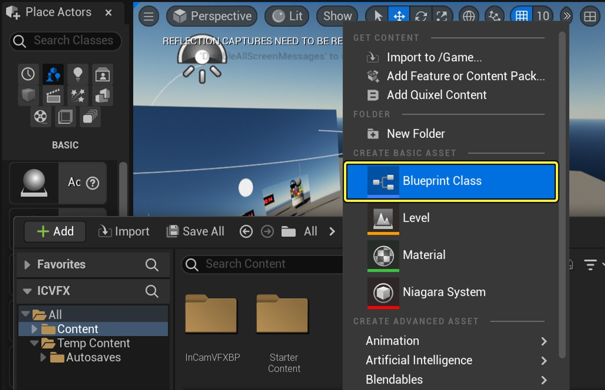
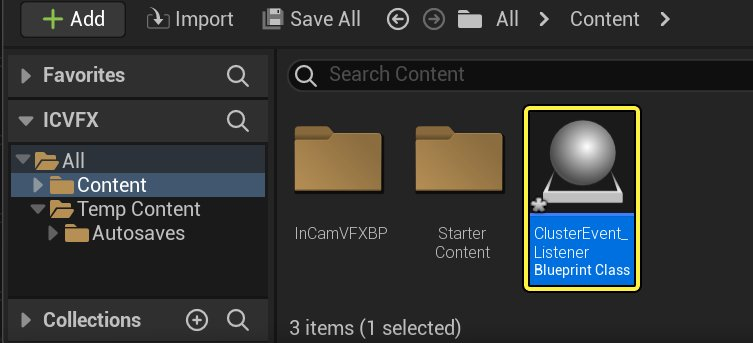

# Using Cluster Events with nDisplay

> 路径：虚幻引擎5.7文档 / 使用媒体 / 媒体集成 / 使用nDisplay在多显示屏上进行渲染 / Using Cluster Events with nDisplay

> 原始页面：https://dev.epicgames.com/documentation/unreal-engine/using-cluster-events-with-ndisplay-in-unreal-engine

该页面没有可用的官方中文版本；以下内容保留原文，并按本项目人工译文规则逐步回译。

Cluster Event 可让 nDisplay 集群中的所有节点同时响应事件。

1. 可以从集群中的某个节点生成 Cluster Event，也可以从外部应用将其发送到主节点。请参阅 [从蓝图发出 Cluster Event](index.md) 或 [从外部应用发出 Cluster Event](index.md).
2. 当集群主节点接收到 Cluster Event 时，会将该事件传播到集群中的每个节点，使事件在每个节点上恰好同一帧发生。
3. 在 Unreal Engine 应用的蓝图或 C++ 逻辑中，可以设置监听器来检测这些 Cluster Event，并用项目所需的 Gameplay 逻辑响应它们。请参阅 [在蓝图中响应 Cluster Event](index.md).

## Cluster Event 格式

nDisplay 支持两种 Cluster Event 格式：JSON 和二进制。JSON 格式可读；它使用 ASCII，某些字符受 JSON 标准禁止，并需要特定 schema 来组织数据。使用二进制格式时，可以使用任意二进制数据，序列化和反序列化由你负责。对于 Cluster Event，二进制格式在数据吞吐量和延迟方面比 JSON 格式性能更好。

### JSON Cluster Event 结构

每个 JSON nDisplay Cluster Event 可包含多个属性：

| 设置 | 类型 |
| --- | --- |
| **Name** | string |
| **类型** | string |
| **Category** | string |
| **SystemEvent** | 用于指定这是系统事件还是用户事件的布尔值。不需要自行设置该标志。 |
| **ShouldDiscardOnRepeat** | 用于指定具有相同 **Name**, **类型**和 **Category** 并且已在当前帧内接收过的事件是否应被丢弃。 |
| **Parameters** | 可选键值对映射，键和值均为字符串。 |

在项目中要通过这些属性发送哪些数据，以及希望监听器如何解释这些数据，都由你决定。

在蓝图中与 JSON Cluster Event 交互时，会使用 **Make DisplayClusterClusterEventJson** 和 **Break DisplayClusterClusterEventJson** 节点构造和拆解 JSON Cluster Event。例如：



在 C++ 中，或从自己的应用发出 JSON Cluster Event 时，会使用 [FDisplayClusterClusterEventJson](https://dev.epicgames.com/documentation/unreal-engine/API/Plugins/DisplayCluster/Cluster/FDisplayClusterClusterEventJson?application_version=5.5) 结构体表示相同结构。

### 二进制 Cluster Event 结构

每个二进制 Cluster Event 可包含多个属性。

| 设置 | 类型 |
| --- | --- |
| **Event Id** | 32 位整数 |
| **System Event** | 用于指定这是系统事件还是用户事件的布尔值。不需要自行设置该标志。 |
| **ShouldDiscardOnRepeat** | 用于指定具有相同 **Event Id** 并且已在当前帧内接收过的事件是否应被丢弃。 |
| **Event Data** | 字节数组 |

在项目中要通过这些属性发送哪些数据，以及希望监听器如何解释这些数据，都由你决定。

在蓝图中与二进制 Cluster Event 交互时，会使用 **Make DisplayClusterClusterEventBinary** 和 **Break DisplayClusterClusterEventBinary** 节点构造和拆解二进制 Cluster Event。例如：



在 C++ 中，或从自己的应用发出二进制 Cluster Event 时，会使用 [FDisplayClusterClusterEventBinary](https://dev.epicgames.com/documentation/unreal-engine/API/Plugins/DisplayCluster/Cluster/FDisplayClusterClusterEventBinar-?application_version=5.5) 结构体表示相同结构。

## 从蓝图发出 Cluster Event

以下示例展示如何从蓝图类发出 JSON Cluster Event。稍作修改后，也可以使用相同步骤从蓝图类发出二进制 Cluster Event。

要从项目中的蓝图类发出 JSON Cluster Event：

1. 获取 **DisplayCluster Module API** （参阅 [Blueprint API](../ndisplay-overview/index.md)），并调用其 **Cluster >** **Emit JSON cluster event** 函数。该节点会将 Cluster Event 发送到主节点（在 API 中标为 master node），主节点再将其传播回集群中的所有节点。

   

   点击图像展开。
2. 默认情况下，Unreal Engine 应用中每个在 Gameplay 逻辑中求值此蓝图节点的实例都会触发该 Cluster Event。 如果该蓝图图表在集群中多个不同节点上求值，可能会导致事件发生多个副本。 为避免触发多个 Cluster Event 副本，可以设置 **Primary Only** 布尔值，位于 **Emit JSON cluster event** 节点上。如果勾选该框，只有主节点会发出此 Cluster Event。如果其他非主集群节点对同一蓝图图表求值，这些节点不会发出该事件。

   
3. 从 **Event** 端口向左拖出，该端口位于 **Emit JSON cluster event** 节点，并选择 **Make DisplayClusterClusterEventJson**.

   

   点击图像展开。
4. 使用 **Make DisplayClusterClusterEventJson** 节点中的设置，为 Cluster Event 的字符串值进行设置： **Name**, **类型**和 **Category**。如果需要随 Cluster Event 传递任意键值数据，也可以将这些键和值的映射传递到 **Parameters** 输入。

   

   点击图像展开。
5. **Compile** 和 **Save** 蓝图。

下次重新打包项目并重新启动 nDisplay 集群时，该蓝图代码会触发已设置的 JSON Cluster Event。要在蓝图代码其他位置响应该事件，请参阅 [在蓝图中响应 Cluster Event](index.md).

## 从外部应用发出 Cluster Event

启动 nDisplay 集群时，主节点会开始在特定本地端口监听传入 Cluster Event。可以从网络中任意其他计算机上运行的应用连接到该端口并发送消息，从而向 nDisplay 系统发出新的 Cluster Event。JSON 和二进制端口监听器都使用 TCP，因此可以保持连接打开，直到集群会话结束。

对于要发出的每个 Cluster Node，消息必须遵循以下约定：

- 前四个字节必须给出消息其余部分的总长度。
- 消息其余部分应为 Cluster Event 内容，可表示为 JSON 对象或二进制数据。

  - 对于 JSON 事件消息：

    - JSON 对象，包含必填字段 **Name**, **类型**, **Category**, **SystemEvent**和 **ShouldDiscardOnRepeat**以及可选字段 **Parameters**.
  - 对于二进制事件消息：

    - 事件 ID 占 4 字节。
    - System Event 布尔值占 1 字节。
    - Should Discard on Repeat 布尔值占 1 字节。
    - 二进制数据占 N 字节，N 没有限制。

例如，要发出名称为“quit”、类型为“command”的 JSON Cluster Event，需要：

1. 构造一个包含 Cluster Node 值的 JSON 字符串。 In this case:

   C++

   ```
   {"Name":"quit","Type":"command","Category":"","Parameters":{}}
   ```

   > [!TIP]
   > 该 **Name**, **类型**和 **Category** 字段是必填的，但可以省略 Parameters 字段。虽然某些字段是必填的，但可以为任意字段分配空值，因为空字段事件会被归为一组。建议提供名称和 ID 以提高可读性。
2. Get the length of the JSON string — in this case, 62 characters — 并以二进制格式将该长度发送到 nDisplay 主节点，占 4 bytes. In this example, it would be `0x00111110`.
3. 将 JSON 字符串本身发送到 nDisplay 主节点。

> [!TIP]
> 默认情况下，主节点在端口 41003 监听 Cluster Event，在端口 41004 监听二进制 Cluster Event。可以在 nDisplay 配置文件中更改此默认值。请参阅 [更改 nDisplay 通信端口](../changing-ndisplay-communication-ports/index.md).

> [!NOTE]
> 要在项目蓝图代码中响应这些 Cluster Event，请参阅 [在蓝图中响应 Cluster Event](index.md).

## 在蓝图中响应 Cluster Event

使用上述方法之一将 Cluster Event 发到 nDisplay 网络后，需要设置蓝图（或 C++）Gameplay 逻辑来检测这些 Cluster Event 并以某种方式响应。为此，需要创建并注册监听器：一个实现 **DisplayClusterClusterEventListener** 接口的类。通过调用 **Add Cluster Event Listener** 函数来注册监听器，该函数来自 nDisplay API；然后使用 **Event On Cluster Event** 节点检测 Cluster Event 并响应。

例如，要创建新的蓝图类并将其注册为监听器：

1. In the **Content Browser**中右键点击并选择 **Create Basic Asset > Blueprint Class**.

   

   点击图像展开。
2. 选择 **Actor** 作为父类。
3. 在 **Content Browser**.

   
4. 将该类拖入 Level Viewport 并放入关卡。

   > 图片已省略：Drag and drop the Blueprint into the Level

   点击图像展开。
5. 双击新的蓝图类进行编辑。
6. 在 Toolbar 中点击 **Class Settings**.
7. In the **Details** 面板中，找到 **Interfaces > Implemented Interfaces** 设置并点击 **Add**.

   > 图片已省略：Add interface
8. 在列表中查找并选择 **DisplayClusterClusterEventListener** 接口。
9. 点击 **Compile** 以在 Toolbar 中编译类。
10. 在 **Event Graph** 选项卡上，设置以下图来注册监听器：

    > 图片已省略：Add the event listener

    点击图像展开。

    要设置它：

    1. 从 **Begin Play** Event 节点的输出向右拖出并选择 **N Display > DisplayCluster Module API**.
    2. Drag right from the **Out API** 端口向右拖出并选择 **Display Cluster > Cluster > Add cluster event listener**.
    3. 最后，从 **Listener** 端口向左拖出，该端口位于 **Add cluster event listener** 节点，并选择 **Variables > Get a reference to self**.
11. 当确定不再需要某个监听器时，也应销毁创建的每个监听器。例如，可以在 Blueprint Actor 被销毁时执行：

    > 图片已省略：Remove the event listener

    点击图像展开。

    要设置它：

    1. 在 Event Graph 中右键点击并选择 **Add Event > Event Destroyed** 节点。
    2. 从 **Event Destroyed** 节点并选择 **N Display > DisplayCluster Module API**.
    3. Drag right from the **Out API** 端口向右拖出并选择 **Display Cluster > Cluster > Remove cluster event listener (Interface Call)**.
    4. 最后，从 **Listener** 端口向左拖出，该端口位于 **Remove cluster event listener** 节点，并选择 **Variables > Get a reference to self**.
12. 在 **Event Graph**另一区域，添加 **Add Event > N Display > Event On Cluster Event Json** node. 每当 nDisplay 集群中发生 JSON Cluster Event，该事件都会触发。 通常需要读取分配给该事件的设置和参数，以判断蓝图需要执行什么操作。 为此，从 **Event** 端口向右拖出，该端口属于 Event **On Cluster Event Json** 节点，并选择 **Break DisplayClusterClusterEventJson**. 例如，此图只是将每个 JSON Cluster Event 的 Name 值打印到屏幕上：

    > 图片已省略：Respond to the Cluster Event

    点击图像展开。
13. **Compile** 和 **Save** your Blueprint class.

下次集群中任意来源发出任何 JSON Cluster Event 时，该 JSON Cluster Event 的名称都会打印到屏幕上。
