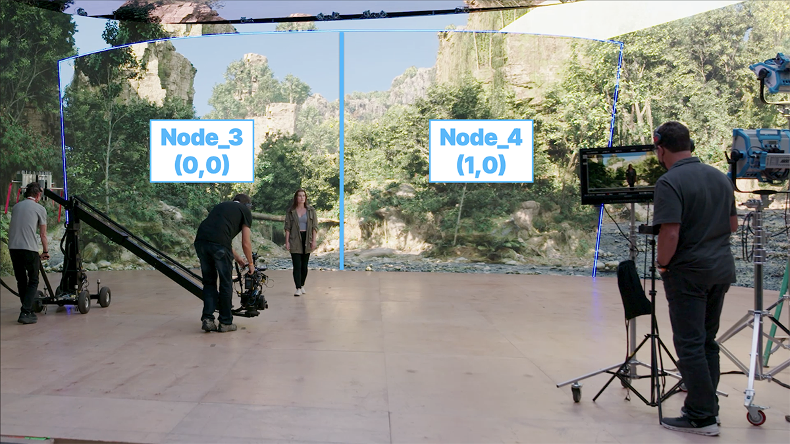
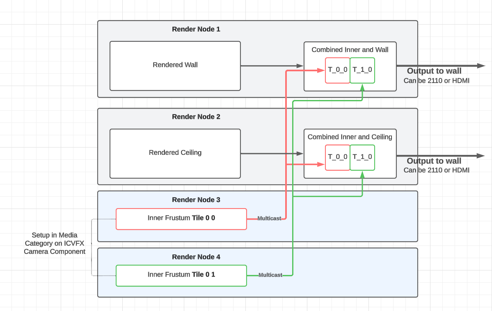
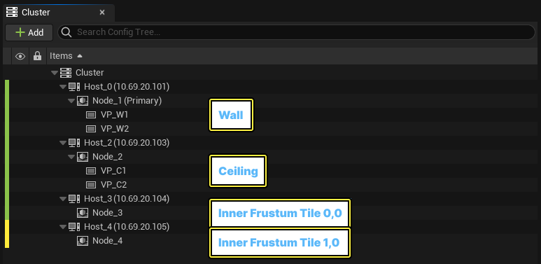
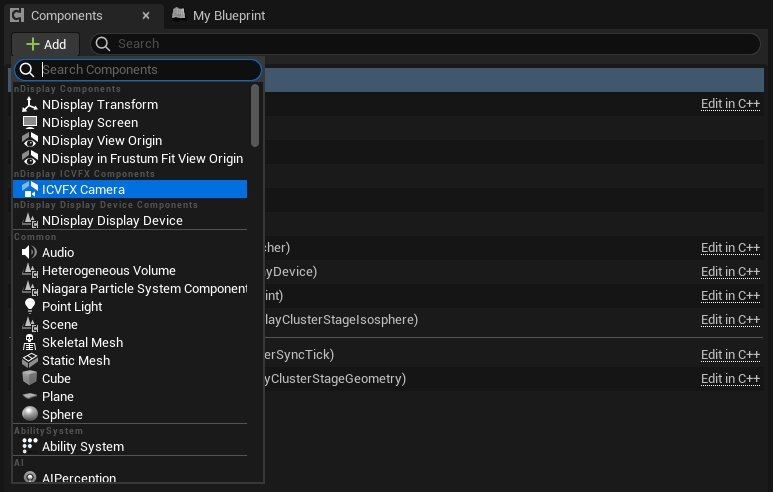
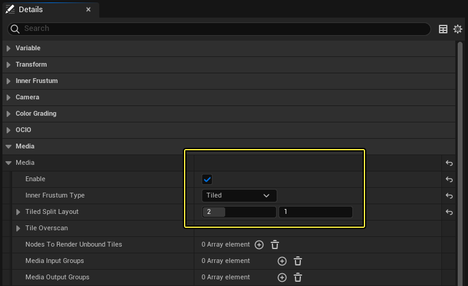
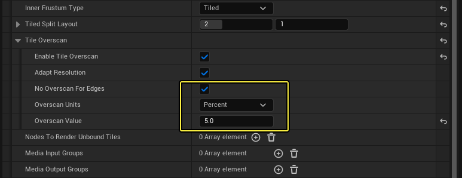
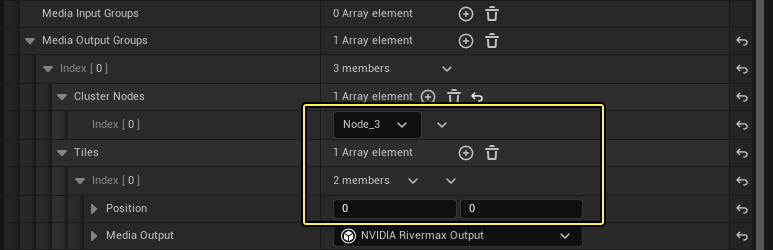
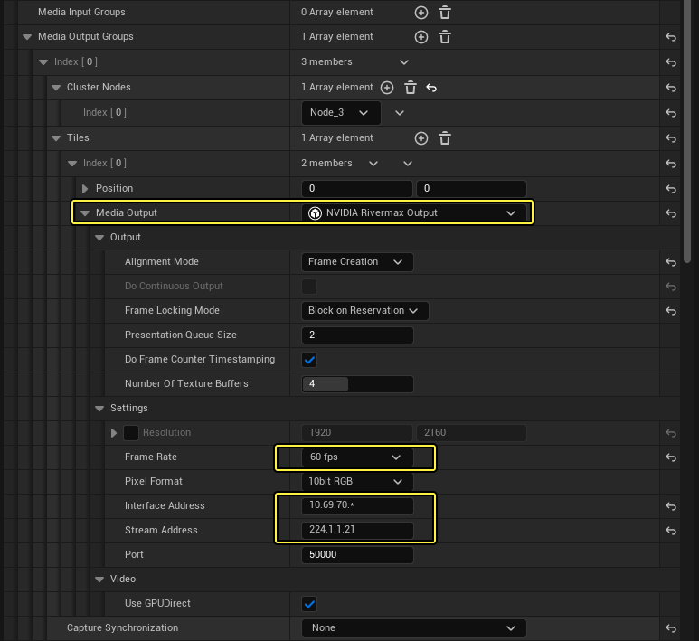

# 配置内视锥体分割

> 路径：虚幻引擎5.7文档 / 使用媒体 / 媒体集成 / 使用nDisplay在多显示屏上进行渲染 / 将SMPTE 2110用于nDisplay / 配置内视锥体分割

> 原始页面：https://dev.epicgames.com/documentation/unreal-engine/inner-frustum-split-for-smpte-2110-in-unreal-engine

本教程将指导你使用SMPTE 2110标准，配置nDisplay ICVFX摄像机的内视锥体分割。

随着对SMPTE 2110支持的引入，你现在可以让整个nDisplay渲染节点专门渲染内视锥体。虚幻引擎提供了使用更多硬件资源渲染内视锥体的能力，并通过多个节点和多个GPU（类似于[多进程渲染](../../multi-process-rendering/index.md)部署）来生成最高质量的内视锥体。 随着新摄像机的分辨率提升和体积增大，系统也可以随着现代制片的需求而拓展。

在ICVFX拍摄现场使用多个节点进行内视锥体分割。

## 配置

使用nDisplay和SMPTE 2110的内视锥体分割的示例配置图。

1. 创建[nDisplay配置](https://dev.epicgames.com/documentation/404)。
2. 添加一个反映设置部署的节点布局。

   

   - 节点1和节点2分别渲染墙体和天花板。
   - 节点3和节点4分别渲染内视锥体图块（0,0）和（0,1），且两处均启用 **无头渲染（Headless Rendering）** 设置（分别在对应的配置项中进行设置），这意味着不渲染（外部）视口。
3. 添加ICVFX摄像机组件。

   
4. 选择 ICVFX摄像机组件，并前往 **细节（Details）** 面板。

   

   - 启用 **媒体（Media）** ，将 **内视锥体类型（Inner Frustum Type）** 选为 **图块（Tiled）** 。
   - 使用 **图块分割布局（Tiled Split Layout）** 的值设定水平（X轴）和垂直（Y轴）方向的图块数量。

     - 本例中，待渲染的图块总数为二（2），即水平方向两块，垂直方向一块。
5. 转到 **图块过扫描（Tile Overscan）** 的设置项，设定下列属性，以使用过扫描优化图块的混合：

   - 启用 **不对边缘进行过扫描（No Overscan for Edges）** 。
   - 将 **过扫描值（Overscan Value）** 设为5%或以上。

     
6. （可选。详见下文的[图块配置向导](#%E5%9B%BE%E5%9D%97%E9%85%8D%E7%BD%AE%E5%90%91%E5%AF%BC)）小节。转到 **媒体输出群组（Media Output Groups）** ，为每组将渲染内视锥体图块的节点分别创建一个群组。本示例中，第一个图块（0,0）将由节点_3渲染，第二个图块将由节点_4（1,0）渲染。

   
7. 选择 **NVIDIA Rivermax输出（NVIDIA Rivermax Output）** 作为媒体输出（Media Output）。这意味着你可以使用指定的参数设置SMPTE 2110的流送。

   

   默认情况下，大多数属性将被初始化。

   - 将根据图块布局自动设置 **分辨率（Resolution）** ，而无需你来设置具体的值。
   - 为你的网络设置正确的 **接口地址（Interface Address）** 和 **流送地址（Stream Address）** 。
   - 你设置的 **帧率（Frame Rate）** 必须高于渲染速率。如果带宽允许，至少应该高两倍。
   - 如果要使用GPU Direct，必须将 **帧锁定模式（Frame Locking Mode）** 设为 **在预留时阻止（Block on Reservation）** 且将 **对齐模式（Alignment Mode）** 设为 **帧创建（Frame Creation）** ，这时虚幻引擎才能支持该功能。因此请按要求设置这些值。
   - 将 **捕获同步（Capture Synchronization）** 设为 **无（None）** 。
8. 转到 **媒体输入群组（Media Input Groups）** ，指定将接收内视锥体图块的节点。

   > 图片已省略：image alt text

   - 为每个将接收内视锥体图块的外部视口群组创建一个 **媒体输入群组（Media Input Groups）** 。

     - 本示例中存在两个图块，且Node_1（墙体）和Node_2（天花板）都应该可以看到这两个图块。
   - 添加图块的数量，直到与 **媒体输出群组（Media Output Groups）** 中配置的渲染数量相匹配。每个索引都是一个要传送到上述节点的内视锥体图块。
   - 为各个图块指定相关的图块坐标，添加一个 **NVIDIA Rivermax源（NVIDIA Rivermax Source）** ，并匹配媒体输出群组的流送设置。

     > [!NOTE]
     > 某些部署可能需要指定不同的 **接口地址（Interface Address）** 或删除通配符。 请确保输入和输出的帧率一致。
   - 如果PCI-e根复合体相同，则输入端将支持GPUDirect。

## 媒体图块配置向导

你可以使用自动化的流程配置图块，即使用 **媒体图块配置（Media Tiles Configuration）** 向导。这是为了尽可能简化图块的配置流程。

> [!NOTE]
> 上述配置流程中的步骤6-8仍然有效，可供你进行手动分割配置。

媒体图块配置向导的关键功能如下：

- 根据图块布局自动生成输入和输出群组。
- 根据默认设置自动配置预先定义的媒体参数。

  - 仅NVIDIA Rivermax和共享内存媒体属于预先定义的媒体。
  - 默认参数已预先配置并可供使用。

要启动配置向导，请点击 **配置图块（Configure Tiles）** 。

> 图片已省略：启动图块配置向导的配置图块按钮。

启动图块配置向导的配置图块按钮。

配置流程从图块的布局配置开始。

> 图片已省略：媒体图块配置向导。

媒体图块配置向导。

1. 选择代表你的设置所需的分割布局的图块，点击 **下一步（Next）** 。下方示例将内视锥体水平分割为两个图块，因此所选布局为 **2x1** 布局。

   > 图片已省略：选择双图块分割布局。
2. 指定 **媒体源（Media Source）** 和 **媒体输出（Media Output）** 的类型。下方示例均使用NVIDIA Rivermax。

   > 图片已省略：指定媒体源和媒体输出。
3. 指定生成并发送图块的节点，以及消耗并接收图块的节点。

   > [!NOTE]
   > 此步骤为初步的输入和输出配置步骤。接下来的步骤灵活性更高。

   > 图片已省略：指定节点。
4. 图块的映射是根据上一步提供的数据预先配置的。如有必要，你也可以手动将图块映射到将对其进行渲染的节点上。

   下方示例中存在双图块。左边的图块被映射到了 **Node_3** ，右边被映射到了 **Node_4** 。对于如此简单的示例而言，这样做没有问题。但对于更复杂的设置，你可以点击任一图块，然后手动选择另一个或多个节点来渲染它。

   > 图片已省略：检查图块映射。
5. 点击 **完成（Finish）** 以完成配置流程。

配置向导完成后，摄像机设置将与所有图块媒体设置一同更新。

> 图片已省略：image alt text

> [!NOTE]
> 默认情况下，NVIDIA Rivermax和共享内存媒体会自动配置。如有需要，你也可以手动修改设置，但在大多数情况下，默认设置已经足够。

> [!WARNING]
> **将媒体输入和输出重置为默认值（Reset Media Input and Output to Default）** 按钮会将所有的现存媒体输入和输出重置为预先配置的默认值。你可以用此按钮将不成功的手动更改恢复为原始默认设置。

## 多进程内视锥体分割

如果部署的渲染节点有多个（2个或更多）GPU，那么你可以选择将[共享内存/多进程](../../multi-process-rendering/index.md)部署与SMPTE 2110和内视锥体分割结合起来。 这意味着你可以为各个视口和内视锥体图块投入更多资源，同时减少部署所需的渲染节点总数。

在下方示例中，与上一示例的设置相同，但3台主机改为4台主机，且外部视口不再共享同一进程/GPU：

- 所有视口都由同一主机上的对应节点/GPU渲染，且配置会同时使用共享内存和SMPTE 2110媒体。
- 所有内视锥体都由同一主机上的对应节点/GPU渲染，且配置只共享SMPTE媒体。

> 图片已省略：使用nDisplay和SMPTE 2110的多进程内视锥体分割的主机和节点。

使用nDisplay和SMPTE 2110的多进程内视锥体分割的主机和节点。

> 图片已省略：使用nDisplay和SMPTE 2110的多进程内视锥体分割的示例配置图。

使用nDisplay和SMPTE 2110的多进程内视锥体分割的示例配置图。
