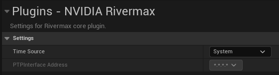
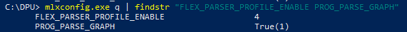
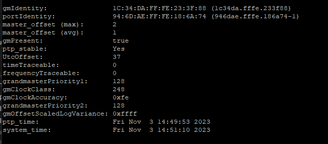

# 故障排除

> 路径：虚幻引擎5.7文档 / 使用媒体 / 媒体集成 / 使用nDisplay在多显示屏上进行渲染 / 将SMPTE 2110用于nDisplay / 故障排除

> 原始页面：https://dev.epicgames.com/documentation/unreal-engine/troubleshooting-smpte-2110-in-unreal-engine

本指南可用于解决你在按SMPTE 2110标准使用Nvidia Rivermax时可能遇到的问题。

- 如果系统应该支持GPUDirect，但你在日志中看到了下列消息：

  `Cuda device doesn't support RDMA. GPUDirect won't be available for Rivermax`

  请验证你的环境变量，并确保将 `RIVERMAX_ENABLE_CUDA` 设为1。
- 打开RivermaxMediaSource时，如果看到了如下消息：

  `RTP dynamic header data split is not supported for device IP`

  请确保 `INTERNAL_CPU_MODEL` 被设为 `SEPARATED_HOST(0)` ，此时运行的是如下命令：

  `mlxconfig.exe q | findstr "REAL_TIME_CLOCK_ENABLE INTERNAL_CPU_MODEL"`
- 打开RivermaxMediaSource时，如果日志中出现了如下警告：

  `Could not attach flow to stream. Status: 13.`

  说明你使用的是ConnectX-6卡片（而不是BlueField-2），所以请验证虚幻引擎项目设置的 **时间源（Time Source）** ，并将其设为 **系统（System）** 。

  

  Nvidia Rivermax插件的时间源设置。
- 打开RivermaxMediaSource时，如果异常显示彩虹色图片，请确保下列命令显示了相同的输出： `mlxconfig.exe q | findstr "FLEX_PARSER_PROFILE_ENABLE PROG_PARSE_GRAPH"`

  

  验证命令的输出相同
- 如果使用ST 2110驱动时发现墙壁撕裂的现象，请在所有节点上验证PTP。

  1. 使用Putty连接到BlueField-2卡的COM端口，并以Root身份登录。
  2. 在根文件夹运行 `firefly_monitor.sh` 脚本。这将验证DOCA容器是否在运行，并打印PTP的状态。

     

     firefly_monitor.sh的输出
  3. 验证所有节点的 `gmIdentity` （主时钟身份）的值是否相同，否则它们将不会使用相同的时间参考。
  4. 验证 `gmPresent` 和 `ptp_stable` 的值是否有效。

## 重要信息

- **虚幻引擎5.3-5.4版本将在未来移除以下内容：**SMPTE 2110的网络数据包大小和像素分组存在限制因素。由于该限制，某些分辨率会要求至少有一个数据包的大小与其他数据包不同。已知这会导致Rivermax中的数据包间际抖动的问题。建议使用标准分辨率，因为这些分辨率不会遇到此问题。如果无法如此，虚幻引擎仍将尝试将帧数据分成大小均匀的数据包；如果这不起作用，则每帧的最后一个数据包的大小将与其余数据包不同。 你可以设置以下控制台变量来禁用发送大小不一的数据包： `Rivermax.Output.EnableMultiSRD=0` 如果分辨率没有被分成相同大小的数据包，则虚幻引擎日志中会出现以下消息： "由于YOUR_RESOLUTION的分辨率，将通过多个大小各异的数据包发送行数据。（Due to resolution YOUR_RESOLUTION, row data will be sent over multiple packets with varied sizes.）"
- 针对Rivermax 1.41.11版本和虚幻引擎5.4版本， `Rivermax.Output.ForceSkip` 控制台变量的默认值已被更改为推荐值0。虚幻引擎5.3使用了Rivermax.Output.ForceSkip=1，且已知会在长时间播放后导致问题。Rivermax 1.41.11提供的 `RIVERMAX_TX_DELAY_ADAPTIVE_AUTO_CORRECTION_FACTOR` 环境变量原生修复了此问题，而此控制台变量是虚幻引擎人工处理该问题的方法
