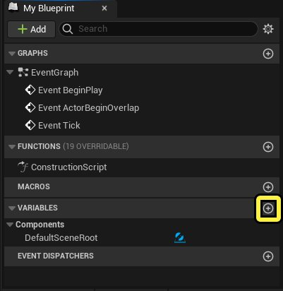
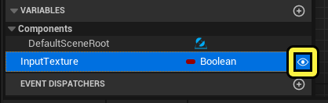
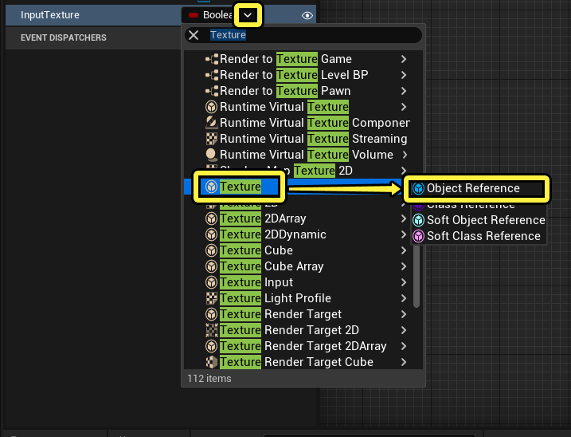
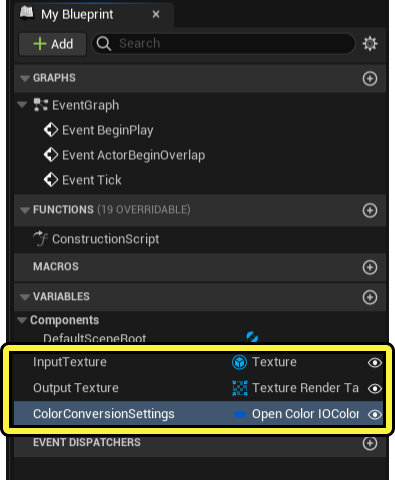
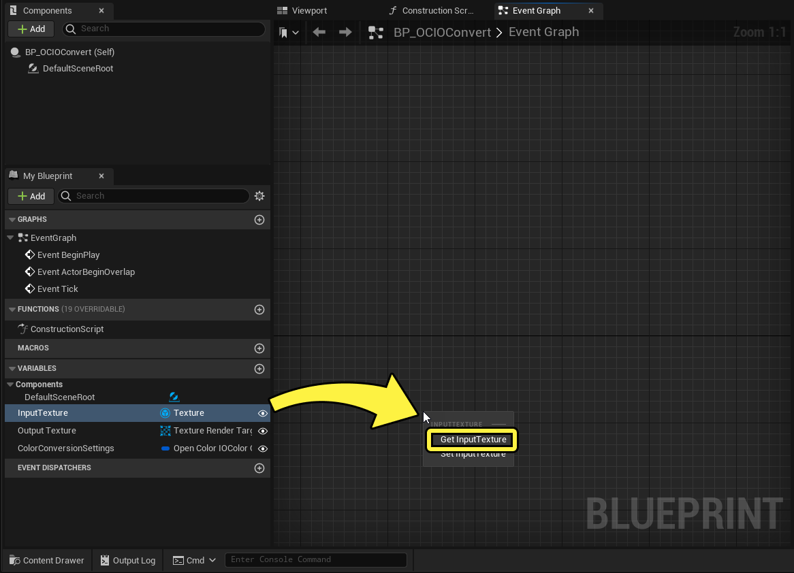
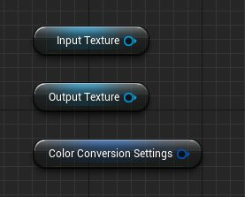
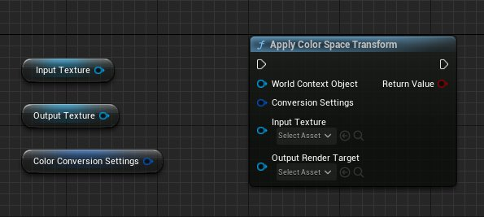
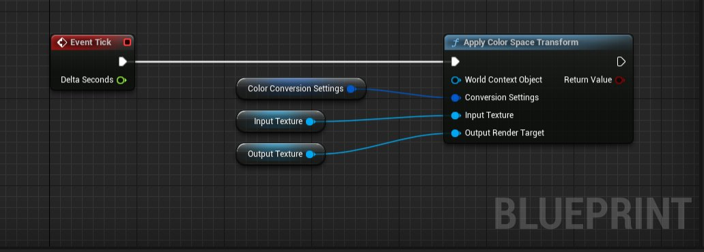

# 在蓝图中转换颜色

> 路径：虚幻引擎5.7文档 / 使用媒体 / 颜色管理 / OpenColorIO颜色管理 / 在蓝图中转换颜色

> 原始页面：https://dev.epicgames.com/documentation/unreal-engine/converting-colors-in-unreal-engine-blueprints

你可以使用 **蓝图（Blueprints）** 将[OpenColorIO](../index.md) (**OCIO**)颜色变换应用于任何一种输入纹理（包括播放视频源的 **MediaTexture**），并在 **RenderTarget** 中获得转换后的结果。此页面将显示如何在项目中使用 **Apply Color Space Transform** 蓝图函数。

## 先决条件

你必须在项目中设置以下内容才能完成下面的分段：

- 一个 **OpenColorIO配置资产（OpenColorIO Configuration Asset）**。请参阅[OpenColorIO快速入门](../opencolorio-quick-start/index.md)了解创建此资产的步骤。
- 一个 **蓝图类（Blueprint Class）** ，从包含 **事件更新函数（Event Tick）** 的 **蓝图Actor（Blueprint Actor）** 创建。

## 使用Apply Color Space Transform函数

执行以下步骤，将颜色转换应用于蓝图。这些步骤使用 **EditorUtilityActor** 蓝图类作为示例。

1. 在 **蓝图编辑器（Blueprint Editor）** 中，双击打开你的 **蓝图类（Blueprint Class）** 。
2. 在 **我的蓝图（My Blueprint）** 面板中的 **变量（Variables）> 组件（Components）** 下，点击 **添加(+)变量（Add (+) Variable）** 以创建新变量。将新变量命名为 **InputTexture** 。

   
3. 在新的InputTexture变量旁边，点击 **设为公开（Make Public）** ，使其在此蓝图之外可见。

   
4. 将变量InputTexture的 **变量类型（Variable Type）** 设为 **对象类型（Object Types）> 纹理（Texture）> 对象引用（Object Reference）** 。

   
5. 再创建两个变量并将其设为公开：

   - **OutputTexture** ，变量类型为 **纹理渲染目标2D（Texture Render Target 2D）> 对象引用（Object Reference）**
   - **ColorConversionSettings** ，变量类型为 **打开颜色IOColor转换设置（Open Color IOColor Conversion Settings）** 。

   
6. 将 **InputTexture** 变量拖动到 **事件图表（Event Graph）** 中，然后选择 **Get InputTexture**。这会在事件图表中创建新的InputTexture节点。

   
7. 对 **OutputTexture** 和 **ColorConversionSettings** 变量重复该过程。

   
8. 在 **事件图表** 中右键点击，然后添加新的 **Apply Color Space Transform** 节点。

   
9. 将这些节点连接起来：

   - 将 **输出执行引脚** 从预先提供的 **Event Tick** 节点连接到 **Apply Color Space Transform** 节点的 **输入执行引脚**。
   - 将 **InputTexture** 节点的 **输出数据引脚** 连接到 **Apply Color Space Transform** 节点上的 **输入纹理输入数据引脚**。
   - 将 **OutputTexture** 节点的 **输出数据引脚** 连接到 **Apply Color Space Transform** 节点的 **输出渲染目标** **输入数据引脚**。
   - 将 **Color Conversion Settings** 节点的 **输出数据引脚** 连接到 **Apply Color Space Transform** 节点的 **转换设置输入数据引脚**。

   
10. **编译（Compile）** 并 **保存（Save）** 蓝图。关闭蓝图编辑器。
11. 将你的 **蓝图资产（Blueprint Asset）** 拖动到关卡中以创建其 **Actor** 。
12. 在 **大纲视图（Outliner）** 中，选择你的 **蓝图Actor（Blueprint Actor）** 以打开其 **细节（Details）** 面板。
13. 在 **细节（Details）** 面板中，展开 **默认（Default）** 分段，并将 **输入纹理（Input Texture）** 设为你所需的输入文件。
14. 在 **内容浏览器（Content Browser）** 中创建 **渲染目标资产（Render Target Asset）** ，并将 **输出纹理（Output Texture）** 设为指向新的渲染目标资产。

    > 图片已省略：分配了所有变量的蓝图类Actor的细节面板
15. 在 **蓝图Actor（Blueprint Actor）** 的 **细节（Details）** 面板中，展开 **颜色转换设置（Color Conversion Settings）** 分段。将 **配置源（Configuration Source）** 设为你的OpenColorIO配置资产，并调整 **源颜色空间（Source Color Space）** 和 **目标颜色空间（Destination Color Space）** 以匹配输入和输出媒体的颜色空间。
16. 将你的 **渲染目标资产（Render Target Asset）** 拖动到关卡中的 **Actor** ，以使用颜色变换预览你的媒体。你可以继续调整源颜色空间（Source Color Space）和目标颜色空间（Destination Color Space）设置以便预览不同的输出。
