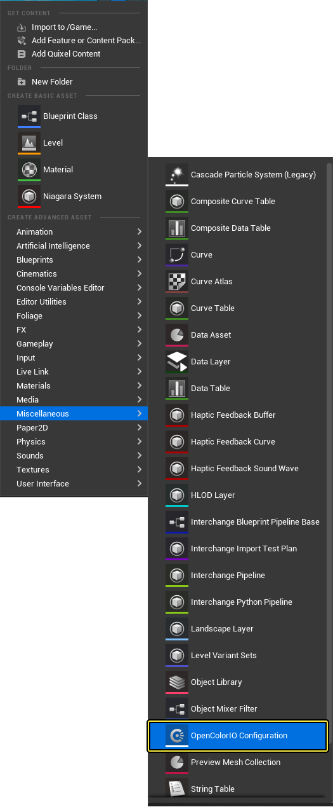
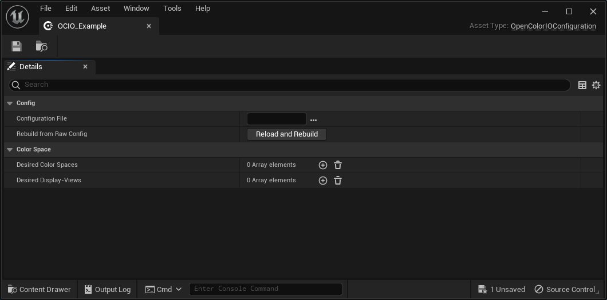
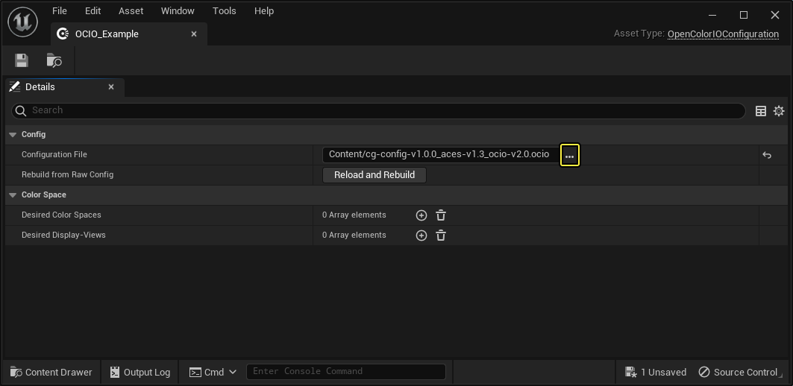
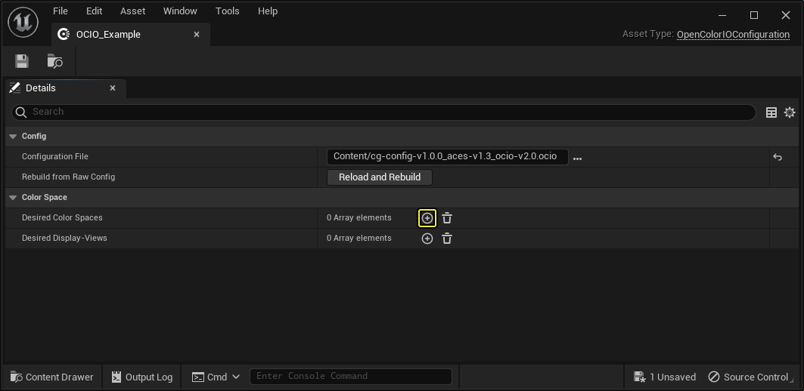
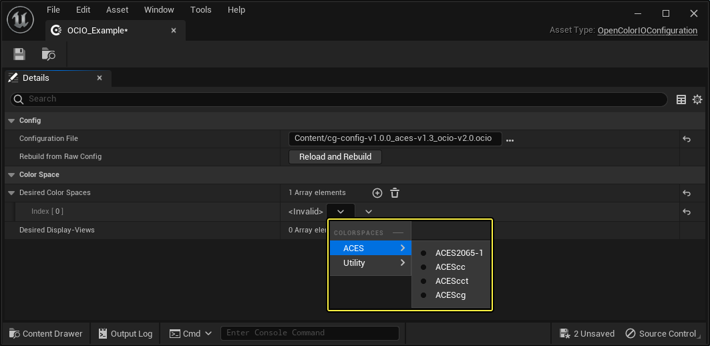
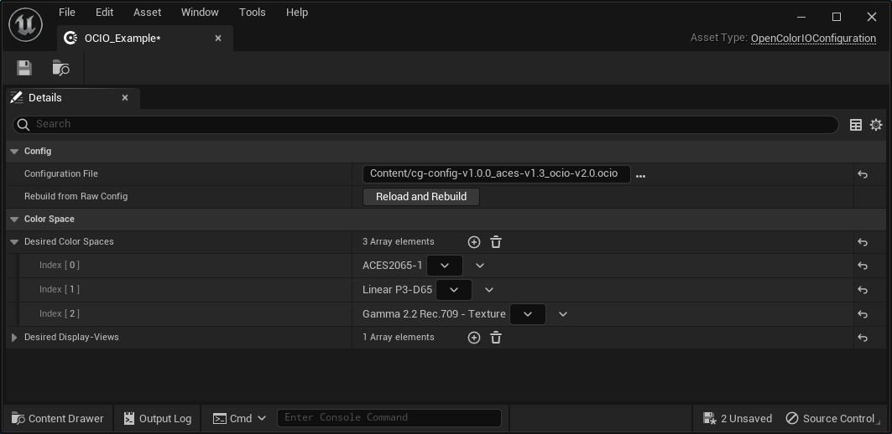
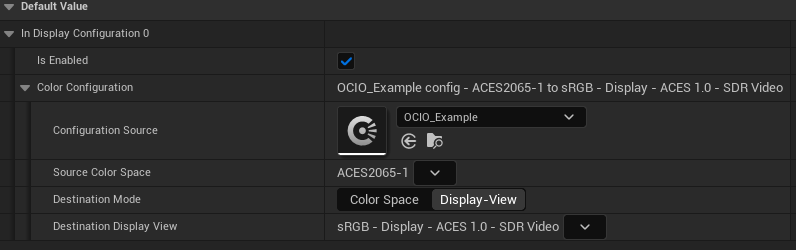

# OpenColorIO快速入门

> 路径：虚幻引擎5.7文档 / 使用媒体 / 颜色管理 / OpenColorIO颜色管理 / OpenColorIO快速入门

> 原始页面：https://dev.epicgames.com/documentation/unreal-engine/opencolorio-quick-start-for-unreal-engine

本文将介绍如何在虚幻引擎（UE）中使用OpenColorIO（OCIO）， 并展示如何基于OCIO配置来创建 **OpenColor配置资产（OpenColor Configuration Asset）**。

创建此文件后，可以使用OCIO来应用颜色变换。你可以通过[蓝图](../converting-colors-in-unreal-engine-blueprints/index.md)以及在UE的[视口模式和在编辑器中运行模式](../apply-color-conversion-to-the-level-viewport-an-97a382c0/index.md)中进行操作。

## 先决条件

在你新建项目时，UE会自动启用OpenColorIO插件。 如果OpenColorIO插件被禁用，则必须将其启用才能在UE中使用OCIO。 如需了解如何在UE中启用插件，请参阅[使用插件](../../../../understanding-the-basics/foundational-knowledge-in/working-with-plugins/index.md)。

## OCIO配置

OCIO配置包含可与OCIO一起使用的颜色空间、显示和视图的集合。 你可以使用自己的OCIO配置文件、OCIO插件提供的默认ACES配置之一，或[美国学院软件基金会（Academy Software Foundation）](https://github.com/AcademySoftwareFoundation/OpenColorIO-Config-ACES/releases/tag/v1.0.0)GitHub仓库中的ACES配置文件之一。

## 使用内置的OCIO配置

若要使用其中一个内置OCIO配置，可以在OpenColorIO配置资产的 **配置文件（Configuration File）** 路径中输入以下字符串之一（请参阅"创建OpenColorIO配置资产"）。 这些配置文件内置于OCIO库中，不需要任何外部文件。

- 若要使用[默认ACES CG配置](https://opencolorio.readthedocs.io/en/latest/releases/ocio_2_2.html#built-in-configs)，请在 **配置文件（Configuration File）** 路径中输入以下字符串：`ocio://default`
- 若要使用ACES CG配置，请在 **配置文件（Configuration File）** 路径中输入以下字符串：`ocio://cg-config-v1.0.0_aces-v1.3_ocio-v2.1`
- 若要使用ACES Studio配置，请在 **配置文件（Configuration File）** 路径中输入以下字符串：`ocio://studio-config-v1.0.0_aces-v1.3_ocio-v2.1`

## 导入OCIO配置文件

要将OCIO配置（`ocio` 或 `.ocioz`）文件添加到项目中，必须使用计算机的文件资源管理器将该文件添加到项目的内容（Content）文件夹中。 UE无法自动识别 `.ocio` 和 `.ocioz` 文件，因此你无法使用UE中的内容抽屉（Content Drawer）将这些文件添加到项目中。

> [!NOTE]
> OCIO插件还支持 `.ocioz` 存档文件。 如果要将配置文件及其LUT纹理文件夹压缩到单个存档中，此格式的存档文件可能很有用。

## 示例OCIO配置文件

Epic创建了一个示例 `.ocio` 配置文件并将其包含OCIO插件中。 此示例配置文件位于引擎安装文件夹中，在 `Engine\Plugins\Compositing\OpenColorIO\Content\OCIO` 下面。

在内容浏览器（Content Browser）中浏览到OpenColorIO插件的内容时，内容浏览器不会显示这些文件，因为内容浏览器只显示.uasset文件。 请改为使用计算机的文件资源管理器浏览到这些文件。

## 创建OpenColorIO配置资产

OCIO插件使用OpenColorIO配置资产来管理要在项目中使用的颜色描述。 此资产引用一个OCIO配置，这个配置包含有关多个颜色描述以及如何在这些颜色描述之间进行转换的详细规范。

UE目前支持OCIO v2.2。 有关OCIO配置文件的更多细节，请参阅[OpenColorIO v2文档](https://opencolorio.readthedocs.io/en/latest/index.html)和[OCIO v2.2版本信息](https://opencolorio.readthedocs.io/en/latest/releases/ocio_2_2.html)。

在使用OCIO之前，必须先创建一个OpenColorIO配置资产。

要创建OpenColorIO配置资产，请执行以下操作：

1. 在[内容浏览器（Content Browser）](../../../../understanding-the-basics/content-browser/index.md)中，单击右键以打开上下文菜单，然后选择 **杂项（Miscellaneous）> OpenColorIO配置（OpenColorIO Configuration）** 以创建 **OpenColorIO配置资产（OpenColorIO Configuration Asset）**。

   
2. 双击你创建的 **OpenColorIO配置资产** 以编辑其设置。 在此示例中，资产名为 **OCIO_Example**。

   
3. 对于 **配置文件（Configuration File）** 参数，单击 **浏览（Browse）** 以查找并选择计算机上的OCIO配置（`.ocio`）文件，或输入URL以使用其中一个内置配置。 默认情况下，新的OpenColor配置资产使用 `ocio://default` OCIO配置。

   
4. 对于 **需要的颜色空间（Desired Color Spaces）** 参数，请单击 **添加（+）（Add (+)）** 以添加新的颜色空间条目。

   
5. 在新条目中，打开下拉列表，然后选择要在UE中使用的配置文件中定义的颜色空间之一。

   
6. 对要使用的每个颜色空间或显示视图重复最后两个步骤，然后单击 **保存（Save）** 以保存你的资产。

   

> [!TIP]
> 仅设置你在UE中实际需要使用的颜色描述。 这有助于你的配置资产尽可能保持轻量级。

你的OpenColorIO配置资产现已设置完毕，接下来可以使用此配置资产将颜色转换应用于引擎中的不同系统。

## 配置OpenColorIO配置资产

虽然在UE中为系统设置颜色转换的方法可能不同，但针对OpenColorIO的颜色转换设置是相同的。 你需要指定要使用的OpenColorIO配置资产，以及源和目标颜色空间：

- **配置源（Configuration Source）**：你正在使用的OpenColorIO配置资产。
- **源颜色空间（Source Color Space）**：要进行转换的输入颜色空间。
- **目标颜色空间（Destination Color Space）**：要转换到的输出颜色空间。
- **目标显示视图（Destination Display View）**：要在其中转换颜色的显示视图。
